> [!IMPORTANT]
> La cuenta de GitHub `@wuiproject` se migró a `@wui-js` para que coincidiera con el nombre de la cuenta de NPM.

[English](https://github.com/wui-js/wuijs-main-lib/blob/main/docs/README-en.md) |
[Español](https://github.com/wui-js/wuijs-main-lib/blob/main/docs/README-es.md)
---

# wuijs-main-lib

<p align="center">
	
</p>

|                       | |
| --------------------- | --- |
| **Nombre librería**   | `wuijs-main-lib` |
| **Versión librería**  | `0.6.2` ([Registro de Cambios](https://github.com/wui-js/wuijs-main-lib/blob/main/docs/CHANGELOG-es.md)) |
| **Paquete npm**       | `@wui-js/main` |
| **Versión documento** | `0.6.3.20260508.0` |
| **Licencia**          | `Licencia Apache 2.0` |
| **Autor**             | `Sergio E. Belmar V. <wuijs.project@gmail.com>` |
| **Repositorio**       | [https://github.com/wui-js/wuijs-main-lib](https://github.com/wui-js/wuijs-main-lib) |
| **Documentación**     | [https://docs.wuijs.dev](https://docs.wuijs.dev) |
| **Sitio web**         | [https://wuijs.dev](https://wuijs.dev) |

## Índice

*   [Descripción General](#overview)
	*   [Acerca del Proyecto WUI/JS](#project)
	*   [Tabla de Clases](#classtable)
	*   [Mapa de Directorios](#dirmap)
*   [Instalación](#install)
*   [Implementación](#implementation)
	*   [Implementación Estándar](#standard)
	*   [Implementación Abreviada](#abbreviated)
*   [Clases](#classes)
	*   [WUICookie](#wui-cookie)
	*   [WUIHead](#wui-head)
	*   [WUIBody](#wui-body)
	*   [WUILanguage](#wui-language)
	*   [WUIScrolly](#wui-scrolly)
	*   [WUIIcon](#wui-icon)
	*   [WUIFade](#wui-fade)
	*   [WUILoader](#wui-loader)
	*   [WUITooltip](#wui-tooltip)
	*   [WUIModal](#wui-modal)
	*   [WUIPaging](#wui-paging)
	*   [WUISlider](#wui-slider)
	*   [WUITabs](#wui-tabs)
	*   [WUIMenubar](#wui-menubar)
	*   [WUIList](#wui-list)
	*   [WUITable](#wui-table)
	*   [WUIForm](#wui-form)
	*   [WUIFormat](#wui-format)
	*   [WUISelectpicker](#wui-selectpicker)
	*   [WUIDatepicker](#wui-datepicker)
	*   [WUITimepicker](#wui-timepicker)
	*   [WUIColorpicker](#wui-colorpicker)
	*   [WUISwitch](#wui-switch)
	*   [WUIIntensity](#wui-intensity)
	*   [WUIButton](#wui-button)
*	[Buenas Prácticas de Codificación](#goodpractices)
*   [Demos](#demos) (CodeSandbox)

<a name="overview"></a>

## Descripción General

WUI/JS Main Lib, acrónimo del inglés *Web User Interface JavaScript library*, es una librería vainilla JavaScript/CSS de código abierto orientada a la implementación rápida de interfaces de usuario Web compuesta por 25 clases, las que pueden ser utilizadas de manera independiente o conjunta.

<a name="project"></a>

### Acerca del Proyecto WUI/JS

WUI/JS Main Lib es parte del proyecto WUI/JS, que consta actualmente de 4 repositorios:

-	[https://github.com/wui-js/wuijs-main-lib](https://github.com/wui-js/wuijs-main-lib)<br>
	Librería UI principal.<br><br>
-	[https://github.com/wui-js/wuijs-plugins-lib](https://github.com/wui-js/wuijs-plugins-lib)<br>
	Librería de complementos UI.<br><br>
-	[https://github.com/wui-js/wuijs-environment-lib](https://github.com/wui-js/wuijs-environment-lib)<br>
	Librería puente entre entornos web y motores de renderizado web nativos.<br><br>
-	[https://github.com/wui-js/wuijs-demos](https://github.com/wui-js/wuijs-demos)<br>
	Repositorio con demos y ejemplos de uso de las librerías del proyecto.<br><br>

<a name="classtable"></a>

### Tabla de Clases

| Nombre Clase                         | Version | Descripción |
| ------------------------------------ | -------:| ----------- |
| [WUICookie](#wui-cookie)             | `0.4`   | Utilidades para el manejo de cookies. |
| [WUIHead](#wui-head)                 | `0.3`   | Utilidades para el manejo de la cabecera HTML. |
| [WUIBody](#wui-body)                 | `0.3`   | Utilidades para el manejo del cuerpo HTML. Permite la importación de contenido CSS/JS/HTML y facilita la implementación en entornos nativos móviles. |
| [WUILanguage](#wui-language)         | `0.3`   | Utilidades para el manejo de interfaces con distintos lenguajes. Permite cargar archivos de idioma en formato JS o JSON y actualizar dinámicamente el contenido de los elementos HTML según el idioma. |
| [WUIScrolly](#wui-scrolly)           | `0.5`   | Utilidades para el manejo de animación de elementos HTML mediante el evento "onscroll" del cuerpo de la página HTML. |
| [WUIIcon](#wui-icon)                 | `0.4`   | Conjunto de íconos prediseñados y carga mediante CSS, para uso en interfaces. |
| [WUIFade](#wui-fade)                 | `0.3`   | Utilidades para control de salida y entrada con opacidad (fade-out y fade-in respectivamente) de elementos HTML. |
| [WUILoader](#wui-loader)             | `0.4`   | Componente para la implementación de animaciones de carga. |
| [WUITooltip](#wui-tooltip)           | `0.3`   | Componente para la implementación de textos emergentes. |
| [WUIModal](#wui-modal)               | `0.5`   | Componente para la implementación de cuadros de diálogo (tipo `message`) y ventanas emergentes (tipo `page`). |
| [WUIPaging](#wui-paging)             | `0.4`   | Componente para la implementación de vistas accesibles paginadamente con transiciones animadas. |
| [WUISlider](#wui-slider)             | `0.5`   | Componente para la implementación de presentaciones de diapositivas controladas por arrastre de ratón/táctil y/o por evento. |
| [WUITabs](#wui-tabs)                 | `0.3`   | Componente para la implementación de vistas accesibles mediante selección por pestaña. |
| [WUIMenubar](#wui-menubar)           | `0.4`   | Componente para la implementación de barras de menú. |
| [WUIList](#wui-list)                 | `0.4`   | Componente para la implementación de listas de datos y botoneras para cada fila de manera opcional. |
| [WUITable](#wui-table)               | `0.5`   | Componente para la implementación de tablas de datos. A diferencia del componente `WUIList`, el componente `WUITable` incluye una cabecera de columnas. |
| [WUIForm](#wui-form)                 | `0.5`   | Componente para la implementación de formularios de datos. Este componente permite la implementación de elementos HTML de entrada de datos tales como `<input>`, `<select>` y `<textarea>` y objetos de la librería WUI como `WUISelectpicker`, `WUIDatepicker`, `WUITimepicker`, `WUIColorpicker`, `WUISwitch`, `WUIIntensity` y `WUIButton`. |
| [WUIFormat](#wui-format)             | `0.3`   | Utilidades para manejo y validación de formatos de datos de tipo `string`, `number` y `Date`. |
| [WUISelectpicker](#wui-selectpicker) | `0.6`   | Componente para la implementación de entradas de datos de tipo lista de selección múltiple o excluyente basada en el elemento HTML `<select>`. |
| [WUIDatepicker](#wui-datepicker)     | `0.6`   | Componente para la implementación de entradas de datos de tipo fecha basada en el elemento HTML `<input type="date">`. |
| [WUITimepicker](#wui-timepicker)     | `0.6`   | Componente para la implementación de entradas de datos de tipo hora basada en el elemento HTML `<input type="time">`. |
| [WUIColorpicker](#wui-colorpicker)   | `0.6`   | Componente para la implementación de entradas de datos de tipo selector de color basada en el elemento HTML `<input type="color">`. |
| [WUISwitch](#wui-switch)             | `0.6`   | Componente para la implementación de entradas de datos de tipo casilla de verificación basada en el elemento HTML `<input type="checkbox">`. |
| [WUIIntensity](#wui-intensity)       | `0.4`   | Componente para la implementación de entradas de datos de tipo selector de intensidad de 4 niveles: nada, bajo, medio y alto basada en el elemento HTML `<input type="range">`. |
| [WUIButton](#wui-button)             | `0.6`   | Componente para la implementación de botones basada en el elemento HTML `<button>`. |

<a name="dirmap"></a>

### Mapa de Directorios

```bash
wuijs-main-lib/
├── docs/
├── imgs/
│   ├── icons/
│   └── logo/
├── legacy/
│   └── wui-js/
│       └── main/
├── src/
│   └── wui-js/
│       └── main/
├── tools/
└── tests/
```

| Ruta                                                                                         | Descripción |
| -------------------------------------------------------------------------------------------- | ----------- |
| [docs](https://github.com/wui-js/wuijs-main-lib/tree/main/docs/)                             | Documentación. |
| [imgs](https://github.com/wui-js/wuijs-main-lib/tree/main/imgs/)                             | Imágenes utilizadas en la documentación. |
| [imgs/icons](https://github.com/wui-js/wuijs-main-lib/tree/main/imgs/icons/)                 | Íconos generados por la herramienta `/tools/svg-icon-maker.py` a partir de la clase WUIIcon. |
| [imgs/logo](https://github.com/wui-js/wuijs-main-lib/tree/main/imgs/logo/)                   | Logotipo e isotipo del proyecto en formato SVG y PNG. |
| [legacy](https://github.com/wui-js/wuijs-main-lib/tree/main/legacy/)                         | Fuentes obsoletas con versiones anteriores. |
| [legacy/wui-js](https://github.com/wui-js/wuijs-main-lib/tree/main/legacy/wui-js/)           | Directorio del proyecto WUI/JS. |
| [legacy/wui-js/main](https://github.com/wui-js/wuijs-main-lib/tree/main/legacy/wui-js/main/) | Librería WUI/JS Main (versiones anteriores). |
| [src](https://github.com/wui-js/wuijs-main-lib/tree/main/src/)                               | Fuentes principales de la última versión. |
| [src/wui-js](https://github.com/wui-js/wuijs-main-lib/tree/main/src/wui-js)                  | Directorio del proyecto WUI/JS. |
| [src/wui-js/main](https://github.com/wui-js/wuijs-main-lib/tree/main/src/wui-js/main/)       | Librería WUI/JS Main. |
| [tools](https://github.com/wui-js/wuijs-main-lib/tree/main/tools/)                           | Herramientas complementarias. |
| [tests](https://github.com/wui-js/wuijs-main-lib/tree/main/tests/)                           | Scripts de testeo. |

<a name="install"></a>

## Instalación

**Opción 1: Instalar desde fuente**

Para instalar la librería WUI/JS desde GitHub, se debe clonar el repositorio oficial en GitHib (`wui-js/wuijs-main-lib`).
Suponiendo que el proyecto donde se implementará tenga un directorio de código fuente `./src` y, dentro de este, un directorio de librerías `./src/libraries`, debe escribir lo siguiente en la terminal:

```bash
git clone https://git@github.com/wui-js/wuijs-main-lib.git
cp -r ./wuijs-main-lib/src/wui-js/ ../src/libraries/
```

Opcionalmente puede ser descargada desde los mismos repositorios en formato ZIP.

```bash
wget https://github.com/wui-js/wuijs-main-lib/archive/refs/heads/main.zip
unzip main.zip
cp -r ./wuijs-main-lib-main/src/wui-js/ ../src/libraries/
```

**Opción 2: Instalar mediante npm**

Para instalar la librería WUI/JS mediante npm:

```bash
npm i @wui-js/main
```

Los recursos quedarán disponibles en la ruta `./node_modules/@wui-js/main`.

<a name="implementation"></a>

## Implementación

La librería WUI puede incluirse en un proyecto de dos formas: en modo estándar, enlazando individualmente los archivos CSS y JS de cada componente, o en modo abreviado, mediante el script `wui.js` que gestiona la carga automática de los componentes indicados.

> [!NOTE]
> El uso obligatorio del archivo de configuración `wui.css` fue deprecado a partir de la versión `0.6.0`.

<a name="standard"></a>

### Implementación Estándar

Para habilitar todas las clases se deben implementar las dependencias CSS y JS de las librerías en la cabecera HTML de la página web.

Suponiendo que las librerías se encuentren en el directorio `/libraries/`, la cabecera HTML queda de la forma:

Código HTML:

```html
<!DOCTYPE html>
<html>
	<head>
		<title></title>
		<meta charset="utf-8">
		<meta name="viewport" content="width=device-width, initial-scale=1, maximum-scale=1, viewport-fit=cover">
		<meta name="application-name" content="">
		<meta name="theme-color" content="">
		<link type="text/css" rel="stylesheet" href="/libraries/wui-js/main/scrolly/wui-scrolly-0.5.root.css">
		<link type="text/css" rel="stylesheet" href="/libraries/wui-js/main/scrolly/wui-scrolly-0.5.css">
		<link type="text/css" rel="stylesheet" href="/libraries/wui-js/main/icon/wui-icon-0.4.root.css">
		<link type="text/css" rel="stylesheet" href="/libraries/wui-js/main/icon/wui-icon-0.4.css">
		<link type="text/css" rel="stylesheet" href="/libraries/wui-js/main/loader/wui-loader-0.4.root.css">
		<link type="text/css" rel="stylesheet" href="/libraries/wui-js/main/loader/wui-loader-0.4.css">
		<link type="text/css" rel="stylesheet" href="/libraries/wui-js/main/tooltip/wui-tooltip-0.3.root.css">
		<link type="text/css" rel="stylesheet" href="/libraries/wui-js/main/tooltip/wui-tooltip-0.3.css">
		<link type="text/css" rel="stylesheet" href="/libraries/wui-js/main/modal/wui-modal-0.5.root.css">
		<link type="text/css" rel="stylesheet" href="/libraries/wui-js/main/modal/wui-modal-0.5.css">
		<link type="text/css" rel="stylesheet" href="/libraries/wui-js/main/paging/wui-paging-0.4.root.css">
		<link type="text/css" rel="stylesheet" href="/libraries/wui-js/main/paging/wui-paging-0.4.css">
		<link type="text/css" rel="stylesheet" href="/libraries/wui-js/main/slider/wui-slider-0.5.root.css">
		<link type="text/css" rel="stylesheet" href="/libraries/wui-js/main/slider/wui-slider-0.5.css">
		<link type="text/css" rel="stylesheet" href="/libraries/wui-js/main/tabs/wui-tabs-0.3.root.css">
		<link type="text/css" rel="stylesheet" href="/libraries/wui-js/main/tabs/wui-tabs-0.3.css">
		<link type="text/css" rel="stylesheet" href="/libraries/wui-js/main/menubar/wui-menubar-0.4.root.css">
		<link type="text/css" rel="stylesheet" href="/libraries/wui-js/main/menubar/wui-menubar-0.4.css">
		<link type="text/css" rel="stylesheet" href="/libraries/wui-js/main/list/wui-list-0.4.root.css">
		<link type="text/css" rel="stylesheet" href="/libraries/wui-js/main/list/wui-list-0.4.css">
		<link type="text/css" rel="stylesheet" href="/libraries/wui-js/main/table/wui-table-0.5.root.css">
		<link type="text/css" rel="stylesheet" href="/libraries/wui-js/main/table/wui-table-0.5.css">
		<link type="text/css" rel="stylesheet" href="/libraries/wui-js/main/form/wui-form-0.5.root.css">
		<link type="text/css" rel="stylesheet" href="/libraries/wui-js/main/form/wui-form-0.5.css">
		<link type="text/css" rel="stylesheet" href="/libraries/wui-js/main/selectpicker/wui-selectpicker-0.6.root.css">
		<link type="text/css" rel="stylesheet" href="/libraries/wui-js/main/selectpicker/wui-selectpicker-0.6.css">
		<link type="text/css" rel="stylesheet" href="/libraries/wui-js/main/datepicker/wui-datepicker-0.6.root.css">
		<link type="text/css" rel="stylesheet" href="/libraries/wui-js/main/datepicker/wui-datepicker-0.6.css">
		<link type="text/css" rel="stylesheet" href="/libraries/wui-js/main/timepicker/wui-timepicker-0.6.root.css">
		<link type="text/css" rel="stylesheet" href="/libraries/wui-js/main/timepicker/wui-timepicker-0.6.css">
		<link type="text/css" rel="stylesheet" href="/libraries/wui-js/main/colorpicker/wui-colorpicker-0.6.root.css">
		<link type="text/css" rel="stylesheet" href="/libraries/wui-js/main/colorpicker/wui-colorpicker-0.6.css">
		<link type="text/css" rel="stylesheet" href="/libraries/wui-js/main/switch/wui-switch-0.6.root.css">
		<link type="text/css" rel="stylesheet" href="/libraries/wui-js/main/switch/wui-switch-0.6.css">
		<link type="text/css" rel="stylesheet" href="/libraries/wui-js/main/intensity/wui-intensity-0.4.root.css">
		<link type="text/css" rel="stylesheet" href="/libraries/wui-js/main/intensity/wui-intensity-0.4.css">
		<link type="text/css" rel="stylesheet" href="/libraries/wui-js/main/button/wui-button-0.3.css">
		<script type="text/javascript" src="/libraries/wui-js/main/cookie/wui-cookie-0.4.js"></script>
		<script type="text/javascript" src="/libraries/wui-js/main/head/wui-head-0.3.js"></script>
		<script type="text/javascript" src="/libraries/wui-js/main/body/wui-body-0.3.js"></script>
		<script type="text/javascript" src="/libraries/wui-js/main/language/wui-language-0.3.js"></script>
		<script type="text/javascript" src="/libraries/wui-js/main/scrolly/wui-scrolly-0.5.js"></script>
		<script type="text/javascript" src="/libraries/wui-js/main/fade/wui-fade-0.3.js"></script>
		<script type="text/javascript" src="/libraries/wui-js/main/loader/wui-loader-0.4.js"></script>
		<script type="text/javascript" src="/libraries/wui-js/main/tooltip/wui-tooltip-0.3.js"></script>
		<script type="text/javascript" src="/libraries/wui-js/main/modal/wui-modal-0.5.js"></script>
		<script type="text/javascript" src="/libraries/wui-js/main/paging/wui-paging-0.4.js"></script>
		<script type="text/javascript" src="/libraries/wui-js/main/slider/wui-slider-0.5.js"></script>
		<script type="text/javascript" src="/libraries/wui-js/main/tabs/wui-tabs-0.3.js"></script>
		<script type="text/javascript" src="/libraries/wui-js/main/menubar/wui-menubar-0.4.js"></script>
		<script type="text/javascript" src="/libraries/wui-js/main/list/wui-list-0.4.js"></script>
		<script type="text/javascript" src="/libraries/wui-js/main/table/wui-table-0.5.js"></script>
		<script type="text/javascript" src="/libraries/wui-js/main/form/wui-form-0.5.js"></script>
		<script type="text/javascript" src="/libraries/wui-js/main/format/wui-format-0.3.js"></script>
		<script type="text/javascript" src="/libraries/wui-js/main/selectpicker/wui-selectpicker-0.6.js"></script>
		<script type="text/javascript" src="/libraries/wui-js/main/datepicker/wui-datepicker-0.6.js"></script>
		<script type="text/javascript" src="/libraries/wui-js/main/timepicker/wui-timepicker-0.6.js"></script>
		<script type="text/javascript" src="/libraries/wui-js/main/colorpicker/wui-colorpicker-0.6.js"></script>
		<script type="text/javascript" src="/libraries/wui-js/main/switch/wui-switch-0.6.js"></script>
		<script type="text/javascript" src="/libraries/wui-js/main/intensity/wui-intensity-0.4.js"></script>
		<script type="text/javascript" src="/libraries/wui-js/main/button/wui-button-0.3.js"></script>
	</head>
	<body>
	</body>
</html>
```

> [!NOTE]
> Esta implementación supone la instalación vía GitHub.
> Si se instaló vía NPM el llamado a los recursos es mediante la ruta `/node_modules/wui/`.
> ```html
> <script src="node_modules/@wui-js/main/button/wui-button-0.3.js"></script>
> ```

> [!TIP]
> En caso que se requiere customizar el diseño, se puede agregar un archivo CSS con la personalización de las variables CSS de los archivos `*.root.css `que se necesiten.
> En el estándar del proyecto WUI/JS a este archivo se le llama `wui.root.css`.

<a name="abbreviated"></a>

### Implementación Abreviada

Desde la vesrión 0.4.0 se agregó un cargador de recursos para la implementación abreviada de las librerías WUI.
Este cargador permite integrar todas las librerías WUI en una página web, ya sea de manera completa o parcial, sin requerir la inclusión manual de los archivos JavaScript y CSS correspondientes a cada librería.

```html
<!DOCTYPE html>
<html>
	<head>
		<title></title>
		<meta charset="utf-8">
		<meta name="viewport" content="width=device-width, initial-scale=1, maximum-scale=1, viewport-fit=cover">
		<meta name="application-name" content="">
		<meta name="theme-color" content="">
		<link type="text/css" rel="stylesheet" href="./settings/wui.root.css">
		<script type="text/javascript" src="/libraries/wui-js/main/wui.js?v=0.6.2"></script>
	</head>
	<body>
	</body>
</html>
```

Para especificar la versión de la librería WUI, se debe agregar el parámetro `version` (o su alias corto `v`) en la URL del archivo `wui.js`.
Si no se especifica el parámetro `version` se asumirá la versión instalada.

> [!TIP]
> Para una correcta implementación abreviada revise la sección [Buenas Prácticas de Codificación](#goodpractices).

> [!TIP]
> Para una implementación simplificada del archivo `wui.root.css`, opcionalmente se puede utilizar el plugin [WUIPluginThemes](https://github.com/wui-js/wuijs-plugins-lib?tab=readme-ov-file#wuipluginthemes) proporcionado en la librería [wuijs-plugins-lib](https://github.com/wui-js/wuijs-plugins-lib).

Opcionalmente se pueden incluir las librerías de manera individual, para ello se debe agregar mediante el parámetro `class` (o su alias corto `c`) en la URL del archivo `wui.js`.
Los nombres de las librerías pasadas en el parámetro `class` no deben contener el sufijo de versión (`-x.x`) ya que la versión será definida automáticamente por el script de carga simple.

```html
<script type="text/javascript" src="/libraries/wui-js/main/wui.js?v=0.6.2&c=selectpicker,switch"></script>
```

> [!NOTE]
> El parámetro `class` no distingue entre mayúsculas y minúsculas.

Adicionalmente se puede omitir la carga de los archivos `root.css` de cada librería agregando el parámetro `root` con el valor `0` (cero) en la URL del archivo `wui.js`.

```html
<script type="text/javascript" src="/libraries/wui-js/main/wui.js?v=0.6.2&c=selectpicker,switch&r=0"></script>
```

> [!TIP]
> Puede revisar este ejemplo funcional en CodeSandbox en el enlace: [https://codesandbox.io/p/sandbox/github/wui-js/wuijs-demos/tree/main/demos/main/resource-loader/basic](https://codesandbox.io/p/sandbox/github/wui-js/wuijs-demos/tree/main/demos/main/resource-loader/basic).

<a name="classes"></a>

## Clases

<a name="wui-cookie"></a>

### WUICookie

Versión: `0.4`

Utilidades para el manejo de cookies.

#### Fuentes

| Tipo | Archivo |
|:----:| ------- |
| JS   | [src/wui-js/main/cookie/wui-cookie-0.4.js](https://github.com/wui-js/wuijs-main-lib/blob/main/src/wui-js/main/cookie/wui-cookie-0.4.js) |

#### Constructor

| Tipo      | Descripción |
| --------- | ----------- |
| WUICookie | `WUICookie([properties])`<br><br>Parámetros:<br>**• properties:** `object` |

#### Propiedades

| Propiedad | Tipo      | Valor predeterminado | Descripción |
| --------- | --------- | -------------------- | ----------- |
| domain    | `string`  | `location.hostname`  | (get/set)<br><br>Define el dominio desde el que se puede acceder a la cookie. Por defecto, es el host actual. Al configurarlo como un dominio principal (p. ej., ejemplo.com para sub.ejemplo.com), los subdominios pueden acceder a él. |
| path      | `string`  | `"./"`               | (get/set)<br><br>Especifica la ruta válida para la cookie. El valor predeterminado es la ruta actual siendo el valor vacío equivalente a este. Al establecer "/", la cookie es accesible en todo el dominio. |
| minutes   | `number`  | `525600`             | (get/set)<br><br>Especifica la duración medida en minutos que tendrá la cookie. El valor predeterminado equivale a 365 días. |
| overssl   | `boolean` | `false`              | (get/set)<br><br>Si se establece como `true`, la cookie solo se enviará a través de conexiones HTTPS. |

#### Métodos

| Método | Tipo retorno | Descripción |
| ------ | ------------ | ----------- |
| encode | `string`     | `encode(name, value[, options])`<br><br>Parámetros:<br>**• name:** `string` <br>**• value:** `string` <br>**• options:** `object` *opcional*<br><br>Retorna la cadena codificada de una cookie. |
| set    | `string`     | `set(name, value[, options])`<br><br>Parámetros:<br>**• name:** `string` <br>**• value:** `string` <br>**• options:** `object` *opcional*<br><br>Agrega o modifica una cookie y retorna su cadena codificada. |
| get    | `string`     | `get(name)`<br><br>Parámetros:<br>**• name:** `string`<br><br>Lee el contenido de una cookie mediante su nombre. |
| remove | `void`       | `remove(name)`<br><br>Parámetros:<br>**• name:** `string`<br><br>Elimina una cookie mediante su nombre. |

#### Implementación

Código CSS:

```css
html,
body {
	height: 100%;
	margin: 0;
	padding: 0;
}

.my-output {
	font-family: monospace;
}
```

Cabecera HTML:

```html
<script type="text/javascript" src="/libraries/wui-js/main/cookie/wui-cookie-0.4.js"></script>
```

Código HTML:

```html
<div class="my-output"></div>
```

Código JS:

```js
const init = () => {
	const output = document.body.querySelector(".my-output");
	const cookie = new WUICookie({
		//domain: location.hostname,
		//path: "./",
		//minutes: 365*24*60,
		//overssl: false
	});
	const encode = cookie.set("mycookie", "test");
	const value = cookie.get("mycookie");
	output.innerHTML = "<pre>"
		+ `Value codificado : ${encode}\n`
		+ `Value leído.     : ${value}\n`
		+ "</pre>";
}

window.addEventListener("DOMContentLoaded", init);
```

> [!TIP]
> Puede revisar este ejemplo funcional en CodeSandbox en el enlace: [https://codesandbox.io/p/sandbox/github/wui-js/wuijs-demos/tree/main/demos/main/cookie/basic](https://codesandbox.io/p/sandbox/github/wui-js/wuijs-demos/tree/main/demos/main/cookie/basic).

<a name="wui-head"></a>

### WUIHead

Versión: `0.3`

Utilidades para el manejo de la cabecera HTML.

#### Fuentes

| Tipo | Archivo |
|:----:| ------- |
| JS   | [src/wui-js/main/head/wui-head-0.3.js](https://github.com/wui-js/wuijs-main-lib/blob/main/src/wui-js/main/head/wui-head-0.3.js) |

#### Constructor

| Tipo    | Descripción |
| ------- | ----------- |
| WUIHead | `WUIHead()` |

#### Propiedades

Clase sin propiedades.

#### Métodos

| Método             | Tipo retorno | Descripción |
| ------------------ | ------------ | ----------- |
| setTitle           | `void`       | `setTitle(name)`<br><br>Parámetros:<br>**• name:** `string`<br><br>Establece el nombre del documento HTML mediante la etiqueta `<title>`. |
| setMetaContent     | `void`       | `setMetaContent(name, content)`<br><br>Parámetros:<br>**• name:** `string` <br>**• content:** `string`<br><br>Establece un meta valor en la cabecera del documento HTML mediante la etiqueta `<meta>`.<br>Revisar especificaciones y compatibilidad en [MDN Web Docs](https://developer.mozilla.org/en-US/docs/Web/HTML/Reference/Elements/meta/name). |
| setApplicationName | `void`       | `setApplicationName(content)`<br>Alias de `setMetaContent("application-name", content)`<br><br>Parámetros:<br>**• content:** `string`<br><br>Establece el meta valor `application-name` en la cabecera del documento HTML. |
| setThemeColor      | `void`       | `setThemeColor(content)`<br>Alias de `setMetaContent("theme-color", content)`<br><br>Parámetros:<br>**• content:** `string`<br><br>Establece el meta valor `theme-color` en la cabecera del documento HTML.<br>Revisar especificaciones y compatibilidad en [MDN Web Docs](https://developer.mozilla.org/en-US/docs/Web/HTML/Reference/Elements/meta/name/theme-color). |
| refresh            | `void`       | `refresh()`<br><br>Recarga los archivos JS y CSS llamados desde la sección `<head>` del documennto HTML, mediante el anexo de un parámetro dinámico get. |

#### Implementación

Cabecera HTML:

```html
<title></title>
<meta name="application-name" content="">
<meta name="theme-color" content="">
<script type="text/javascript" src="/libraries/wui-js/main/head/wui-head-0.3.js"></script>
```

Código JS:

```js
const init = () => {
	const head = new WUIHead();
	head.setTitle("Título de prueba");
	head.setApplicationName("Aplicación de prueba");
	head.setThemeColor("#1e90ff");
}

window.addEventListener("DOMContentLoaded", init);
```

<a name="wui-body"></a>

### WUIBody

Versión: `0.3`

Utilidades para el manejo del cuerpo HTML. Permite la importación de contenido CSS/JS/HTML y facilita la implementación en entornos nativos móviles.

#### Fuentes

| Tipo | Archivo |
|:----:| ------- |
| JS   | [src/wui-js/main/body/wui-body-0.3.js](https://github.com/wui-js/wuijs-main-lib/blob/main/src/wui-js/main/body/wui-body-0.3.js) |

#### Constructor

| Tipo    | Descripción |
| ------- | ----------- |
| WUIBody | `WUIBody([properties])`<br><br>Parámetros:<br>**• properties:** `object` |

#### Propiedades

| Propiedad       | Tipo       | Valor predeterminado | Descripción |
| --------------- | ---------- | -------------------- | ----------- |
| environment     | `string`   | `"web"`              | (get/set)<br><br>Entorno de despliegue de la interfaz web.<br><br>Valores:<br>• `"web"`<br>• `"native.android"`<br>• `"native.ios"` |
| importDirectory | `string`   | `""`                 | (get/set)<br><br>Ruta relativa del directorio donde se alojan los subdirectorio para importación de contenido. |
| importMode      | `string`   | `"fetch"`            | (get/set)<br><br>Método de recuperación de contenido para carga.<br><br>Valores:<br>• `"fetch"`<br>• `"xhr"`<br><br>Cuando el despliegue se realiza en ambientes nativos mediante WebView para Android o WebKit para iOS, se recomienda utilizar `"xhr"`. |
| onCompleted     | `function` | `null`               | (get/set)<br><br>Función que se ejecuta cuando todos los contenidos son importados y cargados en el cuerpo de la página HTML. |
| debug           | `boolean`  | `false`              | (get/set)<br><br>Modo de testeo. Imprime en consola los contenidos importados cuando el valor de la propiedad es `true`. |

#### Métodos

| Método   | Tipo retorno | Descripción |
| -------- | ------------ | ----------- |
| import   | `void`       | `import(id, path[, done])`<br><br>Parámetros:<br>**• id:** `string`, especifica el id del elemento HTML donde se va a cargar el contenido.<br>**• path:** `string`, especifica la ruta del subdirectorio y el nombre de los archivos con extensión `.css`, `.htm` y `.js` que serán importados y cargados.<br>**• done:** `function` *opcional*, esta función que es ejecutada cuando la carga del contenido ha concluido.<br><br>Importa contenido CSS/JS/HTML referenciado a un elemento HTML por medio de su `id`. El contenido también se suele denominar "módulo" y es cargado en tres secciones:<br>**• CSS:** mediante un elemento `<style>` que es insertado antes del contenido HTML.<br>**• HTML:** sobre el elemento identificado mediante su `id`.<br>**• JS:** mediante un elemento `<script>` que es insertado en el cuerpo del documento HTML. |
| prepare  | `void`       | `prepare()`<br><br>En función del valor del parámetro `environment`, modifica los elementos HTML de etiqueta `a`, `input` y `select` del cuerpo del documento HTML para adaptarlos a entornos nativos. |
| openURL  | `void`       | `openURL(url[, download])`<br><br>Parámetros:<br>**• id:** `string`, especifica la dirección URL que se requiere abrir o descargar.<br>**• download:** `string` *opcional*, especifica el nombre del archivo con que se descargará el contenido referido mediante la URL.<br><br>Abre o descarga un contenido mediante una dirección URL. Este método es requerido en entornos nativos ya que no se siempre se cuenta con soporte mediante WebView sobre Android o WebKit sobre iOS. |
| destroy  | `void`       | `destroy()`<br><br>Destructor. |

#### Implementación

Contenido CSS del archivo `./modules/test/module.css`:

```css
.test a,
.test a:visited {
	text-decoration: none;
	font-size: 20px;
	color: blue;
}
```

Contenido HTML del archivo `./modules/test/module.htm`:

```html
<section id="testContent" class="test">
	<a href="https://www.google.com">Google!</a><a href="https://wuijs.dev" target="_blank">go to WUI/JS Project website!</a>
</section>
```

Contenido JS del archivo `./modules/test/module.js`:

```js
const testContentLog = (content) => {
	const output = document.body.querySelector(".my-output");
	output.innerHTML = `<pre>${content}</pre>`;
}
```

Código CSS:

```css
html,
body {
	height: 100%;
	margin: 0;
	padding: 0;
}

.my-output {
	font-family: monospace;
}
```

Cabecera HTML:

```html
<script type="text/javascript" src="/libraries/wui-js/main/body/wui-body-0.3.js"></script>
```

Código HTML:

```html
<section id="testContent"></section>

<div class="my-output"><pre>cargando contenido...</pre></div>
```

Código JS:

```js
const init = () => {
	const body = new WUIBody({
		//environment: "web",
		importDirectory: "./modules/",
		//importMode: "fetch",
		onCompleted: () => {
			body.prepare();
		},
		debug: true
	});
	body.import("testContent", "test/module", () => {
		testContentLog("contenido de prueba cargado");
	});
}

window.addEventListener("DOMContentLoaded", init);
```

> [!TIP]
> Puede revisar este ejemplo funcional en CodeSandbox en el enlace: [https://codesandbox.io/p/sandbox/github/wui-js/wuijs-demos/tree/main/demos/main/body/import](https://codesandbox.io/p/sandbox/github/wui-js/wuijs-demos/tree/main/demos/main/body/import).

<a name="wui-language"></a>

### WUILanguage

Versión: `0.3`

Utilidades para el manejo de interfaces con distintos lenguajes. Permite cargar archivos de idioma en formato JS o JSON y actualizar dinámicamente el contenido de los elementos HTML según el idioma seleccionado.

#### Fuentes

| Tipo | Archivo |
|:----:| ------- |
| JS   | [src/wui-js/main/language/wui-language-0.3.js](https://github.com/wui-js/wuijs-main-lib/blob/main/src/wui-js/main/language/wui-language-0.3.js) |

#### Constructor

| Tipo        | Descripción |
| ----------- | ----------- |
| WUILanguage | `WUILanguage([properties])`<br><br>Parámetros:<br>**• properties:** `object` *opcional* |

#### Propiedades

| Propiedad  | Tipo       | Valor predeterminado | Descripción |
| ---------- | ---------- | -------------------- | ----------- |
| selector   | `string`   | `".wui-language"`    | (get/set)<br><br>Selector CSS para los elementos HTML que serán cargados. Este puede ser aplicado al atributo `content` del elemento `meta`, a la propiedad `innerHTML` de los elementos: `h1`, `h2`, `h3`, `h4`, `h5`, `h6`, `div`, `span`, `p`, `i`, `li`, `a`, `legend`, `label`, `option`, `data`, `button` y al atributo `placeholder` de los elementos `input` y `textarea`. |
| directory  | `string`   | `"languages/"`       | (get/set)<br><br>Ruta del directorio donde se encuentran los archivos de idioma. |
| sets       | `array`    | `["main"]`           | (get/set)<br><br>Lista de nombres del conjuntos del idioma a cargar. |
| lang       | `string`   | `"en"`               | (get/set)<br><br>Código de idioma en formato ISO 639-1. |
| mode       | `string`   | `"js"`               | (get/set)<br><br>Formato de los archivos de idioma.<br><br>Valores:<br>• `"js"`<br>• `"json"` |
| dataKey    | `string`   | `"key"`              | (get/set)<br><br>Nombre del atributo `data-*` que contiene la clave de texto en los elementos HTML. |
| dataOutput | `string`   | `"text"`             | (get/set)<br><br>Nombre del atributo `data-*` donde se puede colocar el texto cargado. |
| onLoad     | `function` | `null`               | (get/set)<br><br>Función que se ejecuta cuando la carga de idioma ha finalizado. |

#### Métodos

| Método  | Tipo retorno | Descripción |
| ------- | ------------ | ----------- |
| load    | `void`       | `load([lang[, sets]])`<br><br>Parámetros:<br>**• lang:** `string` *opcional* (valor predeterminado corresponde a la propiedad `lang` del objeto)<br>**• sets:** `array` *opcional* (valor predeterminado corresponde a la propiedad `sets` del objeto)<br><br>Carga los archivos de idioma indicados por idioma y conjunto y, actualiza los elementos HTML marcados con el selector CSS. |
| refresh | `void`       | `refresh([selector[, lang]])`<br><br>Parámetros:<br>**• selector:** `string` *opcional* (valor predeterminado corresponde a la propiedad `selector` del objeto)<br>**• lang:** `string` *opcional* (valor predeterminado corresponde a la propiedad `lang` del objeto)<br><br>Recarga el texto contenido en los elementos anidados de el elemento HTML especificado en el argumento `selector`. |
| destroy | `void`       | `destroy()`<br><br>Destructor. |

#### Implementación

Código JS archivo `main-es.js`:

```js
return {
	titles: {
		test: "Titulo prueba"
	},
	texts: {
		test: "Texto prueba"
	}
};
```

> [!IMPORTANT]
> Si se utiliza `js` como formato de los archivos de idioma, dicho archivo debe ser inicializado por la palabra reservada `return` seguido de un objeto `{}`.

Código JSON archivo `main-es.json`:

```json
{
	"titles": {
		"test": "Titulo prueba"
	},
	"texts": {
		"test": "Texto prueba"
	}
}
```

Cabecera HTML:

```html
<script type="text/javascript" src="/libraries/wui-js/main/language/wui-language-0.3.js"></script>
```

Código HTML:

```html
<h1 class="wui-language" data-key="titles.test"></h1>
<div class="wui-language" data-key="texts.test"></div>
```

Código JS:

```js
const init = () => {
	const language = new WUILanguage({
		//selector: ".wui-language",
		//directory: "./languages/",
		//sets: ["main"],
		lang: "es",
		//mode: "js",
		//dataKey: "key",
		//dataOutput: "text",
		onLoad: (...args) => {
			[lang, languages] = args;
			console.log("Idioma cargado:", lang, languages);
		}
	});
	let lang = language.lang;
	let languages = {};
	language.load();                  // Opción 1
	//language.load("es");            // Opción 2
	//language.load("es", ["main"]);  // Opción 3
}

window.addEventListener("DOMContentLoaded", init);
```

> [!IMPORTANT]
> El archivo de idioma debe estar en la ruta `./languages/main-es.js` o `./languages/main-es.json` según el set, idioma y modo que se emplee. Es importante que los archivos de idioma tengan la forma `{set}-{lang}.{mode}`, en caso contratio, el archivo no podrá ser importado.

Es posible realizar combinaciones de conjuntos de archivos de un mismo idioma, por ejemplo, si se cuenta con un archivo `main-es.js` y otro `main2-es.js` que complemente al primero, se pueden llamar simultáneamente mediante la propiedad `sets`.

Código JS:

```js
// Opción 1: Actualizar la propiedad sets y posteriormente recargar.
language.sets = ["main", "main2"];
language.load(); 

// Opción 2: Recargar pasando como parámetro ella combinación de conjuntos.
language.load("es", ["main", "main2"]);
```

> [!TIP]
> Si se desea agregar contenido dinámico dentro de un texto, se recomienda utilizar formato de los archivos de idioma `js` (`mode: "js"`) y agregar el texto mediante el método de interpolación de cadenas, conosido también como literales de plantilla. Por ejemplo, ``mykey: `My ${var} text` ``.

<a name="wui-scrolly"></a>

### WUIScrolly

Versión: `0.5`

Utilidades para el manejo de animación de elementos HTML mediante el evento "onscroll" del cuerpo de la página HTML.

#### Fuentes

| Tipo | Archivo |
|:----:| ------- |
| JS   | [src/wui-js/main/scrolly/wui-scrolly-0.5.js](https://github.com/wui-js/wuijs-main-lib/blob/main/src/wui-js/main/scrolly/wui-scrolly-0.5.js) |
| CSS  | [src/wui-js/main/scrolly/wui-scrolly-0.5.css](https://github.com/wui-js/wuijs-main-lib/blob/main/src/wui-js/main/scrolly/wui-scrolly-0.5.css) |
| CSS  | [src/wui-js/main/scrolly/wui-scrolly-0.5.root.css](https://github.com/wui-js/wuijs-main-lib/blob/main/src/wui-js/main/scrolly/wui-scrolly-0.5.root.css) |

#### Constructor

| Tipo       | Descripción |
| ---------- | ----------- |
| WUIScrolly | `WUIScrolly([properties])`<br><br>Parámetros:<br>**• properties:** `object` *opcional* |

#### Propiedades

| Propiedad     | Tipo       | Valor predeterminado        | Descripción |
| ------------- | ---------- | --------------------------- | ----------- |
| sections      | `array`    | `[]`                        | (get/set)<br><br>Lista secciones que serán incorporadas a la animación, según la definición de **Opciones de Sección**. Estas pueden ser definidas directamente sobre esta propiedad o mediante el método `addSection()`. |
| behavior      | `string`   | `"smooth"`                  | (get/set)<br><br>Comportamiento para desplazar el foco en el cuerpo de la página HTML.<br><br>Valores:<br>• `"auto"`<br>• `"smooth"` |
| dataScrollY   | `string`   | `"scrollY"`                 | (get/set)<br><br>Nombre del atributo `data-*` del elemento de documento principal (`<html>` / `document.documentElement`) que contiene el valor numérico medido en píxeles del desplazamiento total del scroll vertical de la página HTML y donde `0` representa la parte superior del documento (o sin movimiento). |
| dataDelay     | `string`   | `"delay"`                   | (get/set)<br><br>Nombre del atributo `data-*` que determina el tiempo medido en milisegundos en que tarda en animarse un elemento HTML animados mediante estilos CSS una vez que se le da foco. |
| onStart       | `function` | `null`                      | (get/set)<br><br>Función que se ejecuta cuando inicia el movimiento del scroll, ya sea a travéz de los eventos `scroll` para ratón o `touchmove` para pantalla táctil. |
| onMove        | `function` | `null`                      | (get/set)<br><br>Función que se ejecuta cuando se ejecuta el movimiento del scroll, ya sea a travéz de los eventos `scroll` para ratón o `touchmove` para pantalla táctil. |
| onStop        | `function` | `null`                      | (get/set)<br><br>Función que se ejecuta cuando termina el movimiento del scroll, ya sea a travéz de los eventos `scroll` para ratón o `touchmove` para pantalla táctil. |
| scrollY       | `number`   | `0`                         | (get)<br><br>Posición vertical de la página medida en píxeles. |
| deltaY        | `number`   | `0`                         | (get)<br><br>Último paso de desplazamiento en el movimiento vertical de la página medida en píxeles. |
| direction     | `string`   | `null`                      | (get)<br><br>Sentido del movimiento vertical de la página.<br><br>Valores:<br>• `"up"`<br>• `"down"` |
| sceneWidth    | `number`   | `WUIScrolly.screenWidth()`  | (get)<br><br>Ancho de la escena medido en píxeles. |
| sceneHeight   | `number`   | `WUIScrolly.screenHeight()` | (get)<br><br>Alto de la escena medido en píxeles. |
| sceneIndex    | `number`   | `null`                      | (get)<br><br>Número de escena. |
| sceneStep     | `number`   | `null`                      | (get)<br><br>Número de paso en una escena. |
| sceneProgress | `number`   | `null`                      | (get)<br><br>Porcentaje de progreso de un paso en una escena, con valores entre `0` y `1`. |
| debug         | `boolean`  | `false`                     | (get/set)<br><br>Modo de testeo. Imprime en consola los valores `selector` y `height` de las escenas agregadas en la instancia de inicio y `scrollY`, `y`, `index`, `sceneIndex`, `step`, `sceneStep` y `progress` cuando estos cambian. Se habilitac cuando el valor de la propiedad es `true`. |

#### Opciones de Sección

| Propiedad | Tipo       | Valor predeterminado | Descripción |
| --------- | ---------- | -------------------- | ----------- |
| selector  | `string`   | `undefined`          | Selector CSS que define el elemento HTML que serán incluido como sección. En caso de existir más de un elemento coincidente con el selector se incluirá únicamente la primera coincidencia. *oblogatorio* |
| target    | `string`   | `undefined`          | Nombre auxiliar para referenciar la sección. Utilizado en el método `goSection()`. |
| type      | `string`   | `"auto"`             | Comportamiento CSS del alto de la sección.<br><br>Valores:<br>• `"auto"`<br>• `"static"` |
| height    | `number`   | `undefined`          | Alto de la sección. Este puede estar expresado como número asociado a píxeles o en formato compatible CSS. |
| steps     | `number`   | `undefined`          | Número total de pasos definidos en la función de animación `animation`. |
| pages     | `number`   | `undefined`          | Número total de paginas definidos en la función de animación `animation`. |
| animation | `function` | `undefined`          | `function(step, progress)`<br><br>Parámetros:<br>**• step:** `number`, valor entre `0` y `pages - 1` <br>**• progress:** `number`, valor entre `0` y `1` <br><br>Función que se ejecuta cuando se ejecuta el movimiento del scroll en una sección. |

#### Métodos

| Método     | Tipo retorno | Descripción |
| ---------- | ------------ | ----------- |
| init       | `void`       | `init()`<br><br>Inicializa el objeto una vez agregadas las secciones que componen la página HTML. |
| stop       | `void`       | `stop()`<br><br>Interrumpe la animación en su ciclo de ejecución. |
| addSection | `void`       | `addSection(options)`<br><br>Agrega la configuración de una nueva sección animada a la lista de secciones del objeto, según la definición de **Opciones de Sección**. |
| goSection  | `void`       | `goSection(target[, done[, behavior]])`<br><br>Parámetros:<br>**• target:** `string` <br>**• done:** `function` <br>**• behavior:** `string` <br><br>Mueve el foco de la página HTML hasta la sección especificada por del parámetro `target`. |
| selectPage | `void`       | `selectPage(sectionIndex, pageIndex)`<br><br>Parámetros:<br>**• sectionIndex:** `number`, valores desde `0` <br>**• pageIndex:** `number`, valor entre `0` y `pages - 1` <br><br>Mueve el foco de la página HTML hasta la sección especificada por del parámetro `sectionIndex` y avanza hasta la página `pageIndex` de dicha sección. |
| drawCenter | `void`       | `drawCenter()`<br><br>Dibuja el centro de la parte visible de la página HTML en el navegador. |
| drawRuler  | `void`       | `drawRuler()`<br><br>Dibuja una regla vertical con medidas en píxeles, en el lado izquierdo de la página HTML. |
| destroy    | `void`       | `destroy()`<br><br>Destructor. |

#### Variables CSS

| Variable                               | Descripción |
| -------------------------------------- | ----------- |
| `--wui-scrolly-paging-bgcolor-hidden`  | Color del indicador de página no seleccionada. |
| `--wui-scrolly-paging-bgcolor-visible` | Color del indicador de página seleccionada. |

#### Estilos CSS para Animación

| Estilo        | Descripción |
| ------------- | ----------- |
| .fadein       | Entra y sale con opacidad sin movimiento. |
| .fadein-up    | Entra y sale con opacidad desde arriba. |
| .fadein-top   | Alias de `.fadein-up`. |
| .fadein-left  | Entra y sale con opacidad desde la izquierda. |
| .fadein-right | Entra y sale con opacidad desde la derecha. |

#### Implementación

Código CSS:

```css
html,
body {
	height: 100%; /* necessary */
}

body {
	font-family: Arial, Helvetica, Verdana, sans-serif;
	font-size: 14px;
}

.wui-scrolly {
	overflow-x: hidden;
	margin: 0;
	padding: 0;
}

.wui-scrolly > .section {
	width: 100%;
	background-color: lightgray;
}

.wui-scrolly > .section > .scene > .animation {
	position: relative;
}

.wui-scrolly > .section1 {
	background-color: #f1f1f1;
}

.wui-scrolly > .section2 > .scene.scene2 {
	display: flex;
	position: relative; /* necessary */
	align-items: center;
	justify-content: center;
	flex-direction: row;
	gap: 20px;
}

.wui-scrolly > .section2 {
	background-color: #e9e9e9;
}

.wui-scrolly > .section3 {
	background-color: #e1e1e1;
}

.wui-scrolly > .section3 > .scene > .animation > .my-element {
	left: -100px;
}

.my-element {
	display: flex;
	position: relative; /* necessary */
	width: 50px;
	height: 50px;
	margin: 5px;
	margin: 20px;
	background-color: dodgerblue;
	align-items: center;
	justify-content: center;
	color: #fff;
}

.my-output {
	margin: 10px;
	font-family: monospace;
}
```

Cabecera HTML:

```html
<link type="text/css" rel="stylesheet" href="/libraries/wui-js/main/scrolly/wui-scrolly-0.5.root.css">
<link type="text/css" rel="stylesheet" href="/libraries/wui-js/main/scrolly/wui-scrolly-0.5.css">
<script type="text/javascript" src="/libraries/wui-js/main/scrolly/wui-scrolly-0.5.js"></script>
```

Código HTML:

```html
<body class="wui-scrolly">

	<!-- Portada -->

	<section class="section section1">
		<div class="scene">desplázate hacia abajo</div>
	</section>

	<!-- Animación CSS -->

	<section class="section section2">
		<div class="scene scene2">
			<div class="my-element wui-scrolly-load fadein" data-delay=".0">1</div>
			<div class="my-element wui-scrolly-load fadein-left" data-delay=".2">2</div>
			<div class="my-element wui-scrolly-load fadein-top" data-delay=".4">3</div>
			<div class="my-element wui-scrolly-load fadein-right" data-delay=".8">4</div>
		</div>
	</section>

	<!-- Animación JS -->

	<section class="section section3">
		<div class="scene">
			<div class="animation">
				<div class="my-element element5">5</div>
				<div class="my-element element6">6</div>
				<div class="my-element element7">7</div>
			</div>
			<div class="my-output"></div>
		</div>
		<div class="paging dots"></div>
	</section>
</body>
```

Código JS:

```js
const init = () => {
	const element5 = document.body.querySelector(".section3 .my-element.element5");
	const element6 = document.body.querySelector(".section3 .my-element.element6");
	const element7 = document.body.querySelector(".section3 .my-element.element7");
	const output = document.body.querySelector(".section3 .my-output");
	const scrolly = new WUIScrolly({
		sections: [{
			selector: ".section1",
			target: "cover",
			type: "static",
			height: "100%"
		}, {
			selector: ".section2",
			target: "css-animation",
			type: "static",
			height: 400
		}, {
			selector: ".section3",
			target: "js-animation",
			type: "auto",
			height: 4500,
			steps: 3,
			pages: 3,
			animation: (step, progress) => {
				const direction = scrolly.direction;
				const left = step != null ? parseInt(200 * progress - 100) + "px" : "100px";
				const text = `paso: ${step}, progreso: ${progress}, dirección: ${direction}`;
				scrolly.selectPage(2, step);
				if (step == 0) {
					if (direction == "up") {
						element6.style.left = "-100px";
					}
					element5.style.left = left;
				} else if (step == 1) {
					if (direction == "down") {
						element5.style.left = "100px";
					} else if (direction == "up") {
						element7.style.left = "-100px";
					}
					element6.style.left = left;
				} else if (step == 2) {
					if (direction == "down") {
						element6.style.left = "100px";
					}
					element7.style.left = left;
				} else if (step == null) {
					element7.style.left = left;
				}
				output.textContent = text;
			}
		}],
		//behavior: "smooth",
		//dataScrollY: "scrollY",
		//dataDelay: "delay",
		//onStart: null,
		onMove: (index, step, progress) => {
			if (index == 1) {
				element5.style.left = "-100px";
			}
		},
		//onStop: null,
		debug: true
	});
	scrolly.init();
}

window.addEventListener("DOMContentLoaded", init);
```

> [!TIP]
> Puede revisar este ejemplo funcional en CodeSandbox en el enlace: [https://codesandbox.io/p/sandbox/github/wui-js/wuijs-demos/tree/main/demos/main/scrolly/basic](https://codesandbox.io/p/sandbox/github/wui-js/wuijs-demos/tree/main/demos/main/scrolly/basic).

<a name="wui-icon"></a>

### WUIIcon

Versión: `0.4`

Conjunto de íconos prediseñados y carga mediante CSS, para uso en interfaces.

#### Fuentes

| Tipo | Archivo |
|:----:| ------- |
| CSS  | [src/wui-js/main/icon/wui-icon-0.4.css](https://github.com/wui-js/wuijs-main-lib/blob/main/src/wui-js/main/icon/wui-icon-0.4.css) |
| CSS  | [src/wui-js/main/icon/wui-icon-0.4.root.css](https://github.com/wui-js/wuijs-main-lib/blob/main/src/wui-js/main/icon/wui-icon-0.4.root.css) |

#### Tabla de Íconos de Señales

| Icono                                            | Estilo                                                    | Icono                                            | Estilo                                                    | Icono                                       | Estilo                                                           | Icono                                       | Estilo                                                           |
| :---:                                            | ------                                                    | :---:                                            | ------                                                    | :---:                                       | ------                                                           | :---:                                       | ------                                                           |
|                  | .plus-line                                                |               | .plus-lg-line                                             |             | .dash-line                                                       |          | .dash-lg-line                                                    |
|                 | .check-line<br>.successful-line                           |              | .check-lg-line<br>.successful-lg-line                     |             | .info-line                                                       |          | .info-lg-line                                                    |
|              | .question-line                                            |           | .question-lg-line                                         |      | .exclamation-line<br>.warning-line                               |   | .exclamation-lg-line<br>.warning-lg-line                         |
|                 | .slash-line                                               |              | .slash-lg-line                                            |                | .x-line<br>.close-line<br>.error-line                            |             | .x-lg-line<br>.close-lg-line<br>.error-lg-line                   |
|                | .filter-line                                              |             | .filter-lg-line                                           |      | .plus-circle-line                                                |      | .plus-circle-fill                                                |
|           | .dash-circle-line                                         |           | .dash-circle-fill                                         |     | .check-circle-line<br>.successful-circle-line                    |     | .check-circle-fill<br>.successful-circle-fill                    |
|           | .info-circle-line                                         |           | .info-circle-fill                                         |  | .question-circle-line                                            |  | .question-circle-fill                                            |
|    | .exclamation-circle-line<br>.warning-circle-line          |    | .exclamation-circle-fill<br>.warning-circle-fill          |     | .slash-circle-line                                               |     | .slash-circle-fill                                               |
|              | .x-circle-line<br>.close-circle-line<br>error-circle-line |              | .x-circle-fill<br>.close-circle-fill<br>error-circle-fill |    | .filter-circle-line                                              |    | .filter-circle-fill                                              |
|   | .exclamation-octagon-line<br>.warning-octagon-line        |   | .exclamation-octagon-fill<br>.warning-octagon-fill        |        | .x-octagon-line<br>.close-octagon-line<br>.error-octagon-line    |        | .x-octagon-fill<br>.close-octagon-fill<br>.error-octagon-fill    |
|  | .exclamation-triangle-line<br>.warning-triangle-line      |  | .exclamation-triangle-fill<br>.warning-triangle-fill      |       | .x-triangle-line<br>.close-triangle-line<br>.error-triangle-line |       | .x-triangle-fill<br>.close-triangle-fill<br>.error-triangle-fill |

#### Tabla de Íconos de Flecha

| Icono                                                | Estilo                         | Icono                                              | Estilo                       | Icono                                                  | Estilo                           | Icono                                                | Estilo                         |
| :---:                                                | ------                         | :---:                                              | ------                       | :---:                                                  | ------                           | :---:                                                | ------                         |
|                  | .arrow-up-line                 |              | .arrow-left-line             |                 | .arrow-right-line                |                | .arrow-down-line               |
|               | .arrow-up-lg-line              |           | .arrow-left-lg-line          |              | .arrow-right-lg-line             |             | .arrow-down-lg-line            |
|           | .arrow-upleft-lg-line          |        | .arrow-upright-lg-line       |           | .arrow-downleft-lg-line          |        | .arrow-downright-lg-line       |
|              | .arrowhead-up-line             |          | .arrowhead-left-line         |             | .arrowhead-right-line            |            | .arrowhead-down-line           |
|           | .arrowhead-up-lg-line          |       | .arrowhead-left-lg-line      |          | .arrowhead-right-lg-line         |         | .arrowhead-down-lg-line        |
|          | .arrowhead-up-stg-line         |      | .arrowhead-left-stg-line     |         | .arrowhead-right-stg-line        |        | .arrowhead-down-stg-line       |
|              | .arrowhead-up-fill             |          | .arrowhead-left-fill         |             | .arrowhead-right-fill            |            | .arrowhead-down-fill           |
|           | .arrow-up-circle-line          |       | .arrow-left-circle-line      |          | .arrow-right-circle-line         |         | .arrow-down-circle-line        |
|       | .arrow-upleft-circle-line      |    | .arrow-upright-circle-line   |       | .arrow-downleft-circle-line      |    | .arrow-downright-circle-line   |
|           | .arrow-up-circle-fill          |       | .arrow-left-circle-fill      |          | .arrow-right-circle-fill         |         | .arrow-down-circle-fill        |
|       | .arrow-upleft-circle-fill      |    | .arrow-upright-circle-fill   |       | .arrow-downleft-circle-fill      |    | .arrow-downright-circle-fill   |
|               | .arrowbar-up-line              |           | .arrowbar-left-line          |              | .arrowbar-right-line             | 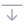            | .arrowbar-down-line            |
|  | .arrows-expand-horizontal-line | 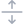 | .arrows-expand-vertical-line | 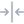 | .arrows-collapse-horizontal-line | 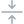 | .arrows-collapse-vertical-line |
|         | .arrows-horizontal-line        |         | .arrows-vertical-line        |      | .arrows-expand-diagonal-line     |  | .arrows-collapse-diagonal-line |
|           | .arrowbox-out-up-line          |       | .arrowbox-out-left-line      |          | .arrowbox-out-right-line         |         | .arrowbox-out-down-line        |
|       | .arrowbox-out-upleft-line      |    | .arrowbox-out-upright-line   |       | .arrowbox-out-downleft-line      |    | .arrowbox-out-downright-line   |
|            | .arrowbox-in-up-line           |        | .arrowbox-in-left-line       |           | .arrowbox-in-right-line          |          | .arrowbox-in-down-line         |
|        | .arrowbox-in-upleft-line       |     | .arrowbox-in-upright-line    |        | .arrowbox-in-downleft-line       |     | .arrowbox-in-downright-line    |

#### Tabla de Íconos de Número

| Icono                                   | Estilo            | Icono                                   | Estilo            | Icono                                   | Estilo            | Icono                                   | Estilo            |
| :---:                                   | ------            | :---:                                   | ------            | :---:                                   | ------            | :---:                                   | ------            |
|  | .num0-circle-line |  | .num0-circle-fill |  | .num1-circle-line |  | .num1-circle-fill |
|  | .num2-circle-line |  | .num2-circle-fill |  | .num3-circle-line |  | .num3-circle-fill |
|  | .num4-circle-line |  | .num4-circle-fill |  | .num5-circle-line |  | .num5-circle-fill |
|  | .num6-circle-line |  | .num6-circle-fill |  | .num7-circle-line |  | .num7-circle-fill |
|  | .num8-circle-line |  | .num8-circle-fill |  | .num9-circle-line |  | .num9-circle-fill |

#### Tabla de Íconos de Persona

| Icono                                     | Estilo              | Icono                                     | Estilo              | Icono                                      | Estilo               | Icono                                      | Estilo               |
| :---:                                     | ------              | :---:                                     | ------              | :---:                                      | ------               | :---:                                      | ------               |
|            | .man-fill           |          | .woman-fill         |          | .person-line         |          | .person-fill         |
|    | .person-plus-line   |    | .person-plus-fill   |     | .person-dash-line    |     | .person-dash-fill    |
|   | .person-check-line  |   | .person-check-fill  |        | .person-x-line       |        | .person-x-fill       |
|         | .people-line        |         | .people-fill        |  | .person-contact-line |  | .person-contact-fill |
|    | .person-card-line   |    | .person-card-fill   |    | .person-names-line   |    | .person-names-fill   |
|  | .person-circle-line |  | .person-circle-fill |            | .user-line           |                                            |                      |

#### Tabla de Íconos de Archivo

| Icono                                    | Estilo             | Icono                                    | Estilo             | Icono                                     | Estilo              | Icono                                     | Estilo              |
| :---:                                    | ------             | :---:                                    | ------             | :---:                                     | ------              | :---:                                     | ------              |
|  | .folder-close-line |  | .folder-close-fill |    | .folder-open-line   |    | .folder-open-fill   |
|          | .file-line         |          | .file-fill         |  | .file-barchart-line |  | .file-barchart-fill |
|    | .file-check-line   |    | .file-check-fill   |       | .file-pdf-line      |       | .file-pdf-fill      |
|    | .file-image-line    |   | .file-image-fill   |      | .file-text-line     |      | .file-text-fill     |
|   | .file-upload-line  |   | .file-upload-fill  |       | .file-zip-line      |       | .file-zip-fill      |

#### Tabla de Íconos de Control

| Icono                                       | Estilo                | Icono                                       | Estilo                | Icono                                      | Estilo               | Icono                                      | Estilo               |
| :---:                                       | ------                | :---:                                       | ------                | :---:                                      | ------               | :---:                                      | ------               |
|         | .calendar-line        |         | .calendar-fill        |    | .calendar-day-line   | 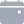   | .calendar-day-fill   |
|    | .calendar-week-line   | 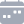   | .calendar-week-fill   |  | .calendar-range-line |  | .calendar-range-fill |
|  | .clipboard-check-line |  | .clipboard-check-fill |  | .clipboard-data-line |  | .clipboard-data-fill |
|         | .bookmark-line        | 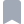        | .bookmark-fill        |       | .bookmarks-line      |       | .bookmarks-fill      |
|   | .bookmark-check-line  |   | .bookmark-check-fill  |      | .bookmark-x-line     | 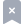     | .bookmark-x-fill     |

#### Tabla de Íconos de Protección

| Icono                                      | Estilo             | Icono                                    | Estilo             | Icono                                      | Estilo               | Icono                                      | Estilo               |
| :---:                                      | ------             | :---:                                    | ------             | :---:                                      | ------               | :---:                                      | ------               |
|    | .shield-check-line |  | .shield-check-fill |     | .shield-lock-line    |     | .shield-lock-fill    |
|     | .patch-check-line  |   | .patch-check-fill  |  | .patch-question-line |  | .patch-question-fill |

#### Tabla de Íconos de Comunicación

| Icono                                       | Estilo                | Icono                                       | Estilo                | Icono                                      | Estilo               | Icono                                      | Estilo               |
| :---:                                       | ------                | :---:                                       | ------                | :---:                                      | ------               | :---:                                      | ------               |
|            | .phone-line           |            | .phone-fill           |       | .phonebook-line      |       | .phonebook-fill      |
|       | .mail-close-line      |       | .mail-close-fill      |       | .chat-dots-line      |       | .chat-dots-fill      |
|  | .chat-left-quote-line |  | .chat-left-quote-fill |  | .chat-left-text-line |  | .chat-left-text-fill |
|    | .emoji-neutral-line   |    | .emoji-neutral-fill   |     | .emoji-smile-line    |     | .emoji-smile-fill    |
|      | .emoji-frown-line     |      | .emoji-frown-fill     |  | .emoji-surprise-line |  | .emoji-surprise-fill |

#### Tabla de Íconos de Nube

| Icono                                    | Estilo             | Icono                                    | Estilo             | Icono                                      | Estilo               | Icono                                      | Estilo               |
| :---:                                    | ------             | :---:                                    | ------             | :---:                                      | ------               | :---:                                      | ------               |
|         | .cloud-line        |         | .cloud-fill        |     | .cloud-slash-line    |     | .cloud-slash-fill    |
|  | .cloud-upload-line |  | .cloud-upload-fill |  | .cloud-download-line |  | .cloud-download-fill |

#### Tabla de Íconos de Mapa

| Icono                                     | Estilo              | Icono                                       | Estilo                | Icono                                  | Estilo           |
| :---:                                     | ------              | :---:                                       | ------                | :---:                                  | ------           |
|            | .map-line           |              | .map-fill             |                                     |                  |
|        | .map-alt-line       |          | .map-alt-fill         |                                     |                  |
|      | .mapmarker-line     |        | .mapmarker-fill       |  | .mapmarker-color |
|         | .mappin-line        |           | .mappin-fill          |     | .mappin-color    |
|     | .mappointer-line    |       | .mappointer-fill      |                                     |                  |
| 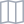      | .mapchart-line      | 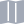        | .mapchart-fill        |                                     |                  |
|          | .globe-line         |        | .globe-alt-line       |                                     |                  |
|  | .globe-america-fill |     | .globe-africa-fill    |                                     |                  |
|     | .globe-asia-fill    |  | .globe-australia-fill |                                     |                  |
|       | .h-circle-line      |         | .h-circle-fill        |                                     |                  |
|     | .highway-66-fill    |       | .highway-75-fill      |  | .highway-94-fill |

#### Tabla de Íconos de Dispositivo

| Icono                                   | Estilo            | Icono                                   | Estilo            | Icono                                | Estilo         | Icono                                  | Estilo           |
| :---:                                   | ------            | :---:                                   | ------            | :---:                                | ------         | :---:                                  | ------           |
|      | .devices-line     |       | .laptop-line      |    | .mobile-line   |  | .mobile-alt-line |
|  | .mobile-apps-line |  | .mobile-apps-fill |  | .computer-line |      | .camera-fill     |

#### Tabla de Íconos de Marca

| Icono                               | Estilo        | Icono                             | Estilo      | Icono                              | Estilo       |
| :---:                               | ------        | :---:                             | ------      | :---:                              | ------       |
|  | .android-fill |  | .apple-fill |  | .huawei-fill |

#### Tabla de Íconos de Aplicaciones

| Icono                                     | Estilo              | Icono                                        | Estilo                 | Icono                                     | Estilo              | Icono                                      | Estilo               |
| :---:                                     | ------              | :---:                                        | ------                 | :---:                                     | ------              | :---:                                      | ------               |
|            | .app-line           |  | .app-notification-line |        | .acrobat-fill       |        | .acrobat-color       |      
|      | .applemail-fill     |        | .applemail-color       |       | .appstore-fill      |       | .appstore-color      |  
|   | .appstore-alt-fill  |     | .appstore-alt-color    |         | .bcardy-fill        |         | .bcardy-color        |  
|        | .behance-fill       |          | .behance-color         |         | .claude-fill        |         | .claude-color        |
|       | .facebook-fill      |         | .facebook-color        |   | .facebook-alt-fill  |   | .facebook-alt-color  |
|         | .github-fill        |           | .github-color          |          | .gmail-fill         |          | .gmail-color         |
|     | .googlemaps-fill    |       | .googlemaps-color      |     | .googleplay-fill    |     | .googleplay-color    |
|      | .instagram-fill     |        | .instagram-color       |  | .instagram-alt-fill |  | .instagram-alt-color |
|           | .line-fill          |             | .line-color            |       | .line-alt-fill      |       | .line-alt-color      |
|       | .linkedin-fill      |         | .linkedin-color        |   | .linkedin-alt-fill  |   | .linkedin-alt-color  |
|      | .messenger-fill     |        | .messenger-color       |        | .outlook-fill       |        | .outlook-color       |
|   | .samsungemail-fill  |     | .samsungemail-color    |          | .skype-fill         |          | .skype-color         |
|       | .telegram-fill      |         | .telegram-color        |   | .telegram-alt-fill  |   | .telegram-alt-color  |
|         | .tiktok-fill        |           | .tiktok-color          |        | .twitter-fill       |        | .twitter-color       |
|    | .twitter-alt-fill   |      | .twitter-alt-color     |      | .twitter-x-fill     |      | .twitter-x-color     |
|          | .vimeo-fill         |            | .vimeo-color           |      | .vimeo-alt-fill     |      | .vimeo-alt-color     |
|          | .yahoo-fill         |            | .yahoo-color           |      | .yahoo-alt-fill     |      | .yahoo-alt-color     |
|        | .youtube-fill       |          | .youtube-color         |       | .whatsapp-fill      |       | .whatsapp-color      |
|   | .whatsapp-alt-fill  |     | .whatsapp-alt-color    |          | .wuijs-fill         |          | .wuijs-color         |

#### Tabla de Íconos de Opciones

| Icono                                   | Estilo            | Icono                                       | Estilo                | Icono                                        | Estilo                 | Icono                                        | Estilo                 |
| :---:                                   | ------            | :---:                                       | ------                | :---:                                        | ------                 | :---:                                        | ------                 |
|           | .at-line          |            | .at-lg-line           |             | .award-line            |             | .award-fill            |
|       | .basket-line      |           | .basket-fill          |              | .bell-line             |              | .bell-fill             |
|    | .bluetooth-line   |        | .bluetooth-fill       |               | .bug-line              |               | .bug-fill              |
|         | .cash-line        |         | .cash-alt-fill        |            | .circle-line           |            | .circle-fill           |
|     | .contacts-line    |         | .contacts-fill        |              | .copy-line             |              | .copy-fill             |
|    | .copy-link-line   |        | .copy-link-fill       |             | .easel-line            |             | .easel-fill            |
|          | .eye-line         |              | .eye-fill             |         | .eye-slash-line        |         | .eye-slash-fill        |
|         | .flag-line        |             | .flag-fill            |            | .floppy-line           | 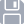           | .floppy-fill           |
|         | .gear-line        |             | .gear-fill            |             | .gears-line            |             | .gears-fill            |
|      | .grid3x2-line     |          | .grid3x3-line         |            | .health-line           |            | .health-fill           |
|         | .home-line        |             | .home-fill            |             | .image-line            |             | .image-fill            |
|    | .image-alt-line   |           | .images-line          |               | .key-line              |               | .key-fill              |
|     | .keyboard-line    |         | .keyboard-fill        |            | .layers-line           |            | .layers-fill           |
|    | .lightbulb-line   |        | .lightbulb-fill       |              | .lock-line             |              | .lock-fill             |
|      | .mailbox-line     |          | .mailbox-fill         |              | .moon-line             |              | .moon-fill             |
|   | .moon-stars-line  |       | .moon-stars-fill      |       | .mortarboard-line      |       | .mortarboard-fill      |
|     | .piechart-line    |         | .piechart-fill        |           | .palette-line          |           | .palette-fill          |
|          | .pen-line         |              | .pen-fill             |            | .pencil-line           |            | .pencil-fill           |
|          | .pin-line         |              | .pin-fill             |             | .plant-line            |             | .plant-fill            |
|         | .play-line        |             | .play-fill            |       | .play-circle-line      |       | .play-circle-fill      |
|         | .send-line        |             | .send-fill            | 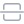      | .separationh-line      |       | .separationv-line      |
|        | .share-line       |            | .share-fill           |              | .shop-line             |          | .shop-alt-fill         |
|     | .signpost-line    |         | .signpost-fill        |               | .sim-line              |               | .sim-fill              |
|         | .star-line        |             | .star-fill            |       | .star-circle-line      |       | .star-circle-fill      |
|   | .stoplights-line  |       | .stoplights-fill      |               | .sun-line              |               | .sun-fill              |
|  | .thermometer-line |  | .thermometer-low-line |  | .thermometer-half-line |  | .thermometer-high-line |
|         | .time-line        |             | .time-fill            |             | .trash-line            |             | .trash-fill            |
|       | .trophy-line      |           | .trophy-fill          |            | .unlock-line           |            | .unlock-fill           |
|       | .wallet-line      |           | .wallet-fill          |           | .wifi-on-line          |          | .wifi-off-line         |
|   | .window-app-line  |       | .window-app-fill      |            | .wrench-line           |            | .wrench-fill           |
|       | .zoomin-line      |          | .zoomout-line         |                                              |                        |                                              |                        |

#### Tabla de Íconos de Compositor

| Icono                                         | Estilo                  | Icono                                          | Estilo                   | Icono                                   | Estilo            | Icono                                     | Estilo              |
| :---:                                         | ------                  | :---:                                          | ------                   | :---:                                   | ------            | :---:                                     | ------              |
|  | .doublequotes-left-fill |  | .doublequotes-right-fill |  | .indent-left-line |   | .indent-right-line  |
|               | .link-line              |            | .link-alt-line           |         | .list-line        |     | .list-check-line    |
|        | .list-number-line       |          | .list-stars-line         |    | .list-task-line   |  | .list-unorderd-line |
|        | .text-center-line       |      | .text-paragraph-line     |    | .text-left-line   |     | .text-right-line    |

#### Tabla de Otros Íconos

| Icono                                        | Estilo                 | Icono                                        | Estilo                 | Icono                                        | Estilo                 | Icono                                  | Estilo           |
| :---:                                        | ------                 | :---:                                        | ------                 | :---:                                        | ------                 | :---:                                  | ------           |
|                | .ai-fill               |          | .bullseye-line         |        | .columnsgap-line       |        | .dart-fill       |
|         | .datasheet-line        |  | .datasheet-health-line |              | .hash-line             |  | .headphones-line |
|           | .headset-line          |               | .lab-fill              |            | .logout-line           |       | .medal-line      |
|              | .menu-line             |     | .pencil-square-fill    |  | .polygon-editable-line | 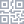         | .qr-line         |
|           | .qr-scan-line          |             | .quote-fill            |            | .rotate-line           |      | .search-line     |
|       | .speedometer-line      |         | .translate-fill        |               | .web-line              |   | .universal-line  |
|  | .universal-circle-line |                                              |                        |                                              |                        |                                        |                  | 

#### Tabla de Íconos Animados

| Icono                                          | Estilo                   | Icono                                         | Estilo                  | Icono                                             | Estilo                      |
| :---:                                          | ------                   | :---:                                         | ------                  | :---:                                             | ------                      |
|  | .animation-loarder-comet |  | .animation-loarder-ring |  | .animation-loarder-ringpath |

#### Variables CSS

| Variable                  | Descripción |
| ------------------------- | ----------- |
| `--wui-icon-bgcolor-out`  | Color de los íconos monocromáticos en estado normal. |
| `--wui-icon-bgcolor-over` | Color de los íconos monocromáticos en estado hover/focus. |

#### Herramienta de generación de imágenes SVG

El script `tools/svg-icon-maker.py` crea el set de archivos SVG en base a todos los estilos de icono disponibles en la librería WUIIcon.

```bash
python ./svg-icon-maker.py

python ./svg-icon-maker.py --css <css-path> -o <output-directory> -c <color> -s <size>
```

| Opción             | Valor predeterminado                       | Descripción |
| ------------------ | ------------------------------------------ | ----------- |
| `--css`            | `../src/wui-js/main/icon/wui-icon-0.4.css` | Ruta al archivo CSS fuente. |
| `-o`,<br>`--out`   | `../imgs/icons/`                           | Directorio de salida para los archivos generados. |
| `-c`,<br>`--color` | `#a2a9b6`                                  | Color en formato CSS compatible que reemplazará a la sentencia 'currentColor' en el código SVG. |
| `-s`,<br>`--size`  | `24`                                       | Tamaño en píxeles (ancho y alto) de las imágenes del set. |

#### Implementación

Código CSS:

```css
html,
body {
	height: 100%;
	margin: 0;
	padding: 0;
}

nav {
	display: flex;
	margin: 10px;
	align-items: center;
	gap: 10px;
}

.my-icon {
	width: 24px;
	height: 24px;
	margin: 10px;
}
```

Cabecera HTML:

```html
<link type="text/css" rel="stylesheet" href="/libraries/wui-js/main/icon/wui-icon-0.4.root.css">
<link type="text/css" rel="stylesheet" href="/libraries/wui-js/main/icon/wui-icon-0.4.css">
```

Código HTML:

```html
<nav>
	<div class="my-icon">
		<div class="wui-icon patch-check-fill"></div>
	</div>
	<div class="my-icon">
		<div class="wui-icon patch-question-fill"></div>
	</div>
</nav>
```

> [!TIP]
> Puede revisar este ejemplo funcional en CodeSandbox en el enlace: [https://codesandbox.io/p/sandbox/github/wui-js/wuijs-demos/tree/main/demos/main/icon/basic](https://codesandbox.io/p/sandbox/github/wui-js/wuijs-demos/tree/main/demos/main/icon/basic).

<a name="wui-fade"></a>

### WUIFade

Versión: `0.3`

Utilidades para control de salida y entrada con opacidad (fade-out y fade-in respectivamente) de elementos HTML. |

Es una clase estática que no posee un constructor ni propiedades.

#### Fuentes

| Tipo | Archivo |
|:----:| ------- |
| JS   | [src/wui-js/main/fade/wui-fade-0.3.js](https://github.com/wui-js/wuijs-main-lib/blob/main/src/wui-js/main/fade/wui-fade-0.3.js) |

#### Métodos

##### Metodos estáticos de la clase `WUIFade`:

Un modo de utilizar la librería es mediante el llamado de los métodos estáticos directamente sobre la clase `WUIFade`:

| Método | Tipo retorno | Descripción |
| ------ | ------------ | ----------- |
| in     | `void`       | `in(element[, options])`<br><br>Parámetros:<br>**• element:** `HTMLElement` <br>**• options:** `object` *opcional*<br><br>Ejecuta la transición de entrada. |
| out    | `void`       | `out(element[, options])`<br><br>Parámetros:<br>**• element:** `HTMLElement` <br>**• options:** `object` *opcional*<br><br>Ejecuta la transición de salida. |

##### Metodos extendidos de la clase `HTMLElement`:

Otro modo alternativo es mediante métodos extendidos de la clase `HTMLElement` por medio de su prototipo:

| Método.    | Tipo retorno | Descripción |
| ---------- | ------------ | ----------- |
| wuiFadein  | `void`       | `wuiFadein([options])`<br><br>Parámetros:<br>**• options:** `object` *opcional*<br><br>Ejecuta la transición de entrada. |
| wuiFadeout | `void`       | `wuiFadeout([options])`<br><br>Parámetros:<br>**• options:** `object` *opcional*<br><br>Ejecuta la transición de salida. |

> [!IMPORTANT]
> Cada modo de llamado de métodos se realiza sobre distintos tipos de clases, la primera se sealiza sobre `WUIFade`, mientras que la segunda sobre `HTMLElement`.

##### Opciones

| Opción  | Tipo      | Valor predeterminado | Descripción |
| ------- | --------- | -------------------- | ----------- |
| delay   | `number`  | `400`                | Define el tiempo que tardará la transición del efecto de entrada y de salida medido en milisegundos. |
| display | `string`  | `"block"`            | Establece el valor de la propiedad CSS `display` del elemento HTML en el que se ejecuta el efecto de transición, una vez que la transición de entrada finaliza. |
| force   | `boolean` | `false`              | Ambos efectos, entrada y salida, son ejecutadas siempre y cuando la propiedad CSS `display` sea distinta a `options.display` y a `"none"` respectivamente. La opción `force` ignora esta validación. |

#### Implementación

Código CSS:

```CSS
html,
body {
	height: 100%;
	margin: 0;
	padding: 0;
}

body {
	font-family: Arial, Helvetica, Verdana, sans-serif;
	font-size: 14px;
}

nav {
	display: flex;
	margin: 10px;
	align-items: center;
	gap: 10px;
}

.my-button {
	margin: 0;
	padding: 0px 5px;
}

.my-element {
	display: none;
	width: 64px;
	height: 64px;
	margin: 10px;
	background-color: red;
}
```

Cabecera HTML:

```html
<script type="text/javascript" src="/libraries/wui-js/main/fade/wui-fade-0.3.js"></script>
```

Código HTML:

```html
<nav>
	<button class="my-button fadein">fade-in</button>
	<button class="my-button fadeout">fade-out</button>
</nav>

<div id="myElement" class="my-element"></div>
```

Código JS:
```js
const init = () => {
	const element = document.getElementById("myElement");
	const fadeinButton = document.querySelector(".my-button.fadein");
	const fadeoutButton = document.querySelector(".my-button.fadeout");
	const options = {
		delay: 200,
		//display: "block"
	};
	fadeinButton.addEventListener("click", () => {
		element.wuiFadein(options);
		// o alternativamente
		//WUIFade.in(element, options);
	});
	fadeoutButton.addEventListener("click", () => {
		element.wuiFadeout(options);
		// o alternativamente
		//WUIFade.out(element, options);
	});
}

window.addEventListener("DOMContentLoaded", init);
```

> [!TIP]
> Puede revisar este ejemplo funcional en CodeSandbox en el enlace: [https://codesandbox.io/p/sandbox/github/wui-js/wuijs-demos/tree/main/demos/main/fade/basic](https://codesandbox.io/p/sandbox/github/wui-js/wuijs-demos/tree/main/demos/main/fade/basic).

<a name="wui-loader"></a>

### WUILoader

Version: `0.4`

Componente para la implementación de animaciones de carga

#### Fuentes

| Tipo | Archivo |
|:----:| ------- |
| JS   | [src/wui-js/main/loader/wui-loader-0.4.js](https://github.com/wui-js/wuijs-main-lib/blob/main/src/wui-js/main/loader/wui-loader-0.4.js) |
| CSS  | [src/wui-js/main/loader/wui-loader-0.4.css](https://github.com/wui-js/wuijs-main-lib/blob/main/src/wui-js/main/loader/wui-loader-0.4.css) |
| CSS  | [src/wui-js/main/loader/wui-loader-0.4.root.css](https://github.com/wui-js/wuijs-main-lib/blob/main/src/wui-js/main/loader/wui-loader-0.4.root.css) |

#### Constructor

| Tipo       | Descripción |
| ---------- | ----------- |
| WUILoader  | `WUILoader([properties])`<br><br>Parámetros:<br>**• properties:** `object` *opcional* |

#### Propiedades

| Propiedad | Tipo     | Valor predeterminado | Descripción |
| --------- | -------- | -------------------- | ----------- |
| selector  | `string` | `".wui-loader"`      | (get/set)<br><br>Selector CSS que define el elemento HTML que serán convertido en el objeto. En caso de existir más de un elemento coincidente con el selector se incluirá únicamente la primera coincidencia. |
| style     | `string` | `"ring"`             | (get/set)<br><br>Estilo de la animación de carga.<br><br>Valores:<br>• `"ring"`, anillo.<br>• `"dualring"`, anillo dual.<br>• `"spinner"`, spinner.<br>• `"roller"`, roller.<br>• `"ellipsis"`, puntos.<br>• `"grid"`, grilla. |
| size      | `number` | `60`                 | (get/set)<br><br>Tamaño de la animación de carga en píxeles. |
| dataStyle | `string` | `"style"`            | (get/set)<br><br>Nombre del atributo `data-*` que contiene el valor de la propiedad `style`. |
| dataSize  | `string` | `"size"`             | (get/set)<br><br>Nombre del atributo `data-*` que contiene el valor de la propiedad `size`. |

#### Métodos

| Método       | Tipo retorno | Descripción |
| ------------ | ------------ | ----------- |
| getElements  | `NodeList`   | `getElements()`<br><br>Retorna una lista de elementos HTML con los contenedores de los objetos tipo animación de carga. |
| init         | `void`       | `init()`<br><br>Inicializa los objetos tipo animación de carga	. |
| destroy      | `void`       | `destroy()`<br><br>Destructor. |

#### Variables CSS

| Variable             | Descripción |
| -------------------- | ----------- |
| `--wui-loader-color` | Color de la animación de carga. |

#### Implementación

<a name="wui-tooltip"></a>

### WUITooltip

Versión: `0.3`

Componente para la implementación de textos de información emergente (tooltip).

#### Fuentes

| Tipo | Archivo |
|:----:| ------- |
| JS   | [src/wui-js/main/tooltip/wui-tooltip-0.3.js](https://github.com/wui-js/wuijs-main-lib/blob/main/src/wui-js/main/tooltip/wui-tooltip-0.3.js) |
| CSS  | [src/wui-js/main/tooltip/wui-tooltip-0.3.css](https://github.com/wui-js/wuijs-main-lib/blob/main/src/wui-js/main/tooltip/wui-tooltip-0.3.css) |
| CSS  | [src/wui-js/main/tooltip/wui-tooltip-0.3.root.css](https://github.com/wui-js/wuijs-main-lib/blob/main/src/wui-js/main/tooltip/wui-tooltip-0.3.root.css) |

#### Constructor

| Tipo       | Descripción |
| ---------- | ----------- |
| WUITooltip | `WUITooltip([propiedades])`<br><br>Argumentos:<br>**• propiedades:** `object` *opcional* |

#### Propiedades

| Propiedad | Tipo     | Valor por defecto        | Descripción |
| --------- | -------- | ------------------------ | ----------- |
| selector  | `string` | `".wui-tooltip-target"` | (get/set)<br><br>Selector CSS que define los elementos HTML que actúan como disparadores del tooltip. Si más de un elemento coincide con el selector, todos serán incluidos. |

#### Métodos

| Método      | Tipo de retorno | Descripción |
| ----------- | --------------- | ----------- |
| getElements | `NodeList`      | `getElements()`<br><br>Retorna la lista de elementos HTML que actúan como disparadores del tooltip. |
| init        | `void`          | `init()`<br><br>Inicializa el objeto, vinculando los eventos hover a todos los elementos objetivo. |
| lock        | `void`          | `lock()`<br><br>Bloquea todos los tooltips en estado abierto. |
| unlock      | `void`          | `unlock()`<br><br>Desbloquea todos los tooltips, restaurando el comportamiento hover normal. |
| destroy     | `void`          | `destroy()`<br><br>Destructor. |

#### Variables CSS

| Variable                   | Descripción |
| -------------------------- | ----------- |
| `--wui-tooltip-open-delay` | Retraso antes de que aparezca el tooltip. |
| `--wui-tooltip-bgcolor`    | Color de fondo del tooltip. |
| `--wui-tooltip-textcolor`  | Color del texto del tooltip. |

#### Implementación

Código CSS:

```css
html,
body {
	height: 100%;
	margin: 0;
	padding: 0;
}

.my-container {
	position: relative;
	display: inline-block;
}
```

Cabecera HTML:

```html
<link type="text/css" rel="stylesheet" href="/libraries/wui-js/main/tooltip/wui-tooltip-0.3.root.css">
<link type="text/css" rel="stylesheet" href="/libraries/wui-js/main/tooltip/wui-tooltip-0.3.css">
<script type="text/javascript" src="/libraries/wui-js/main/tooltip/wui-tooltip-0.3.js"></script>
```

Código HTML:

```html
<div class="wui-tooltip-target my-container">
	<button>Pasa el cursor aquí</button>
	<div class="wui-tooltip-top">Texto del tooltip</div>
</div>
```

Código JS:

```js
const init = () => {
	const tooltip = new WUITooltip({
		selector: ".wui-tooltip-target.my-container"
	});
	tooltip.init();
}

window.addEventListener("DOMContentLoaded", init);
```

<a name="wui-modal"></a>

### WUIModal

Versión: `0.5`

Componente para la implementación de cuadros de diálogo (tipo `message`) y ventanas emergentes (tipo `page`).

#### Fuentes

| Tipo | Archivo |
|:----:| ------- |
| JS   | [src/wui-js/main/modal/wui-modal-0.5.js](https://github.com/wui-js/wuijs-main-lib/blob/main/src/wui-js/main/modal/wui-modal-0.5.js) |
| CSS  | [src/wui-js/main/modal/wui-modal-0.5.css](https://github.com/wui-js/wuijs-main-lib/blob/main/src/wui-js/main/modal/wui-modal-0.5.css) |
| CSS  | [src/wui-js/main/modal/wui-modal-0.5.root.css](https://github.com/wui-js/wuijs-main-lib/blob/main/src/wui-js/main/modal/wui-modal-0.5.root.css) |

#### Constructor

| Tipo     | Descripción |
| -------- | ----------- |
| WUIModal | `WUIModal([properties])`<br><br>Parámetros:<br>**• properties:** `object` *opcional* |

#### Propiedades

| Propiedad    | Tipo       | Valor predeterminado | Descripción |
| ------------ | ---------- | -------------------- | ----------- |
| selector     | `string`   | `""`                 | (get/set)<br><br>Selector CSS que define el elemento HTML contenedor del objeto. En caso de existir más de un elemento coincidente con el selector se incluirá únicamente la primera coincidencia. |
| openDelay    | `number`   | `200`                | (get/set)<br><br>Duración de apertura del modal en milisegundos. |
| onStartOpen  | `function` | `null`               | (get/set)<br><br>Función que se ejecuta cuando inicia la apertura del modal. |
| onOpen       | `function` | `null`               | (get/set)<br><br>Función que se ejecuta cuando el modal se ha abierto completamente. |
| onMaximize   | `function` | `null`               | (get/set)<br><br>Función que se ejecuta cuando el modal se maximiza. |
| onScrolling  | `function` | `null`               | (get/set)<br><br>Función que se ejecuta durante el scroll del cuerpo del modal. |
| onStartClose | `function` | `null`               | (get/set)<br><br>Función que se ejecuta cuando inicia el cierre del modal. |
| onClose      | `function` | `null`               | (get/set)<br><br>Función que se ejecuta cuando el modal se ha cerrado completamente. |
| onBack       | `function` | `null`               | (get/set)<br><br>Función que se ejecuta cuando se pulsa el botón de retroceso del modal. |

#### Métodos de la Clase

| Método           | Tipo retorno | Descripción |
| ---------------- | ------------ | ----------- |
| getAllInstances  | `Array`      | `WUIModal.getAllInstances()` *(método estático)*<br><br>Retorna todas las instancias de WUIModal. |
| getOpenInstances | `Array`      | `WUIModal.getOpenInstances()` *(método estático)*<br><br>Retorna todas las instancias abiertas de WUIModal. |
| closeAll         | `void`       | `WUIModal.closeAll([except])` *(método estático)*<br><br>Parámetros:<br>**• except:** `string` *opcional*, selector del modal que se excluirá de la secuencia de cierre.<br><br>Cierra todos los modales excepto el especificado por selector. |

#### Métodos de la Instancia

| Método        | Tipo retorno  | Descripción |
| ------------- | ------------- | ----------- |
| getElement    | `HTMLElement` | `getElement()`<br><br>Retorna el elemento HTML contenedor del objeto. |
| getBox        | `HTMLElement` | `getBox()`<br><br>Retorna el elemento HTML de la caja del modal. |
| getHeader     | `HTMLElement` | `getHeader()`<br><br>Retorna el elemento HTML de la cabecera del modal. |
| getBack       | `HTMLElement` | `getBack()`<br><br>Retorna el elemento HTML del botón de retroceso del modal. |
| getTopbar     | `HTMLElement` | `getTopbar()`<br><br>Retorna el elemento HTML de la barra superior del modal. |
| getTitle      | `HTMLElement` | `getTitle()`<br><br>Retorna el elemento HTML del título del modal. |
| getClose      | `HTMLElement` | `getClose()`<br><br>Retorna el elemento HTML del botón de cierre del modal. |
| getBody       | `HTMLElement` | `getBody()`<br><br>Retorna el elemento HTML del cuerpo del modal. |
| getFooter     | `HTMLElement` | `getFooter()`<br><br>Retorna el elemento HTML del pie del modal. |
| getStatus     | `string`      | `getStatus()`<br><br>Retorna el estado actual del modal como cadena separada por comas. Posibles valores: `"opened"`, `"maximized"`, `"under"`, `"close"`. |
| setHeadBorder | `void`        | `setHeadBorder(border)`<br><br>Parámetros:<br>**• border:** `boolean`.<br><br>Establece si la cabecera tiene borde inferior. |
| init          | `void`        | `init()`<br><br>Inicializa el objeto. |
| open          | `void`        | `open([onOpen[, delay]])`<br><br>Parámetros:<br>**• onOpen:** `function` *opcional*, función que se ejecuta al abrir el modal. El valor predeterminado corresponde al de la propiedad `onOpen`.<br>**• delay:** `number` *opcional*, duración de apertura del modal en milisegundos. El valor predeterminado corresponde al de la propiedad `openDelay`.<br><br>Abre el modal. |
| resposive     | `void`        | `resposive()`<br><br>Ajusta el modal al tamaño de la ventana. |
| maximize      | `void`        | `maximize([onMaximize[, delay]])`<br><br>Parámetros:<br>**• onMaximize:** `function` *opcional*, función que se ejecuta al maximizar el modal. El valor predeterminado corresponde al de la propiedad `onMaximize`.<br>**• delay:** `number` *opcional*, duración de apertura del modal en milisegundos. El valor predeterminado corresponde al de la propiedad `openDelay`.<br><br>Maximiza el modal. |
| close         | `void`        | `close([onClose[, delay]])`<br><br>Parámetros:<br>**• onClose:** `function` *opcional*, función que se ejecuta al cerrar el modal. El valor predeterminado corresponde al de la propiedad `onClose`.<br>**• delay:** `number` *opcional*, duración de apertura del modal en milisegundos. El valor predeterminado corresponde al de la propiedad `openDelay`.<br><br>Cierra el modal. |
| isOpen        | `boolean`     | `isOpen()`<br><br>Retorna si el modal está abierto. |
| destroy       | `void`        | `destroy()`<br><br>Destructor. |

#### Variables CSS

| Variable                                             | Descripción |
| ---------------------------------------------------- | ----------- |
| `--wui-modal-overlay-bgcolor`                        | Color de fondo del overlay del modal. |
| `--wui-modal-box-borderradius`                       | Radio de borde de la caja del modal. |
| `--wui-modal-box-bgcolor`                            | Color de fondo de la caja del modal. |
| `--wui-modal-back-textcolor`                         | Color del texto del botón de retroceso. |
| `--wui-modal-close-bgcolor`                          | Color de fondo del botón de cierre. |
| `--wui-modal-topbar-height`                          | Altura de la barra superior del modal. |
| `--wui-modal-title-textfont`                         | Fuente del texto del título del modal. |
| `--wui-modal-title-textcase`                         | Transformación del texto del título (uppercase, lowercase, none). |
| `--wui-modal-title-textcolor`                        | Color del texto del título del modal. |
| `--wui-modal-body-scroll-bgcolor-out`                | Color de la barra de desplazamiento del cuerpo en estado normal. |
| `--wui-modal-body-scroll-bgcolor-over`               | Color de la barra de desplazamiento del cuerpo en estado hover. |
| `--wui-modal-footer-bordercolor`                     | Color del borde del pie del modal. |
| `--wui-modal-button-submit-bgcolor-mobile`           | Color de fondo del botón de envío en modo móvil. |
| `--wui-modal-button-submit-textcolor-mobile`         | Color del texto del botón de envío en modo móvil. |
| `--wui-modal-button-warning-textcolor-mobile`        | Color del texto del botón de advertencia en modo móvil. |
| `--wui-modal-message-box-width`                      | Ancho de la caja del modal tipo mensaje. |
| `--wui-modal-message-box-bgcolor`                    | Color de fondo de la caja del modal tipo mensaje. |
| `--wui-modal-message-box-textcolor`                  | Color del texto de la caja del modal tipo mensaje. |
| `--wui-modal-message-linkcolor`                      | Color de los enlaces en el modal tipo mensaje. |
| `--wui-modal-message-mobile-box-width`               | Ancho de la caja del modal tipo mensaje en modo móvil. |
| `--wui-modal-message-mobile-footer-bordercolor`      | Color del borde del pie del modal tipo mensaje en modo móvil. |
| `--wui-modal-message-mobile-button-bordercolor`      | Color del borde de los botones del modal tipo mensaje en modo móvil. |
| `--wui-modal-page-box-width`                         | Ancho de la caja del modal tipo página. |
| `--wui-modal-page-box-height`                        | Altura de la caja del modal tipo página. |
| `--wui-modal-page-box-borderradius`                  | Radio de borde de la caja del modal tipo página. |
| `--wui-modal-page-box-maxheight`                     | Altura máxima de la caja del modal tipo página. |
| `--wui-modal-page-box-bgcolor`                       | Color de fondo de la caja del modal tipo página. |
| `--wui-modal-page-header-topbar-bgcolor`             | Color de fondo de la barra superior de la cabecera del modal tipo página. |
| `--wui-modal-page-header-bordercolor`                | Color del borde de la cabecera del modal tipo página. |
| `--wui-modal-slidepage-box-margin`                   | Margen de la caja del modal tipo página deslizante. |
| `--wui-modal-smallpage-box-width`                    | Ancho de la caja del modal tipo página pequeña. |
| `--wui-modal-smallpage-box-height`                   | Altura de la caja del modal tipo página pequeña. |
| `--wui-modal-mobile-page-box-topmargin`              | Margen superior de la caja del modal tipo página en modo móvil. |
| `--wui-modal-mobile-page-box-borderradius-maximized` | Radio de borde máximizado de la caja del modal tipo página en modo móvil. |

#### Implementación

Código CSS:

```css
html,
body {
	height: 100%;
	margin: 0;
	padding: 0;
}

body {
	font-family: Arial, Helvetica, Verdana, sans-serif;
	font-size: 14px;
}

nav {
	display: flex;
	margin: 10px;
	align-items: center;
	gap: 10px;
}

.my-output {
	font-family: monospace;
}
```

Cabecera HTML:

```html
<link type="text/css" rel="stylesheet" href="/libraries/wui-js/main/icon/wui-icon-0.4.root.css">
<link type="text/css" rel="stylesheet" href="/libraries/wui-js/main/icon/wui-icon-0.4.css">
<link type="text/css" rel="stylesheet" href="/libraries/wui-js/main/modal/wui-modal-0.5.root.css">
<link type="text/css" rel="stylesheet" href="/libraries/wui-js/main/modal/wui-modal-0.5.css">
<script type="text/javascript" src="/libraries/wui-js/main/modal/wui-modal-0.5.js"></script>
```

Código HTML:

```html
<nav>
	<button id="my-button">abrir modal</button>
	<div class="my-output"></div>
</nav>

<div class="wui-modal my-modal page">
	<div class="box">
		<div class="header">
			<div class="topbar"></div>
			<div class="title">Título del Modal</div>
			<div class="close wui-icon close-lg-line"></div>
		</div>
		<div class="body">
			<p>Contenido del modal...</p>
		</div>
		<div class="footer">
			Pié de página
		</div>
	</div>
</div>
```

Código JS:

```js
const init = () => {
	const button = document.querySelector(".my-button");
	const output = document.body.querySelector(".my-output");
	const modal = new WUIModal({
		selector: ".wui-modal.my-modal",
		//openDelay: 200,
		onStartOpen: () => {
			output.textContent = "Abriendo modal";
		},
		onOpen: () => {
			output.textContent = "Modal abierto";
		},
		//onMaximize: null,
		//onScrolling: null,
		onStartClose: () => {
			output.textContent = "Cerrando modal";
		},
		onClose: () => {
			output.textContent = "Modal cerrado";
		}
		//onBack: null
	});
	modal.init();
	button.addEventListener("click", () => {
		modal.open();
	});
}

window.addEventListener("DOMContentLoaded", init);
```

> [!IMPORTANT]
> Si el selector define un elemento que no es de tipo `HTMLDivElement`, el objeto no se inicializará.

> [!TIP]
> Puede revisar este ejemplo funcional en CodeSandbox en el enlace: [https://codesandbox.io/p/sandbox/github/wui-js/wuijs-demos/tree/main/demos/main/modal/basic](https://codesandbox.io/p/sandbox/github/wui-js/wuijs-demos/tree/main/demos/main/modal/basic).

<a name="wui-paging"></a>

### WUIPaging

Versión: `0.4`

Componente para la implementación de vistas accesibles paginadamente con transiciones animadas.

#### Fuentes

| Tipo | Archivo |
|:----:| ------- |
| JS   | [src/wui-js/main/paging/wui-paging-0.4.js](https://github.com/wui-js/wuijs-main-lib/blob/main/src/wui-js/main/paging/wui-paging-0.4.js) |
| CSS  | [src/wui-js/main/paging/wui-paging-0.4.css](https://github.com/wui-js/wuijs-main-lib/blob/main/src/wui-js/main/paging/wui-paging-0.4.css) |
| CSS  | [src/wui-js/main/paging/wui-paging-0.4.root.css](https://github.com/wui-js/wuijs-main-lib/blob/main/src/wui-js/main/paging/wui-paging-0.4.root.css) |

#### Constructor

| Tipo      | Descripción |
| --------- | ----------- |
| WUIPaging | `WUIPaging([properties])`<br><br>Parámetros:<br>**• properties:** `object` *opcional* |

#### Propiedades

| Propiedad   | Tipo       | Valor predeterminado | Descripción |
| ----------- | ---------- | -------------------- | ----------- |
| selector    | `string`   | `""`                 | (get/set)<br><br>Selector CSS que define el elemento HTML contenedor del objeto. En caso de existir más de un elemento coincidente con el selector se incluirá únicamente la primera coincidencia. |
| index       | `number`   | `null`               | (get/set)<br><br>Índice de la página actualmente seleccionada. |
| dataTarget  | `string`   | `"target"`           | (get/set)<br><br>Nombre del atributo `data-*` que contiene el identificador de cada página. |
| onSelect    | `function` | `null`               | (get/set)<br><br>Función que se ejecuta cuando se inicia la selección de una página. Recibe los parámetros:<br><br>**• inputIndex:** `number`, índice de la página que se va a seleccionar.<br>**• inputTarget:** `string`, identificador de la página que se va a seleccionar.<br>**• outputIndex:** `number`, índice de la página actualmente seleccionada.<br>**• outputTarget:** `string`, identificador de la página actualmente seleccionada. |
| onChange    | `function` | `null`               | (get/set)<br><br>Función que se ejecuta cuando se completa el cambio de página. Recibe los parámetros:<br><br>**• index:** `number`, índice de la nueva página seleccionada.<br>**• target:** `string`, identificador de la nueva página seleccionada. |
| onBack      | `function` | `null`               | (get/set)<br><br>Función que se ejecuta cuando se completa el retroceso a una página anterior del historial. Recibe los parámetros:<br><br>**• index:** `number`, índice de la página recuperada del historial.<br>**• target:** `string`, identificador de la página recuperada del historial. |
| onScrolling | `function` | `null`               | (get/set)<br><br>Función que se ejecuta durante el scroll dentro de una página con clase `scroll`. Recibe el parámetro:<br><br>**• scroll:** `number`, posición del scroll en píxeles. |

#### Métodos

| Método     | Tipo retorno   | Descripción |
| ---------- | -------------- | ----------- |
| getElement | `HTMLElement`  | `getElement()`<br><br>Retorna el elemento HTML contenedor del objeto. |
| getIndex   | `number`       | `getIndex([target])`<br><br>Parámetros:<br>**• target:** `string` *opcional*, identificador de la página. Si no se especifica, utiliza el target actual.<br><br>Retorna el índice de una página según su identificador. |
| getTarget  | `string`       | `getTarget([index])`<br><br>Parámetros:<br>**• index:** `number` *opcional*, índice de la página. Si no se especifica, utiliza el índice actual.<br><br>Retorna el identificador de una página según su índice. |
| getPages   | `NodeList`     | `getPages()`<br><br>Retorna una lista con todos los elementos HTML de tipo página (con clase `.page`). |
| getPage    | `HTMLElement`  | `getPage(target)`<br><br>Parámetros:<br>**• target:** `string` o `number`, identificador o índice de la página.<br><br>Retorna el elemento HTML de una página específica. |
| init       | `void`         | `init()`<br><br>Inicializa el objeto, estableciendo la página inicial y configurando los eventos de scroll. |
| select     | `void`         | `select(target[, onChange])`<br><br>Parámetros:<br>**• target:** `string` o `number`, identificador o índice de la página a seleccionar.<br>**• onChange:** `function` *opcional*, función que se ejecuta al completar el cambio. El valor predeterminado corresponde al de la propiedad `onChange`.<br><br>Selecciona y muestra una página con animación de transición. |
| setHistory | `void`         | `setHistory([history])`<br><br>Parámetros:<br>**• history:** `array` *opcional*, lista de identificadores o índices de páginas que conforman el historial.<br><br>Establece manualmente el historial de navegación. |
| back       | `void`         | `back([onBack])`<br><br>Parámetros:<br>**• onBack:** `function` *opcional*, función que se ejecuta al completar el retroceso. El valor predeterminado corresponde al de la propiedad `onBack`.<br><br>Retrocede a la página anterior del historial. |
| reset      | `void`         | `reset()`<br><br>Reinicia el componente, seleccionando la primera página y limpiando el historial. |
| destroy    | `void`         | `destroy()`<br><br>Destructor. |

#### Variables CSS

| Variable                                | Descripción |
| --------------------------------------- | ----------- |
| `--wui-paging-page-transition-time`     | Tiempo de duración de la animación de transición entre páginas. |
| `--wui-paging-page-bgcolor`             | Color de fondo de las páginas. |
| `--wui-paging-page-scroll-bgcolor-out`  | Color de la barra de scroll en estado normal (páginas con clase `scroll`). |
| `--wui-paging-page-scroll-bgcolor-over` | Color de la barra de scroll en estado hover (páginas con clase `scroll`). |

#### Implementación

Código CSS:

```css
html,
body {
	height: 100%;
	margin: 0;
	padding: 0;
}

body {
	font-family: Arial, Helvetica, Verdana, sans-serif;
	font-size: 14px;
}

.my-paging {
	position: absolute;
}

.my-paging > .page > nav {
	position: absolute;
	top: 50%;
	left: 50%;
	display: flex;
	gap: 10px;
	transform: translate(-50%, -50%);
}

.my-output {
	position: absolute;
	left: 0;
	bottom: 0;
	margin: 10px;
	font-family: monospace;
}
```

Cabecera HTML:

```html
<link rel="stylesheet" type="text/css" href="/libraries/wui-js/main/paging/wui-paging-0.4.css">
<script type="text/javascript" src="/libraries/wui-js/main/paging/wui-paging-0.4.js"></script>
```

Código HTML:

```html
<div class="wui-paging my-paging">
	<div class="page scroll" data-target="page1">
		<h1>Página 1</h1>
		<nav>
			<button class="my-button go-page2">ir a la página 2 &#9205;</button>
		</nav>
	</div>
	<div class="page scroll" data-target="page2">
		<h1>Página 2</h1>
		<nav>
			<button class="my-button go-page1">&#9204; ir a la página 1</button>
			<button class="my-button go-page3">ir a la página 3 &#9205;</button>
		</nav>
	</div>
	<div class="page scroll" data-target="page3">
		<h1>Página 3</h1>
		<nav>
			<button class="my-button go-page2">&#9204; ir a la página 2</button>
		</nav>
	</div>
</div>

<div class="my-output"></div>
```

Código JS:

```js
const init = () => {
	const output = document.body.querySelector(".my-output");
	const paging = new WUIPaging({
		selector: ".wui-paging.my-paging",
		//index: null,
		//dataTarget: "target",
		onSelect: (inputIndex, inputTarget, outputIndex, outputTarget) => {
			output.textContent = `Seleccionando página: ${inputTarget} (${inputIndex})`;
		},
		onChange: (index, target) => {
			output.textContent = `Cambio completado a: ${target} (${index})`;
		},
		onBack: (index, target) => {
			output.textContent = `Retroceso a: ${target} (${index})`;
		},
		onScrolling: (scroll) => {
			output.textContent = `Scroll en: ${scroll}px`;
		}
	});
	paging.init();
	["page1", "page2", "page3"].forEach(target => {
		document.querySelectorAll(".go-" + target).forEach(button => {
			button.addEventListener("click", () => {
				paging.select(target);
			});
		})
	});
}

window.addEventListener("DOMContentLoaded", init);
```

> [!IMPORTANT]
> Si el selector define un elemento que no es de tipo `HTMLDivElement`, el objeto no se inicializará.

> [!NOTE]
> Las páginas pueden tener la clase `scroll` para permitir scroll vertical. El componente soporta dos modos de transición: movimiento lateral (predeterminado) o por opacidad (agregando la clase `opacity` al contenedor principal).

> [!TIP]
> Puede revisar este ejemplo funcional en CodeSandbox en el enlace: [https://codesandbox.io/p/sandbox/github/wui-js/wuijs-demos/tree/main/demos/main/paging/basic](https://codesandbox.io/p/sandbox/github/wui-js/wuijs-demos/tree/main/demos/main/paging/basic).

<a name="wui-slider"></a>

### WUISlider

Versión: `0.5`

Componente para la implementación de presentaciones de diapositivas controladas por arrastre de ratón/táctil y/o por evento.

#### Fuentes

| Tipo | Archivo |
|:----:| ------- |
| JS   | [src/wui-js/main/slider/wui-slider-0.5.js](https://github.com/wui-js/wuijs-main-lib/blob/main/src/wui-js/main/slider/wui-slider-0.5.js) |
| CSS  | [src/wui-js/main/slider/wui-slider-0.5.css](https://github.com/wui-js/wuijs-main-lib/blob/main/src/wui-js/main/slider/wui-slider-0.5.css) |
| CSS  | [src/wui-js/main/slider/wui-slider-0.5.root.css](https://github.com/wui-js/wuijs-main-lib/blob/main/src/wui-js/main/slider/wui-slider-0.5.root.css) |

#### Constructor

| Tipo      | Descripción |
| --------- | ----------- |
| WUISlider | `WUISlider([properties])`<br><br>Parámetros:<br>**• properties:** `object` *opcional* |

#### Propiedades

| Propiedad | Tipo       | Valor predeterminado | Descripción |
| --------- | ---------- | -------------------- | ----------- |
| selector  | `string`   | `".wui-slider"`      | (get/set)<br><br>Selector CSS del elemento HTML contenedor del slider. Al asignarse, localiza también los subelementos `.body` y `.paging` internos. |
| onChange  | `function` | `null`               | (get/set)<br><br>Función que se ejecuta cuando cambia la diapositiva activa.<br><br>Parámetros de la función:<br>**• index:** `number`, índice de la diapositiva activa (comienza en `0`). |

#### Métodos

| Método     | Tipo retorno  | Descripción |
| ---------- | ------------- | ----------- |
| getElement | `HTMLElement` | `getElement()`<br><br>Retorna el elemento HTML raíz del slider. |
| getBody    | `HTMLElement` | `getBody()`<br><br>Retorna el elemento HTML interno `.body` que contiene las diapositivas. |
| getIndex   | `number`      | `getIndex()`<br><br>Retorna el índice de la diapositiva activa (comienza en `0`). |
| init       | `void`        | `init()`<br><br>Inicializa el slider. Equivale a llamar `load()`. |
| load       | `void`        | `load()`<br><br>Carga o recarga las diapositivas, reinicia los indicadores de paginación y vuelve a adjuntar los eventos de interacción (arrastre y táctil). |
| prev       | `void`        | `prev()`<br><br>Desplaza el slider hacia la diapositiva anterior con animación. No tiene efecto si ya está en la primera diapositiva. |
| next       | `void`        | `next()`<br><br>Desplaza el slider hacia la siguiente diapositiva con animación. No tiene efecto si ya está en la última diapositiva. |
| go         | `void`        | `go(index)`<br><br>Parámetros:<br>**• index:** `number`, índice de la diapositiva destino (comienza en `0`)<br><br>Salta directamente a la diapositiva indicada sin animación de transición. |
| destroy    | `void`        | `destroy()`<br><br>Destructor. |

#### Variables CSS

| Variable                              | Descripción |
| ------------------------------------- | ----------- |
| `--wui-slider-paging-bgcolor-hidden`  | Color del indicador de paginación en estado no seleccionado. |
| `--wui-slider-paging-bgcolor-visible` | Color del indicador de paginación en estado seleccionado. |

#### Implementación

```css
html,
body {
	height: 100%;
	margin: 0;
	padding: 0;
}

body {
	font-family: Arial, Helvetica, Verdana, sans-serif;
	font-size: 14px;
}

.my-slider {
	width: 100%;
	max-height: 400px;
}

.my-slider .slide {
	display: flex;
	justify-content: center;
	align-items: center;
	color: #fff;
}

.slide1 {
	background-color: #FF5C8A;
}

.slide2 {
	background-color: #8B5CF6;
}

.slide3 {
	background-color: #4DA3FF;
}

nav {
	display: flex;
	width: 100%;
	justify-content: center;
	margin-top: 10px;
	gap: 10px;
}

.my-output {
	width: 100%;
	height: 40px;
	margin: 10px;
	font-family: monospace;
}
```

Cabecera HTML:

```html
<link type="text/css" rel="stylesheet" href="/libraries/wui-js/main/slider/wui-slider-0.5.root.css">
<link type="text/css" rel="stylesheet" href="/libraries/wui-js/main/slider/wui-slider-0.5.css">
<script type="text/javascript" src="/libraries/wui-js/main/slider/wui-slider-0.5.js"></script>
```

Código HTML:

```html
<div class="wui-slider">
	<div class="body">
		<div class="slide slide1">Diapositiva 1</div>
		<div class="slide slide2">Diapositiva 2</div>
		<div class="slide slide3">Diapositiva 3</div>
	</div>
	<div class="paging dots"></div>
</div>

<nav>
	<button class="my-button prev">&#9204; enterior</button>
	<button class="my-button next">siguiente &#9205;</button>
</nav>

<div class="my-output"></div>
```

Código JS:

```js
const init = () => {
	const prevButton = document.body.querySelector(".my-button.prev");
	const nextButton = document.body.querySelector(".my-button.next");
	const output = document.body.querySelector(".my-output");
	const slider = new WUISlider({
		selector: ".wui-slider.my-slider",
		onChange: (index) => {
			output.textContent = `Cambio a: ${index}`;
		}
	});
	slider.init();
	prevButton.addEventListener("click", () => {
		slider.prev();
	});
	nextButton.addEventListener("click", () => {
		slider.next();
	});
}

window.addEventListener("DOMContentLoaded", init);
```

> [!IMPORTANT]
> Si el selector define un elemento que no es de tipo `HTMLDivElement`, el objeto no se inicializará.

> [!TIP]
> Puede revisar este ejemplo funcional en CodeSandbox en el enlace: [https://codesandbox.io/p/sandbox/github/wui-js/wuijs-demos/tree/main/demos/main/slider/basic](https://codesandbox.io/p/sandbox/github/wui-js/wuijs-demos/tree/main/demos/main/slider/basic).

<a name="wui-tabs"></a>

### WUITabs

Versión: `0.3`

Componente para la implementación de vistas accesibles por selección de pestañas.

#### Fuentes

| Tipo | Archivo |
|:----:| ------- |
| JS   | [src/wui-js/main/tabs/wui-tabs-0.3.js](https://github.com/wui-js/wuijs-main-lib/blob/main/src/wui-js/main/tabs/wui-tabs-0.3.js) |
| CSS  | [src/wui-js/main/tabs/wui-tabs-0.3.css](https://github.com/wui-js/wuijs-main-lib/blob/main/src/wui-js/main/tabs/wui-tabs-0.3.css) |
| CSS  | [src/wui-js/main/tabs/wui-tabs-0.3.root.css](https://github.com/wui-js/wuijs-main-lib/blob/main/src/wui-js/main/tabs/wui-tabs-0.3.root.css) |

#### Constructor

| Tipo    | Descripción |
| ------- | ----------- |
| WUITabs | `WUITabs([propiedades])`<br><br>Argumentos:<br>**• propiedades:** `object` *opcional* |

#### Propiedades

| Propiedad | Tipo     | Valor por defecto | Descripción |
| --------- | -------- | ----------------- | ----------- |
| selector  | `string` | `""`              | (get/set)<br><br>Selector CSS que define el elemento HTML contenedor del componente de pestañas. Si más de un elemento coincide con el selector, solo se incluirá el primero. |
| index     | `number` | `0`               | (get/set)<br><br>Índice de la pestaña seleccionada por defecto al inicializar. |

#### Métodos

| Método     | Tipo de retorno | Descripción |
| ---------- | --------------- | ----------- |
| getElement | `HTMLElement`   | `getElement()`<br><br>Retorna el elemento HTML contenedor del objeto. |
| init       | `void`          | `init()`<br><br>Inicializa el objeto, vinculando los eventos de clic a las pestañas y seleccionando la pestaña por defecto. |
| select     | `void`          | `select([index])`<br><br>Argumentos:<br>**• index:** `number`, índice de la pestaña a seleccionar. El valor por defecto es `0`.<br><br>Selecciona la pestaña en el índice indicado, mostrando la página correspondiente. |
| destroy    | `void`          | `destroy()`<br><br>Destructor. |

#### Variables CSS

| Variable                          | Descripción |
| --------------------------------- | ----------- |
| `--wui-tabs-tab-bgcolor-out`      | Color de fondo de las pestañas en estado normal. |
| `--wui-tabs-tab-bgcolor-over`     | Color de fondo de las pestañas en estado hover/seleccionado. |
| `--wui-tabs-tab-iconcolor-out`    | Color de ícono de las pestañas en estado normal. |
| `--wui-tabs-tab-iconcolor-over`   | Color de ícono de las pestañas en estado hover/seleccionado. |
| `--wui-tabs-tab-iconcolor-mobile` | Color de ícono de las pestañas en modo móvil. |
| `--wui-tabs-tab-textcolor-out`    | Color de texto de las pestañas en estado normal. |
| `--wui-tabs-tab-textcolor-over`   | Color de texto de las pestañas en estado hover/seleccionado. |

#### Implementación

Código CSS:

```css
html,
body {
	height: 100%;
	margin: 0;
	padding: 0;
}

.my-tabs {
	height: 100%;
}
```

Cabecera HTML:

```html
<link type="text/css" rel="stylesheet" href="/libraries/wui-js/main/tabs/wui-tabs-0.3.root.css">
<link type="text/css" rel="stylesheet" href="/libraries/wui-js/main/tabs/wui-tabs-0.3.css">
<script type="text/javascript" src="/libraries/wui-js/main/tabs/wui-tabs-0.3.js"></script>
```

Código HTML:

```html
<div class="wui-tabs bottombar mobile my-tabs">
	<div class="body">
		<div class="border"></div>
		<div class="page">Contenido página 1</div>
		<div class="page">Contenido página 2</div>
		<div class="page">Contenido página 3</div>
	</div>
	<div class="bar">
		<div class="tab">
			<div class="icon wui-icon wui-icon-home"></div>
			<div class="text">Inicio</div>
		</div>
		<div class="tab">
			<div class="icon wui-icon wui-icon-user"></div>
			<div class="text">Perfil</div>
		</div>
		<div class="tab">
			<div class="icon wui-icon wui-icon-settings"></div>
			<div class="text">Ajustes</div>
		</div>
	</div>
</div>
```

Código JS:

```js
const init = () => {
	const tabs = new WUITabs({
		selector: ".wui-tabs.my-tabs",
		index: 0
	});
	tabs.init();
}

window.addEventListener("DOMContentLoaded", init);
```

<a name="wui-menubar"></a>

### WUIMenubar

Versión: `0.4`

Componente para la implementación de barras de menú.

#### Fuentes

| Tipo | Archivo |
|:----:| ------- |
| JS   | [src/wui-js/main/menubar/wui-menubar-0.4.js](https://github.com/wui-js/wuijs-main-lib/blob/main/src/wui-js/main/menubar/wui-menubar-0.4.js) |
| CSS  | [src/wui-js/main/menubar/wui-menubar-0.4.css](https://github.com/wui-js/wuijs-main-lib/blob/main/src/wui-js/main/menubar/wui-menubar-0.4.css) |
| CSS  | [src/wui-js/main/menubar/wui-menubar-0.4.root.css](https://github.com/wui-js/wuijs-main-lib/blob/main/src/wui-js/main/menubar/wui-menubar-0.4.root.css) |

#### Constructor

| Tipo       | Descripción |
| ---------- | ----------- |
| WUIMenubar | `WUIMenubar([properties])`<br><br>Parámetros:<br>**• properties:** `object` *opcional* |

#### Propiedades

| Propiedad     | Tipo       | Valor predeterminado | Descripción |
| ------------- | ---------- | -------------------- | ----------- |
| selector      | `string`   | `".wui-menubar"`     | (get/set)<br><br>Selector CSS que define el elemento HTML que serán convertido en el objeto. En caso de existir más de un elemento coincidente con el selector se incluirá únicamente la primera coincidencia. |
| compacted     | `boolean`  | `false`              | (get/set)<br><br>Define si el menú se muestra en formato compacto. |
| expansive     | `boolean`  | `true`               | (get/set)<br><br>Define si el menú se expande. La función de expansión es no es visible en modo móvil (cuando el ancho de la pantalla es inferior a `768px`). |
| autoClose     | `boolean`  | `true`               | (get/set)<br><br>Define si el submenú se cierra automáticamente hacer click en un botón de él. Si la propiedad es `false` se cargará en la parte superior del submenú un botón para cerrarlo manualmente. |
| topButtons    | `array`    | `[]`                 | (get/set)<br><br>Lista de botones de menú superior, según la definición de **Opciones de Botón**. Los botónes de esta sección no son visibles en modo móvil (cuando el ancho de la pantalla es inferior a `768px`). |
| mainButtons   | `array`    | `[]`                 | (get/set)<br><br>Lista de botones de menú principal, según la definición de **Opciones de Botón**. |
| bottomButtons | `array`    | `[]`                 | (get/set)<br><br>Lista de botones de menú inferior, según la definición de **Opciones de Botón**. Los botónes de esta sección no son visibles en modo móvil (cuando el ancho de la pantalla es inferior a `768px`). |
| onClick       | `function` | `null`               | (get/set)<br><br>Función que se ejecuta cuando un botón es presionado. La función recibe por parámetro:<br><br>**• id:** `string`, identificador único de botón. |
| onSelect      | `function` | `null`               | (get/set)<br><br>Función que se ejecuta cuando un botón con propiedad `selectable` es seleccionado. La función recibe por parámetro:<br><br>**• id:** `string`, identificador único de botón. |

#### Opciones de Botón

| Propiedad    | Tipo       | Valor predeterminado | Descripción |
| ------------ | ---------- | -------------------- | ----------- |
| id           | `string`   | `undefined`          | Identificador único de botón. |
| iconImage    | `string`   | `undefined`          | URL de la imagen asociada al botón de menú. |
| iconClass    | `string`   | `undefined`          | Estilos CSS que define el ícono del botón de menú. Esta opción puede ser utilizado opcionalmente con la librería [WUIIcon](#wuiIcon) mediante el estilo `wui-icon` conjuntamente a un estilo de ícono específico. |
| label        | `string`   | `""`                 | Texto de la etiqueta asociada al botón de menú. |
| radioMode    | `boolean`  | `true`               | Define si el botón se comporta como un botón en modo radio. |
| selectable   | `boolean`  | `true`               | Define si el botón es seleccionable. |
| hoverable    | `boolean`  | `true`               | Define si el botón reacciona al evento `hover`. |
| tooltipable  | `boolean`  | `true`               | Define si el botón muestra un tooltip cuando está contraido y el ancho de la pantalla es mayor o igual a `768px`. |
| selected     | `boolean`  | `false`              | Define si el botón se encuentra seleccionado. |
| enabled      | `boolean`  | `true`               | Define si el botón está habilitado. |
| onClick      | `function` | `null`               | Función que se ejecuta cuando el botón es presionado. Si está definida, esta opción tiene prioridad sobre la propiedad `onClick`. |

#### Métodos

| Método       | Tipo retorno  | Descripción |
| ------------ | ------------- | ----------- |
| getElement   | `HTMLElement` | `getElement()`<br><br>Retorna el elemento HTML contenedor del objeto. |
| getButton    | `object`      | `getButton(id)`<br><br>Parámetros:<br>**• id:** `string`, identificador único de botón.<br><br>Retorna el botón de menú según el identificador único botón de menú pasado por parámetro. |
| init         | `void`        | `init()`<br><br>Inicializa el objeto. |
| selectButton | `void`        | `selectButton(id[, selected[, runCallback]])`<br><br>Parámetros:<br>**• id:** `string`, identificador único de botón.<br>**• selected:** `boolean`, estado de selección del botón. El valor predeterminado `true`.<br>**• runCallback:** `boolean`, ejecuta las funciones `onClick` y `onSelect` del botón. El valor predeterminado `true`.<br><br>Selecciona o deselecciona un botón de menú. |
| enableButton | `void`        | `enableButton(id[, enabled])`<br><br>Parámetros:<br>**• id:** `string`, identificador único de botón.<br>**• enabled:** `boolean`, estado de habilitación del botón. El valor predeterminado `true`.<br><br>Hablita o deshabilita un botón de menú. |
| setPhoto     | `void`        | `setPhoto(id[, src])`<br><br>Parámetros:<br>**• id:** `string`, identificador único de botón.<br>**• src:** `string`, fuente de la imagen. El valor predeterminado `""`.<br><br>Carga una imagen por encima del ícono de un botón. |
| setBubble    | `void`        | `setBubble(id, number)`<br><br>Parámetros:<br>**• id:** `string`, identificador único de botón.<br>**• number:** `number`, número que aparecerá en la burbuja. El valor `0` oculta la burbuja. |
| close        | `void`        | `close()`<br><br>Cierra el submenú en caso de estar desplegado. |
| destroy      | `void`        | `destroy()`<br><br>Destructor. |

#### Variables CSS

| Variable                                          | Descripción |
| ------------------------------------------------- | ----------- |
| `--wui-menubar-shadowcolor`                       | Color de la sombra de la barra de menú y submenú. |
| `--wui-menubar-margin`                            | Margen exterior de la barra de menú respecto a los bordes de la ventana. |
| `--wui-menubar-borderradius`                      | Radio de borde de la barra de menú, submenú y botones. |
| `--wui-menubar-bar-bordercolor`                   | Color del borde de la barra principal de menú. |
| `--wui-menubar-bar-bgcolor-top`                   | Color de fondo superior de la barra principal (usado en gradiente). |
| `--wui-menubar-bar-bgcolor-bottom`                | Color de fondo inferior de la barra principal (usado en gradiente). |
| `--wui-menubar-bar-button-bgcolor-out`            | Color de fondo de los botones de la barra principal en estado normal. |
| `--wui-menubar-bar-button-bgcolor-over`           | Color de fondo de los botones de la barra principal en estado hover/focus. |
| `--wui-menubar-bar-button-bgcolor-selected`       | Color de fondo de los botones de la barra principal en estado seleccionado. |
| `--wui-menubar-bar-button-bgcolor-disabled`       | Color de fondo de los botones de la barra principal en estado deshabilitado. |
| `--wui-menubar-bar-button-iconsize`               | Tamaño de los íconos de los botones de la barra principal. |
| `--wui-menubar-bar-button-iconcolor-out`          | Color de los íconos de los botones de la barra principal en estado normal. |
| `--wui-menubar-bar-button-iconcolor-over`         | Color de los íconos de los botones de la barra principal en estado hover/focus. |
| `--wui-menubar-bar-button-iconcolor-selected`     | Color de los íconos de los botones de la barra principal en estado seleccionado. |
| `--wui-menubar-bar-button-iconcolor-disabled`     | Color de los íconos de los botones de la barra principal en estado deshabilitado. |
| `--wui-menubar-bar-button-textcolor-out`          | Color del texto de los botones de la barra principal en estado normal. |
| `--wui-menubar-bar-button-textcolor-over`         | Color del texto de los botones de la barra principal en estado hover/focus. |
| `--wui-menubar-bar-button-textcolor-selected`     | Color del texto de los botones de la barra principal en estado seleccionado. |
| `--wui-menubar-bar-button-textcolor-disabled`     | Color del texto de los botones de la barra principal en estado deshabilitado. |
| `--wui-menubar-expander-bgcolor-out`              | Color de fondo del botón expansor/contrator en estado normal. |
| `--wui-menubar-expander-bgcolor-over`             | Color de fondo del botón expansor/contrator en estado hover. |
| `--wui-menubar-expander-iconsize`                 | Tamaño del ícono del botón expansor/contrator. |
| `--wui-menubar-expander-iconcolor-out`            | Color del ícono del botón expansor/contrator en estado normal. |
| `--wui-menubar-expander-iconcolor-over`           | Color del ícono del botón expansor/contrator en estado hover. |
| `--wui-menubar-expander-expandicon-src`           | Fuente del ícono de expansión<br>(formato: `url()` o `none` para utilizar la fuente predeterminada). |
| `--wui-menubar-expander-contracticon-src`         | Fuente del ícono de contracción<br>(formato: `url()` o `none` para utilizar la fuente predeterminada). |
| `--wui-menubar-opener-iconsize`                   | Tamaño del ícono del botón abridor de submenú. |
| `--wui-menubar-opener-openicon-src`               | Fuente del ícono de apertura de submenú<br>(formato: `url()` o `none` para utilizar la fuente predeterminada). |
| `--wui-menubar-opener-closeicon-src`              | Fuente del ícono de cierre de submenú<br>(formato: `url()` o `none` para utilizar la fuente predeterminada). |
| `--wui-menubar-submenu-bordercolor`               | Color del borde del submenú. |
| `--wui-menubar-submenu-bgcolor`                   | Color de fondo del submenú. |
| `--wui-menubar-submenu-button-bgcolor-out`        | Color de fondo de los botones del submenú en estado normal. |
| `--wui-menubar-submenu-button-bgcolor-over`       | Color de fondo de los botones del submenú en estado hover/focus. |
| `--wui-menubar-submenu-button-bgcolor-selected`   | Color de fondo de los botones del submenú en estado seleccionado. |
| `--wui-menubar-submenu-button-bgcolor-disabled`   | Color de fondo de los botones del submenú en estado deshabilitado. |
| `--wui-menubar-submenu-button-iconsize`           | Tamaño de los íconos de los botones del submenú. |
| `--wui-menubar-submenu-button-iconcolor-out`      | Color de los íconos de los botones del submenú en estado normal. |
| `--wui-menubar-submenu-button-iconcolor-over`     | Color de los íconos de los botones del submenú en estado hover/focus. |
| `--wui-menubar-submenu-button-iconcolor-selected` | Color de los íconos de los botones del submenú en estado seleccionado. |
| `--wui-menubar-submenu-button-iconcolor-disabled` | Color de los íconos de los botones del submenú en estado deshabilitado. |
| `--wui-menubar-submenu-button-textcolor-out`      | Color del texto de los botones del submenú en estado normal. |
| `--wui-menubar-submenu-button-textcolor-over`     | Color del texto de los botones del submenú en estado hover/focus. |
| `--wui-menubar-submenu-button-textcolor-selected` | Color del texto de los botones del submenú en estado seleccionado. |
| `--wui-menubar-submenu-button-textcolor-disabled` | Color del texto de los botones del submenú en estado deshabilitado. |
| `--wui-menubar-tooltip-bgcolor`                   | Color de fondo del tooltip que aparece al pasar el cursor sobre un botón contraído (solo desktop). |
| `--wui-menubar-tooltip-textcolor`                 | Color del texto del tooltip. |
| `--wui-menubar-bubble-bgcolor`                    | Color de fondo de la burbuja de notificación en los botones. |
| `--wui-menubar-bubble-textcolor`                  | Color del texto de la burbuja de notificación. |
| `--wui-menubar-mobile-bar-horizpadding`           | Margen horizontal interno de la barra principal de menú en modo móvil. |
| `--wui-menubar-mobile-bar-vertpadding`            | Margen vertical interno de la barra principal de menú en modo móvil. |
| `--wui-menubar-mobile-opener-closeicon-src`       | Fuente del ícono de cierre del submenú en modo móvil<br>(formato: `url()` o `none` para utilizar la fuente predeterminada). |

#### Implementación

Código CSS:

```css
html,
body {
	height: 100%;
	margin: 0;
	padding: 0;
}

body {
	font-family: Arial, Helvetica, Verdana, sans-serif;
	font-size: 14px;
}

.my-output {
	position: absolute;
	top: 10px;
	left: 10px;
	right: 10px;
	text-align: right;
	font-family: monospace;
}

@media screen and (max-width: 767px) {
	.my-output {
		text-align: center:
	}
}
```

Cabecera HTML:

```html
<link type="text/css" rel="stylesheet" href="/libraries/wui-js/main/icon/wui-icon-0.4.root.css">
<link type="text/css" rel="stylesheet" href="/libraries/wui-js/main/icon/wui-icon-0.4.css">
<link type="text/css" rel="stylesheet" href="/libraries/wui-js/main/menubar/wui-menubar-0.4.root.css">
<link type="text/css" rel="stylesheet" href="/libraries/wui-js/main/menubar/wui-menubar-0.4.css">
<script type="text/javascript" src="/libraries/wui-js/main/menubar/wui-menubar-0.4.js"></script>
```

Cuerpo HTML:

```html
<div class="wui-menubar my-menubar"></div>
<div class="my-output"></div>
```

JS code:

```js
const init = () => {
	const output = document.body.querySelector(".my-output");
	const menubar = new WUIMenubar({
		selector: ".wui-menubar.my-menubar",
		//expansive: true,
		autoClose: false,
		topButtons: [{
			id: "logo",
			iconImage: "https://wuijs.dev/Images/Logo/wuijs-isotype-color.svg",
			label: "WUI /JS Lib",
			tooltipable: false,
			selectable: false
		}],
		mainButtons: [{
			id: "home",
			iconClass: "wui-icon home-fill",
			label: "Inicio",
			selected: true
		}, {
			id: "tools",
			iconClass: "wui-icon pencil-fill",
			label: "Herramientas",
			buttons: [{
				id: "users",
				iconClass: "wui-icon palette-fill",
				label: "Colores"
			}, {
				id: "zoomin",
				iconClass: "wui-icon zoomin-line",
				label: "Zoom in"
			}, {
				id: "zoomout",
				iconClass: "wui-icon zoomout-line",
				label: "Zoom out"
			}, {
				id: "images",
				iconClass: "wui-icon image-fill",
				label: "Imágenes"
			}]
		}, {
			id: "settings",
			iconClass: "wui-icon gear-fill",
			label: "Configuración",
			selectable: false
		}, {
			id: "account",
			iconClass: "wui-icon person-circle-fill",
			photoImage: "",
			label: "Cuenta",
			selectable: false
		}, {
			id: "notifications",
			iconClass: "wui-icon bell-fill",
			label: "Notificaciones",
			radio: false
		}],
		bottomButtons: [{
			id: "logout",
			iconClass: "wui-icon logout-line",
			label: "Cerrar sesión",
			selectable: false
		}],
		onClick: (id) => {
			output.textContent = `Clic - id botón: "${id}"`;
		},
		onSelect: (id) => {
			output.textContent = `Selección - id botón: "${id}"`;
		}
	});
	menubar.init();
}

window.addEventListener("DOMContentLoaded", init);
```

> [!IMPORTANT]
> Si el selector define un elemento que no es de tipo `HTMLDivElement`, el objeto no se inicializará.

> [!TIP]
> Puede revisar este ejemplo funcional en CodeSandbox en el enlace: [https://codesandbox.io/p/sandbox/github/wui-js/wuijs-demos/tree/main/demos/main/menubar/submenu](https://codesandbox.io/p/sandbox/github/wui-js/wuijs-demos/tree/main/demos/main/menubar/submenu).

<a name="wui-list"></a>

### WUIList

Versión: `0.4`

Componente para la implementación de listas de datos y botoneras para cada fila de manera opcional.

#### Fuentes

| Tipo | Archivo |
|:----:| ------- |
| JS   | [src/wui-js/main/list/wui-list-0.4.js](https://github.com/wui-js/wuijs-main-lib/blob/main/src/wui-js/main/list/wui-list-0.4.js) |
| CSS  | [src/wui-js/main/list/wui-list-0.4.css](https://github.com/wui-js/wuijs-main-lib/blob/main/src/wui-js/main/list/wui-list-0.4.css) |
| CSS  | [src/wui-js/main/list/wui-list-0.4.root.css](https://github.com/wui-js/wuijs-main-lib/blob/main/src/wui-js/main/list/wui-list-0.4.root.css) |

#### Constructor

| Tipo    | Descripción |
| ------- | ----------- |
| WUIList | `WUIList([properties])`<br><br>Parámetros:<br>**• properties:** `object` *opcional* |

#### Propiedades

| Propiedad    | Tipo       | Valor predeterminado | Descripción |
| ------------ | ---------- | -------------------- | ----------- |
| selector     | `string`   | `".wui-list"`        | (get/set)<br><br>Selector CSS que define el elemento HTML que serán convertido en el objeto. En caso de existir más de un elemento coincidente con el selector se incluirá únicamente la primera coincidencia. |
| paging       | `number`   | `0`                  | (get/set)<br><br>Paginado o número de filas por pagina de la lista. El valor `0` indica que el paginado tendrá el mismo largo que filas, dicho de tra manera, el valor `0` desactiva el paginado. |
| page         | `number`   | `0`                  | (get)<br><br>Página actual mostrada en la lista, donde la página `0` corresponde a la primera página y la última al número total de filas menos 1. |
| pages        | `number`   | `0`                  | (get)<br><br>Número total de páginas. |
| total        | `number`   | `0`                  | (get)<br><br>Número total de filas. |
| columns      | `array`    | `[]`                 | (get/set)<br><br>Lista de columnas de la lista, según la definición de **Opciones de Columna**. |
| rows         | `array`    | `[]`                 | (get/set)<br><br>Lista de filas de la lista, según la definición de **Opciones de Fila**. |
| buttons      | `array`    | `[]`                 | (get/set)<br><br>Lista de botones de filas de la lista, según la definición de **Opciones de Botón de Fila**. |
| buttonsStyle | `string`   | `"round"`            | (get/set)<br><br>Estilo de los botones de fila.<br><br>Valores:<br>• `"round"`, forma circular.<br>• `"stretch"`, forma cuadrada. |
| onPrint      | `function` | `null`               | (get/set)<br><br>Función que se ejecuta cuando se despliega una página o la totalidad de la lista. La función recibe por parámetro:<br><br>**• page:** `number`, número de página.<br>**• pages:** `number`, total de página.<br>**• total:** `number`, total de filas. |
| onClick      | `function` | `null`               | (get/set)<br><br>Función que se ejecuta cuando una fila es presionada. La función recibe por parámetro:<br><br>**• index:** `number`, número de fila.<br>**• id:** `string`, id de fila.<br>**• enabled:** `boolean`, estado de habilitación de fila.<br>**• options:** `object`, opciones de configuración de la fila. |

#### Opciones de Columna

| Propiedad | Tipo     | Valor predeterminado | Descripción |
| --------- | -------- | -------------------- | ----------- |
| width     | `string` | `undefined`          | Ancho de la columna. Este puede estar expresado como número asociado a píxeles o en formato compatible CSS. |
| align     | `string` | `"left"`             | Modo de alineación de el contenido de la columna.<br><br>Valores:<br>• `"left"`<br>• `"right"`<br>• `"center"` |

#### Opciones de Fila

| Propiedad    | Tipo      | Valor predeterminado | Descripción |
| ------------ | --------- | -------------------- | ----------- |
| id           | `string`  | `undefined`          | Identificador único de fila. |
| data         | `array`   | `[]`                 | Arreglo con el contenido de las celdas de la fila. |
| innerContent | `string`  | `undefined`          | Contenido opcional de la fila interna, desplegado en la parte inferior de la fila. |
| innerOpened  | `boolean` | `false`              | Apertura inicial del contenido opcional de la fila interna. |
| enabled      | `boolean` | `true`               | Define si la fila está habilitada. |

#### Opciones de Botón de Fila

| Propiedad | Tipo                | Valor predeterminado | Descripción |
| --------- | ------------------- | -------------------- | ----------- |
| iconClass | `string\|function`  | `undefined`          | Estilos CSS que define el ícono del botón de fila. Esta opción puede ser utilizado opcionalmente con la librería [WUIIcon](#wuiIcon) mediante el estilo `wui-icon` conjuntamente a un estilo de ícono específico. |
| bgcolor   | `string\|function`  | `undefined`          | Color de fondo en formato compatible CSS. |
| enabled   | `boolean\|function` | `true`               | Define si el botón está habilitado. |
| onClick   | `function`          | `null`               | Función que se ejecuta cuando el botón es presionado. Reciven los parámetro `index`, correspondiente a la posición de la fila partiendo desde `0`; y `id`, correspondiente al Identificador único de fila. |

> [!IMPORTANT]
> Las opciones que aceptan valores opcionales de tipo función (`iconClass`, `bgcolor` y `enabled`), reciven los parámetro `index`, correspondiente a la posición de la fila partiendo desde `0`; e `id`, correspondiente al Identificador único de fila.

#### Métodos

| Método       | Tipo retorno  | Descripción |
| ------------ | ------------- | ----------- |
| getElement   | `HTMLElement` | `getElement()`<br><br>Retorna el elemento HTML contenedor del objeto. |
| init         | `void`        | `init()`<br><br>Inicializa el objeto. |
| addColumn    | `void`        | `addColumn(options)`<br><br>Agrega la configuración de una nueva columna a la lista de columnas del objeto, según la definición de **Opciones de Columna**. |
| addRow       | `void`        | `addRow(options)`<br><br>Agrega la configuración de una nueva fila a la lista filas del objeto, según la definición de **Opciones de Fila**. |
| addButton    | `void`        | `addButton(options)`<br><br>Agrega la configuración de un nuevo botón de fila a la lista de bootones de fila del objeto, según la definición de **Opciones de Botón de Fila**. |
| print        | `void`        | `print([page])`<br><br>Parámetros:<br>**• page:** `number`, número de página. El valor predeterminado corresponde a la propiedad `page`. Si se pasa como parámetro un valor distinto al de la propiedad `page` y si es válido, la propiedad tomará dicho valor.<br><br>Imprime la vista de una lista, esta vista puede ser una página o la lista completa según la propiedad `paging` y el parámetro `page`. |
| enableRow    | `void`        | `enableRow(index[, enabled])`<br><br>Parámetros:<br>**• index:** `number`, número de fila.<br>**• enabled:** `boolean`, estado de habilitación de la fila. El valor predeterminado `true`.<br><br>Hablita o deshabilita una fila. |
| openInnerRow | `void`        | `openInnerRow(index[, open])`<br><br>Parámetros:<br>**• index:** `number`, número de fila.<br>**• open:** `boolean`, estado de apertura del contenido opcional de la fila interna. El valor predeterminado `true`.<br><br>Abre o cierra el contenido opcional de la fila interna. |
| firstPage    | `void`        | `firstPage()`<br><br>Despliega la vista de la primera página. |
| lastPage     | `void`        | `lastPage()`<br><br>Despliega la vista de la última página. |
| prevPage     | `void`        | `prevPage()`<br><br>Despliega la vista de la página previa si es que esta existe. |
| nextPage     | `void`        | `nextPage()`<br><br>Despliega la vista de la página siguiente si es que esta existe. |
| hasPrevPage  | `boolean`     | `hasPrevPage()`<br><br>Retorna si existe una página previa. |
| hasNextPage  | `boolean`     | `hasNextPage()`<br><br>Retorna si existe una página siguiente. |
| destroy      | `void`        | `destroy()`<br><br>Destructor. |

#### Variables CSS

| Variable                             | Descripción |
| ------------------------------------ | ----------- |
| `--wui-list-shadowcolor`             | Color de la sombra de la lista. |
| `--wui-list-borderradius`            | Radio de borde de la lista. |
| `--wui-list-borderwidth`             | Ancho del borde de la lista. |
| `--wui-list-bordercolor`             | Color del borde de la lista. |
| `--wui-list-scroll-bgcolor-out`      | Color de fondo de la barra de desplazamiento en estado normal. |
| `--wui-list-scroll-bgcolor-over`     | Color de fondo de la barra de desplazamiento en estado hover/activo. |
| `--wui-list-row-height`              | Altura de las filas de la lista. |
| `--wui-list-row-borderwidth`         | Ancho del borde de las filas. |
| `--wui-list-row-bordercolor-out`     | Color del borde de las filas en estado normal. |
| `--wui-list-row-bordercolor-over`    | Color del borde de las filas en estado hover/focus. |
| `--wui-list-row-bgcolor-out`         | Color de fondo de las filas en estado normal. |
| `--wui-list-row-bgcolor-over`        | Color de fondo de las filas en estado hover/focus. |
| `--wui-list-row-textcolor-out`       | Color del texto de las filas en estado normal. |
| `--wui-list-row-textcolor-over`      | Color del texto de las filas en estado hover/focus. |
| `--wui-list-row-textcolor-disabled`  | Color del texto de las filas en estado deshabilitado. |
| `--wui-list-innerrow-borderwidth`    | Ancho del borde de las filas internas (contenido expandible). |
| `--wui-list-innerrow-bordercolor`    | Color del borde de las filas internas (contenido expandible). |
| `--wui-list-innerrow-bgcolor`        | Color de fondo de las filas internas (contenido expandible). |
| `--wui-list-innerrow-textcolor`      | Color del texto de las filas internas (contenido expandible). |
| `--wui-list-buttons-bgcolor`         | Color de fondo del área de botones deslizables de fila. |
| `--wui-list-button-size`             | Tamaño de los botones de fila. |
| `--wui-list-button-hmargin`          | Margen horizontal entre botones de fila. |
| `--wui-list-button-borderradius`     | Radio de borde de los botones de fila. |
| `--wui-list-button-bgcolor-enabled`  | Color de fondo de los botones de fila en estado habilitado. |
| `--wui-list-button-bgcolor-disabled` | Color de fondo de los botones de fila en estado deshabilitado. |

#### Implementación

Código CSS:

```css
html,
body {
	height: 100%;
	margin: 0;
	padding: 0;
}

body {
	font-family: Arial, Helvetica, Verdana, sans-serif;
	font-size: 14px;
}

header {
	display: flex;
    width: 600px;
	margin: 10px;
	justify-content: flex-end;
    align-items: center;
    gap: 5px;
}

.my-button {
	margin: 0;
	padding: 0px 5px;
}

.my-button.disabled {
	color: #ccc;
}

.my-paging {
	font-size: 16px;
}

nav {
	width: 600px;
	margin: 10px;
}

footer {
	width: 600px;
}

.my-output {
	margin: 10px;
	font-family: monospace;
}
```

Cabecera HTML:

```html
<link type="text/css" rel="stylesheet" href="/libraries/wui-js/main/icon/wui-icon-0.4.root.css">
<link type="text/css" rel="stylesheet" href="/libraries/wui-js/main/icon/wui-icon-0.4.css">
<link type="text/css" rel="stylesheet" href="/libraries/wui-js/main/list/wui-list-0.4.root.css">
<link type="text/css" rel="stylesheet" href="/libraries/wui-js/main/list/wui-list-0.4.css">
<script type="text/javascript" src="/libraries/wui-js/main/list/wui-list-0.4.js"></script>
```

Código HTML:

```html
<header>
	<button class="my-button first">&#9198;</button>
	<button class="my-button prev">&#9204;</button>
	<button class="my-button next">&#9205;</button>
	<button class="my-button last">&#9197;</button>
	<div class="my-paging"></div>
</header>

<nav>
	<div class="wui-list my-list"></div>
</nav>
  
<footer>
	<div class="my-output"></div>
</footer>
```

Código JS:

```js
const init = () => {
	const firstButton = document.body.querySelector(".my-button.first");
	const prevButton = document.body.querySelector(".my-button.prev");
	const nextButton = document.body.querySelector(".my-button.next");
	const lastButton = document.body.querySelector(".my-button.last");
	const paging = document.body.querySelector(".my-paging");
	const output = document.body.querySelector(".my-output");
	const list = new WUIList({
		selector: ".wui-list.my-list",
		paging: 5,
		columns: [{
			width: 10
		}, {
			width: 60,
			align: "center"
		}, {
			align: "left"
		}, {
			width: 60,
			align: "center"
		}],
		rows: [{
			id: "row1", data: ["", "A 1", "B 1", "C 1"]}, {
			id: "row2", data: ["", "A 2", "B 2", "C 2"], enabled: false}, {
			id: "row3", data: ["", "A 3", "B 3", "C 3"]}, {
			id: "row4", data: ["", "A 4", "B 4", "C 4"]}, {
			id: "row5", data: ["", "A 5", "B 5", "C 5"]}, {
			id: "row6", data: ["", "A 6", "B 6", "C 6"]}, {
			id: "row7", data: ["", "A 7", "B 7", "C 7"]}, {
			id: "row8", data: ["", "A 8", "B 8", "C 8"]}, {
			id: "row9", data: ["", "A 9", "B 9", "C 9"]}, {
			id: "row10", data: ["", "A 10", "B 10", "C 10"]}, {
			id: "row11", data: ["", "A 11", "B 11", "C 11"]}, {
			id: "row12", data: ["", "A 12", "B 12", "C 12"]
		}],
		buttons: [{
			iconClass: "wui-icon pencil-fill",
			bgcolor: "#1e90ff",
			onClick: (index, id) => {
				output.textContent = `Clic botón editar - índice: ${index}, id: ${id}`;
			},
			enabled: true
		}, {
			iconClass: "wui-icon trash-fill",
			bgcolor: "#f44343",
			onClick: (index, id) => {
				output.textContent = `Clic botón borrar - índice: ${index}, id: ${id}`;
			},
			enabled: true
		}],
		buttonsStyle: "stretch",
		onPrint: (page, pages, total) => {
			if (list.hasPrevPage()) {
				firstButton.classList.remove("disabled");
				prevButton.classList.remove("disabled");
			} else {
				firstButton.classList.add("disabled");
				prevButton.classList.add("disabled");
			}
			if (list.hasNextPage()) {
				lastButton.classList.remove("disabled");
				nextButton.classList.remove("disabled");
			} else {
				lastButton.classList.add("disabled");
				nextButton.classList.add("disabled");
			}
			paging.innerHTML = `${page}/${pages} (${total})`;
		},
		onClick: (index, id, enabled, options) => {
			output.textContent = `Clic fila - índice: ${index}, id: ${id}, enabled: ${enabled}`;
		}
	});
	list.init();
	firstButton.addEventListener("click", () => {
		if (!firstButton.classList.contains("disabled")) {
			list.firstPage();
		}
	});
	prevButton.addEventListener("click", () => {
		if (!prevButton.classList.contains("disabled")) {
			list.prevPage();
		}
	});
	lastButton.addEventListener("click", () => {
		if (!lastButton.classList.contains("disabled")) {
			list.lastPage();
		}
	});
	nextButton.addEventListener("click", () => {
		if (!nextButton.classList.contains("disabled")) {
			list.nextPage();
		}
	});
}

window.addEventListener("DOMContentLoaded", init);
```

> [!IMPORTANT]
> Si el selector define un elemento que no es de tipo `HTMLDivElement`, el objeto no se inicializará.

> [!TIP]
> Puede revisar este ejemplo funcional en CodeSandbox en el enlace: [https://codesandbox.io/p/sandbox/github/wui-js/wuijs-demos/tree/main/demos/main/list/paging-buttongroup](https://codesandbox.io/p/sandbox/github/wui-js/wuijs-demos/tree/main/demos/main/list/paging-buttongroup).

<a name="wui-table"></a>

### WUITable

Versión: `0.5`

Componente para la implementación de tablas de datos. A diferencia del objeto `WUIList`, el objeto `WUITable` incluye una cabecera de columnas.

#### Fuentes

| Tipo | Archivo |
|:----:| ------- |
| JS   | [src/wui-js/main/table/wui-table-0.5.js](https://github.com/wui-js/wuijs-main-lib/blob/main/src/wui-js/main/table/wui-table-0.5.js) |
| CSS  | [src/wui-js/main/table/wui-table-0.5.css](https://github.com/wui-js/wuijs-main-lib/blob/main/src/wui-js/main/table/wui-table-0.5.css) |
| CSS  | [src/wui-js/main/table/wui-table-0.5.root.css](https://github.com/wui-js/wuijs-main-lib/blob/main/src/wui-js/main/table/wui-table-0.5.root.css) |

#### Constructor

| Tipo     | Descripción |
| -------- | ----------- |
| WUITable | `WUITable([properties])`<br><br>Parámetros:<br>**• properties:** `object` *opcional* |

#### Propiedades

| Propiedad    | Tipo       | Valor predeterminado | Descripción |
| ------------ | ---------- | -------------------- | ----------- |
| selector     | `string`   | `".wui-table"`       | (get/set)<br><br>Selector CSS que define el elemento HTML que serán convertido en el objeto. En caso de existir más de un elemento coincidente con el selector se incluirá únicamente la primera coincidencia. |
| width        | `string`   | `"auto"`             | (get/set)<br><br>Ancho de la tabla en formato compatible CSS. |
| paging       | `number`   | `0`                  | (get/set)<br><br>Paginado o número de filas por pagina de la tabla. El valor `0` indica que el paginado tendrá el mismo largo que filas, dicho de tra manera, el valor `0` desactiva el paginado. |
| resetPaging  | `boolean`  | `false`              | (get/set)<br><br>Define si el paginado se reinicia al ordenar por columna. |
| page         | `number`   | `0`                  | (get)<br><br>Página actual mostrada en la tabla, donde la página `0` corresponde a la primera página y la última al número total de filas menos 1. |
| pages        | `number`   | `0`                  | (get)<br><br>Número total de páginas. |
| total        | `number`   | `0`                  | (get)<br><br>Número total de filas. |
| columns      | `array`    | `[]`                 | (get/set)<br><br>Lista de columnas de la tabla, según la definición de **Opciones de Columna**. |
| rows         | `array`    | `[]`                 | (get/set)<br><br>Lista de filas de la tabla, según la definición de **Opciones de Fila**. |
| align        | `string`   | `"left"`             | (get/set)<br><br>Modo de alineación horizontal del contenido de la tabla.<br><br>Valores:<br>• `"left"`<br>• `"center"`<br>• `"right"` |
| valign       | `string`   | `"middle"`           | (get/set)<br><br>Modo de alineación vertical del contenido de la tabla.<br><br>Valores:<br>• `"top"`<br>• `"middle"`<br>• `"bottom"` |
| sortable     | `boolean`  | `true`               | (get/set)<br><br>Define si las filas son ordenables por columna. |
| resizable    | `boolean`  | `true`               | (get/set)<br><br>Define si las columnas son redimensionables. |
| draggable    | `boolean`  | `true`               | (get/set)<br><br>Define si las columnas son arrastrables para poder cambiar su posición. |
| selectable   | `boolean`  | `true`               | (get/set)<br><br>Define si las filas son seleccionables. |
| onPrint      | `function` | `null`               | (get/set)<br><br>Función que se ejecuta cuando una página o la totalidad de la tabla es despliega. La función recibe por parámetro:<br><br>**• page:** `number`, número de página.<br>**• pages:** `number`, total de página.<br>**• total:** `number`, total de filas. |
| onClick      | `function` | `null`               | (get/set)<br><br>Función que se ejecuta cuando una fila es presionada. La función recibe por parámetro:<br><br>**• index:** `number`, número de fila.<br>**• id:** `string`, id de fila.<br>**• enabled:** `boolean`, estado de habilitación de fila.<br>**• options:** `object`, opciones de configuración de la fila. |
| onDblClick   | `function` | `null`               | (get/set)<br><br>Función que se ejecuta cuando una fila es presionada dos veces. La función recibe por parámetro:<br><br>**• index:** `number`, número de fila.<br>**• id:** `string`, id de fila.<br>**• enabled:** `boolean`, estado de habilitación de fila.<br>**• options:** `object`, opciones de configuración de la fila. |
| onSelect     | `function` | `null`               | (get/set)<br><br>Función que se ejecuta cuando una fila es seleccionada. La función recibe por parámetro:<br><br>**• index:** `number`, número de fila.<br>**• id:** `string`, id de fila.<br>**• enabled:** `boolean`, estado de habilitación de fila.<br>**• options:** `object`, opciones de configuración de la fila. |

#### Opciones de Columna

| Propiedad | Tipo      | Valor predeterminado | Descripción |
| --------- | --------- | -------------------- | ----------- |
| label     | `string`  | `""`                 | Etiqueta de la columna. |
| width     | `string`  | `undefined`          | Ancho de la columna. Este puede estar expresado como número asociado a píxeles o en formato compatible CSS. |
| align     | `string`  | `WUITable.align`     | Modo de alineación horizontal del contenido de la columna. Esta opción tiene prioridad sobre la propiedad `align`.<br><br>Valores:<br>• `"left"`<br>• `"center"`<br>• `"right"` |
| valign    | `string`  | `WUITable.valign`    | Modo de alineación vertical del contenido de la columna. Esta opción tiene prioridad sobre la propiedad `valign`.<br><br>Valores:<br>• `"top"`<br>• `"middle"`<br>• `"bottom"` |
| sortable  | `boolean` | `WUITable.sortable`  | Define si las filas son ordenables en base a la columna. Esta opción tiene prioridad sobre la propiedad `sortable`. |
| resizable | `boolean` | `WUITable.resizable` | Define si la columna es redimensionables. Esta opción tiene prioridad sobre la propiedad `resizable`. |
| draggable | `boolean` | `WUITable.draggable` | Define si la columna es arrastrables para poder cambiar su posición. Esta opción tiene prioridad sobre la propiedad `draggable`. |

> [!IMPORTANT]
> La opción de fila `width` no tomará valores mayores al ancho máximo computado entre todas las celdas pertenecientes a la comumna.
> De esta manera, el modo `resizable` sólo podrá alcanzar dicho valor máximo en cada columna.

#### Opciones de Fila

| Propiedad | Tipo      | Valor predeterminado | Descripción |
| --------- | --------- | -------------------- | ----------- |
| id        | `string`  | `undefined`          | Identificador único de fila. |
| align     | `string`  | `WUITable.align`     | Modo de alineación horizontal del contenido de la fila. Esta opción tiene prioridad sobre la propiedad `align`.<br><br>Valores:<br>• `"left"`<br>• `"center"`<br>• `"right"` |
| valign    | `string`  | `WUITable.valign`    | Modo de alineación vertical del contenido de la fila. Esta opción tiene prioridad sobre la propiedad `valign`.<br><br>Valores:<br>• `"top"`<br>• `"middle"`<br>• `"bottom"` |
| data      | `array`   | `[]`                 | Arreglo con el contenido de las celdas de la fila. |
| selected  | `boolean` | `false`              | Define si la fila está seleccionada. |
| enabled   | `boolean` | `true`               | Define si la fila está habilitada. |

#### Métodos

| Método       | Tipo retorno  | Descripción |
| ------------ | ------------- | ----------- |
| getElement   | `HTMLElement` | `getElement()`<br><br>Retorna el elemento HTML contenedor del objeto. |
| init         | `void`        | `init()`<br><br>Inicializa el objeto. |
| addColumn    | `void`        | `addColumn(options)`<br><br>Agrega la configuración de una nueva columna a la lista de columnas del objeto, según la definición de **Opciones de Columna**. |
| addRow       | `void`        | `addRow(options)`<br><br>Agrega la configuración de una nueva fila a la lista filas del objeto, según la definición de **Opciones de Fila**. |
| print        | `void`        | `print([page])`<br><br>Parámetros:<br>**• page:** `number`, número de página. El valor predeterminado corresponde a la propiedad `page`. Si se pasa como parámetro un valor distinto al de la propiedad `page` y si es válido, la propiedad tomará dicho valor.<br><br>Imprime la vista de una tabla, esta vista puede ser una página o la tabla completa según la propiedad `paging` y el parámetro `page`. |
| sort         | `void`        | `first(index[, direction])`<br><br>Parámetros:<br>**• index:** `number`, número de columns.<br>**• direction:** `string`, dirección de orden, esta puede ser: `"asc"` o `"desc"`. El valor predeterminado `asc`. |
| selectRow    | `void`        | `selectRow(index[, selected])`<br><br>Parámetros:<br>**• index:** `number`, número de fila.<br>**• selected:** `boolean`, estado de selección de la fila. El valor predeterminado `true`.<br><br>Selecciona o deselecciona una fila. |
| enableRow    | `void`        | `enableRow(index[, enabled])`<br><br>Parámetros:<br>**• index:** `number`, número de fila.<br>**• enabled:** `boolean`, estado de habilitación de la fila. El valor predeterminado `true`.<br><br>Hablita o deshabilita una fila. |
| firstPage    | `void`        | `firstPage()`<br><br>Despliega la vista de la primera página. |
| lastPage     | `void`        | `lastPage()`<br><br>Despliega la vista de la última página. |
| prevPage     | `void`        | `prevPage()`<br><br>Despliega la vista de la página previa si es que esta existe. |
| nextPage     | `void`        | `nextPage()`<br><br>Despliega la vista de la página siguiente si es que esta existe. |
| hasPrevPage  | `boolean`     | `hasPrevPage()`<br><br>Retorna si existe una página previa. |
| hasNextPage  | `boolean`     | `hasNextPage()`<br><br>Retorna si existe una página siguiente. |
| destroy      | `void`        | `destroy()`<br><br>Destructor. |

#### Variables CSS

| Variable                                       | Descripción |
| ---------------------------------------------- | ----------- |
| `--wui-table-shadowcolor`                      | Color de la sombra de la tabla. |
| `--wui-table-width`                            | Ancho de la tabla. |
| `--wui-table-borderradius`                     | Radio de borde de la tabla. |
| `--wui-table-scroll-bgcolor-out`               | Color de fondo de la barra de desplazamiento horizontal en estado normal. |
| `--wui-table-scroll-bgcolor-over`              | Color de fondo de la barra de desplazamiento horizontal en estado hover/activo. |
| `--wui-table-column-borderwidth`               | Ancho del borde de las columnas. |
| `--wui-table-column-bordercolor-out`           | Color del borde de las columnas en estado normal. |
| `--wui-table-column-bordercolor-over`          | Color del borde de las columnas en estado hover/focus. |
| `--wui-table-column-bordercolor-selected`      | Color del borde de las columnas en estado seleccionado. |
| `--wui-table-column-bordercolor-disabled`      | Color de borde de las columnas en estado deshabilitado. |
| `--wui-table-column-bgcolor-out`               | Color de fondo de las columnas en estado normal. |
| `--wui-table-column-bgcolor-over`              | Color de fondo de las columnas en estado hover/focus. |
| `--wui-table-column-bgcolor-selected`          | Color de fondo de las columnas en estado seleccionado. |
| `--wui-table-column-bgcolor-disabled`          | Color de fondo de las columnas en estado deshabilitado. |
| `--wui-table-column-textcolor-out`             | Color del texto de las columnas en estado normal. |
| `--wui-table-column-textcolor-over`            | Color del texto de las columnas en estado hover/focus. |
| `--wui-table-column-textcolor-selected`        | Color del texto de las columnas en estado seleccionado. |
| `--wui-table-column-textcolor-disabled`        | Color del texto de las columnas en estado deshabilitado. |
| `--wui-table-column-sorter-iconsize`           | Tamaño del ícono de ordenamiento de columnas. |
| `--wui-table-column-sorter-iconcolor-out`      | Color del ícono de ordenamiento en estado normal. |
| `--wui-table-column-sorter-iconcolor-over`     | Color del ícono de ordenamiento en estado hover. |
| `--wui-table-column-sorter-iconcolor-disabled` | Color del ícono de ordenamiento en estado deshabilitado. |
| `--wui-table-column-sorter-ascicon-src`        | Fuente del ícono de ordenamiento ascendente<br>(formato: `url()` o `none` para utilizar la fuente predeterminada). |
| `--wui-table-column-sorter-descicon-src`       | Fuente del ícono de ordenamiento descendente<br>(formato: `url()` o `none` para utilizar la fuente predeterminada). |
| `--wui-table-column-resizer-bordercolor-out`   | Color del borde del redimensionador de columna en estado normal. |
| `--wui-table-column-resizer-bordercolor-over`  | Color del borde del redimensionador de columna en estado hover. |
| `--wui-table-column-dragger-bordercolor-over`  | Color del borde de la columna durante el arrastre en estado hover. |
| `--wui-table-column-dragger-bgcolor-drop`      | Color de fondo de la columna al soltar durante el arrastre. |
| `--wui-table-row-borderwidth`                  | Ancho de borde de las filas. | Ancho del borde de las filas. |
| `--wui-table-row-bordercolor-out`              | Color del borde de las filas en estado normal. |
| `--wui-table-row-bordercolor-over`             | Color del borde de las filas en estado hover/focus. |
| `--wui-table-row-bordercolor-selected`         | Color del borde de las filas en estado seleccionado. |
| `--wui-table-row-bordercolor-disabled`         | Color del borde de las filas en estado deshabilitado. |
| `--wui-table-row-bgcolor-out`                  | Color de fondo de las filas en estado normal. |
| `--wui-table-row-bgcolor-over`                 | Color de fondo de las filas en estado hover/focus. |
| `--wui-table-row-bgcolor-selected`             | Color de fondo de las filas en estado seleccionado. |
| `--wui-table-row-bgcolor-disabled`             | Color de fondo de las filas en estado deshabilitado. |
| `--wui-table-row-textcolor-out`                | Color del texto de las filas en estado normal. |
| `--wui-table-row-textcolor-over`               | Color del texto de las filas en estado hover/focus. |
| `--wui-table-row-textcolor-selected`           | Color del texto de las filas en estado seleccionado. |
| `--wui-table-row-textcolor-disabled`           | Color del texto de las filas en estado deshabilitado. |

#### Implementación

Código CSS:

```css
body {
	font-family: Arial, Helvetica, Verdana, sans-serif;
	font-size: 14px;
}

header {
	display: flex;
    width: 600px;
	margin: 10px;
	justify-content: flex-end;
    align-items: center;
    gap: 5px;
}

.my-button {
	margin: 0;
	padding: 0px 5px;
}

.my-button.disabled {
	color: #ccc;
}

.my-paging {
	font-size: 16px;
}

nav {
	width: 600px;
	margin: 10px;
}

footer {
	width: 600px;
}

.my-output {
	margin: 10px;
	font-family: monospace;
}
```

Cabecera HTML:

```html
<link type="text/css" rel="stylesheet" href="/libraries/wui-js/main/table/wui-table-0.5.root.css">
<link type="text/css" rel="stylesheet" href="/libraries/wui-js/main/table/wui-table-0.5.css">
<script type="text/javascript" src="/libraries/wui-js/main/table/wui-table-0.5.js"></script>
```

Código HTML:

```html
<header>
	<button class="my-button first">&#9198;</button>
	<button class="my-button prev">&#9204;</button>
	<button class="my-button next">&#9205;</button>
	<button class="my-button last">&#9197;</button>
	<div class="my-paging"></div>
</header>

<nav>
	<div class="wui-table my-table"></div>
</nav>
  
<footer>
	<div class="my-output"></div>
</footer>
```

Código JS:

```js
const init = () => {
	const firstButton = document.body.querySelector(".my-button.first");
	const prevButton = document.body.querySelector(".my-button.prev");
	const nextButton = document.body.querySelector(".my-button.next");
	const lastButton = document.body.querySelector(".my-button.last");
	const paging = document.body.querySelector(".my-paging");
	const output = document.body.querySelector(".my-output");
	const table = new WUITable({
		selector: ".wui-table.my-table",
		//width: "auto",
		paging: 5,
		resetPaging: true,
		columns: [{
			label: "A Column",
			width: 100
		}, {
			label: "B Column",
			width: 100
		}, {
			label: "C Column",
			width: 100
		}, {
			label: "D Column",
			width: 100
		}],
		rows: [{
			id: "row1", data: ["A 1", "B 1", "C 1", "D 1"]}, {
			id: "row2", data: ["A 2", "B 2", "C 2", "D 2"], enabled: false}, {
			id: "row3", data: ["A 3", "B 3", "C 3", "D 3"]}, {
			id: "row4", data: ["A 4", "B 4", "C 4", "D 4"]}, {
			id: "row5", data: ["A 5", "B 5", "C 5", "D 5"]}, {
			id: "row6", data: ["A 6", "B 6", "C 6", "D 6"]}, {
			id: "row7", data: ["A 7", "B 7", "C 7", "D 7"]}, {
			id: "row8", data: ["A 8", "B 8", "C 8", "D 8"]}, {
			id: "row9", data: ["A 9", "B 9", "C 9", "D 9"]}, {
			id: "row10", data: ["A 10", "B 10", "C 10", "D 10"]}, {
			id: "row11", data: ["A 11", "B 11", "C 11", "D 11"]}, {
			id: "row12", data: ["A 12", "B 12", "C 12", "D 12"]
		}],
		align: "center",
		//valign: "middle",
		//sortable: true,
		//resizable: true,
		//draggable: true,
		//selectable: true,
		onPrint: (page, pages, total) => {
			if (table.hasPrevPage()) {
				firstButton.classList.remove("disabled");
				prevButton.classList.remove("disabled");
			} else {
				firstButton.classList.add("disabled");
				prevButton.classList.add("disabled");
			}
			if (table.hasNextPage()) {
				lastButton.classList.remove("disabled");
				nextButton.classList.remove("disabled");
			} else {
				lastButton.classList.add("disabled");
				nextButton.classList.add("disabled");
			}
			paging.innerHTML = `${page}/${pages} (${total})`;
		},
		onClick: (index, id, enabled, options) => {
			output.textContent = `Clic fila - índice: ${index}, id: ${id}, enabled: ${enabled}`;
		},
		onDblClick: (index, id, enabled, options) => {
			output.textContent = `Doble-Clic fila - índice: ${index}, id: ${id}, enabled: ${enabled}`;
		},
		onSelect: (index, id, enabled, options) => {
			output.textContent = `Selección fila - índice: ${index}, id: ${id}, enabled: ${enabled}`;
		}
	});
	table.init();
	firstButton.addEventListener("click", () => {
		if (!firstButton.classList.contains("disabled")) {
			table.firstPage();
		}
	});
	prevButton.addEventListener("click", () => {
		if (!prevButton.classList.contains("disabled")) {
			table.prevPage();
		}
	});
	lastButton.addEventListener("click", () => {
		if (!lastButton.classList.contains("disabled")) {
			table.lastPage();
		}
	});
	nextButton.addEventListener("click", () => {
		if (!nextButton.classList.contains("disabled")) {
			table.nextPage();
		}
	});
}

window.addEventListener("DOMContentLoaded", init);
```

> [!IMPORTANT]
> Si el selector define un elemento que no es de tipo `HTMLDivElement`, el objeto no se inicializará.

> [!TIP]
> Puede revisar este ejemplo funcional en CodeSandbox en el enlace: [https://codesandbox.io/p/sandbox/github/wui-js/wuijs-demos/tree/main/demos/main/table/paging](https://codesandbox.io/p/sandbox/github/wui-js/wuijs-demos/tree/main/demos/main/table/paging).

<a name="wui-form"></a>

### WUIForm

Versión: `0.5`

Componente para la implementación de formularios de datos. Este componente permite la implementación de elementos HTML de entrada de datos tales como `<input>`, `<select>` y `<textarea>` y objetos de la librería WUI como `WUISelectpicker`, `WUIDatepicker`, `WUITimepicker`, `WUIColorpicker`, `WUISwitch`, `WUIIntensity` y `WUIButton`.

#### Fuentes

| Tipo | Archivo |
|:----:| ------- |
| JS   | [src/wui-js/main/form/wui-form-0.5.js](https://github.com/wui-js/wuijs-main-lib/blob/main/src/wui-js/main/form/wui-form-0.5.js) |
| CSS  | [src/wui-js/main/form/wui-form-0.5.css](https://github.com/wui-js/wuijs-main-lib/blob/main/src/wui-js/main/form/wui-form-0.5.css) |
| CSS  | [src/wui-js/main/form/wui-form-0.5.root.css](https://github.com/wui-js/wuijs-main-lib/blob/main/src/wui-js/main/form/wui-form-0.5.root.css) |

#### Constructor

| Tipo    | Descripción |
| ------- | ----------- |
| WUIForm | `WUIForm([properties])`<br><br>Parámetros:<br>**• properties:** `object` |

#### Propiedades

| Propiedad   | Tipo       | Valor predeterminado | Descripción |
| ----------- | ---------- | -------------------- | ----------- |
| selector    | `string`   | `".wui-form"`        | (get/set)<br><br>Selector CSS que define el elemento HTML contenedor del formulario. En caso de existir más de un elemento coincidente con el selector se incluirá únicamente la primera coincidencia. |
| submit      | `boolean`  | `true`               | (get/set)<br><br>Define si el formulario debe enviarse de forma nativa al ocurrir el evento submit. |
| onScrolling | `function` | `null`               | (get/set)<br><br>Función que se ejecuta al desplazar el contenido del cuerpo del formulario. |
| onSubmit    | `function` | `null`               | (get/set)<br><br>Función que se ejecuta al enviar el formulario. |

#### Métodos

| Método      | Tipo retorno                                               | Descripción |
| ----------- | ---------------------------------------------------------- | ----------- |
| getElement  | `HTMLElement`                                              | `getElement()`<br><br>Retorna el elemento HTML contenedor del objeto. |
| getForm     | `HTMLFormElement`                                          | `getForm()`<br><br>Retorna el elemento HTML `<form>`. |
| getFormData | `FormData`                                                 | `getFormData()`<br><br>Retorna los datos del formulario. |
| getHeader   | `HTMLElement`                                              | `getHeader()`<br><br>Retorna el elemento HTML de la sección de la cabecera del formulario. |
| getBody     | `HTMLElement`                                              | `getBody()`<br><br>Retorna el elemento HTML de la sección del cuerpo del formulario. |
| getFooter   | `HTMLElement`                                              | `getFooter()`<br><br>Retorna el elemento HTML de la sección del pie del formulario. |
| getField    | `HTMLElement`                                              | `getField(name)`<br><br>Parámetros:<br>**• name:** `string`<br><br>Retorna el elemento HTML contenedor del campo identificado por el nombre del campo de entrada. |
| getIcon     | `HTMLElement`                                              | `getIcon(name)`<br><br>Parámetros:<br>**• name:** `string`<br><br>Retorna el elemento HTML de la sección del ícono del campo identificado por el nombre del campo de entrada. |
| getLabel    | `HTMLLabelElement`                                         | `getLabel(name)`<br><br>Parámetros:<br>**• name:** `string`<br><br>Retorna el elemento HTML de la sección de la etiqueta del campo identificado por el nombre del campo de entrada. |
| getInput    | `HTMLInputElement\|HTMLSelectElement\|HTMLTextAreaElement` | `getInput(name)`<br><br>Parámetros:<br>**• name:** `string`<br><br>Retorna el elemento HTML de la sección del campo de entrada identificado por el nombre del campo de entrada. |
| getData     | `HTMLDataElement`                                          | `getData(name)`<br><br>Parámetros:<br>**• name:** `string`<br><br>Retorna el elemento HTML de la sección de datos del campo identificado por el nombre de la clase de estilo. |
| getText     | `HTMLElement`                                              | `getText(name)`<br><br>Parámetros:<br>**• name:** `string`<br><br>Retorna el elemento HTML de texto auxiliar identificado por el nombre de la clase de estilo. |
| getValue    | `string`                                                   | `getValue(name)`<br><br>Parámetros:<br>**• name:** `string`<br><br>Retorna el valor del campo de entrada identificado por el nombre del campo de entrada o el valor del campo de salida identificado por el nombre de la clase de estilo. |
| setType     | `void`                                                     | `setType(name, type)`<br><br>Parámetros:<br>**• name:** `string`<br>**• type:** `string`<br><br>Establece el tipo del campo de entrada identificado por el nombre del campo de entrada mediante el atributo `type` de la etiqueta `<input>`. |
| setValue    | `HTMLInputElement\|HTMLSelectElement\|HTMLTextAreaElement` | `setValue(name, value)`<br><br>Parámetros:<br>**• name:** `string`<br>**• value:** `string`<br><br>Establece el valor del campo de entrada identificado por el nombre del campo de entrada. |
| setData     | `HTMLDataElement`                                          | `setData(name, value)`<br><br>Parámetros:<br>**• name:** `string`<br>**• value:** `mixed`<br><br>Establece el valor del elemento HTML de la sección de datos del campo identificado por el nombre de la clase de estilo. |
| setText     | `HTMLElement`                                              | `setText(name, value)`<br><br>Parámetros:<br>**• name:** `string`<br>**• value:** `string`<br><br>Establece el contenido del elemento HTML de texto auxiliar identificado por el nombre de la clase de estilo. |
| setEnabled  | `void`                                                     | `setEnabled(name, value)`<br><br>Parámetros:<br>**• name:** `string`<br>**• value:** `boolean`<br><br>Habilita o deshabilita el campo identificado por el nombre del campo de entrada. |
| reset       | `void`                                                     | `reset()`<br><br>Restablece los valores del formulario. |
| focus       | `void`                                                     | `focus(name)`<br><br>Parámetros:<br>**• name:** `string`<br><br>Establece el foco en el campo identificado por el nombre del campo de entrada. |
| blur        | `void`                                                     | `blur(name)`<br><br>Parámetros:<br>**• name:** `string`<br><br>Quita el foco del campo identificado por el nombre del campo de entrada. |
| change      | `void`                                                     | `change(name)`<br><br>Parámetros:<br>**• name:** `string`<br><br>Desencadena el evento change en el campo identificado por el nombre del campo de entrada. |
| autosize    | `void`                                                     | `autosize(name)`<br><br>Parámetros:<br>**• name:** `string`<br><br>Ajusta automáticamente la altura de un campo de texto `<textarea>` identificado por el nombre del campo de entrada. |
| destroy     | `void`                                                     | `destroy()`<br><br>Destructor. |

#### Variables CSS

| Variable                                         | Descripción |
| ------------------------------------------------ | ----------- |
| `--wui-form-header-bordercolor`                  | Color del borde de la cabecera del formulario. |
| `--wui-form-header-titlecolor`                   | Color del texto del título en la cabecera del formulario. |
| `--wui-form-body-scroll-bgcolor-out`             | Color de fondo de la barra de desplazamiento del cuerpo en estado normal. |
| `--wui-form-body-scroll-bgcolor-over`            | Color de fondo de la barra de desplazamiento del cuerpo en estado hover/activo. |
| `--wui-form-line-bordercolor`                    | Color del borde de las líneas divisorias del formulario. |
| `--wui-form-fieldset-bgcolor`                    | Color de fondo de los conjuntos de campos (fieldset). |
| `--wui-form-legend-texttransform`                | Transformación de texto para las leyendas (legend) de los conjuntos de campos. |
| `--wui-form-legend-textcolor`                    | Color del texto de las leyendas (legend) de los conjuntos de campos. |
| `--wui-form-label-textcolor-out`                 | Color del texto de las etiquetas (label) en estado normal. |
| `--wui-form-label-textcolor-focus`               | Color del texto de las etiquetas (label) en estado focus. |
| `--wui-form-label-textcolor-notempty`            | Color del texto de las etiquetas (label) cuando el campo no está vacío. |
| `--wui-form-label-textcolor-disabled`            | Color del texto de las etiquetas (label) en estado deshabilitado. |
| `--wui-form-input-height`                        | Altura de los campos de entrada. |
| `--wui-form-input-borderwidth`                   | Ancho del borde de los campos de entrada. |
| `--wui-form-input-borderradius`                  | Radio de borde de los campos de entrada. |
| `--wui-form-input-bordercolor-out`               | Color del borde de los campos de entrada en estado normal. |
| `--wui-form-input-bordercolor-focus`             | Color del borde de los campos de entrada en estado focus. |
| `--wui-form-input-bordercolor-invalid`           | Color del borde de los campos de entrada cuando son inválidos. |
| `--wui-form-input-bordercolor-disabled`          | Color del borde de los campos de entrada en estado deshabilitado. |
| `--wui-form-input-bgcolor-out`                   | Color de fondo de los campos de entrada en estado normal. |
| `--wui-form-input-bgcolor-focus`                 | Color de fondo de los campos de entrada en estado focus. |
| `--wui-form-input-bgcolor-disabled`              | Color de fondo de los campos de entrada en estado deshabilitado. |
| `--wui-form-input-textcolor-out`                 | Color del texto de los campos de entrada en estado normal. |
| `--wui-form-input-textcolor-over`                | Color del texto de los campos de entrada en estado hover. |
| `--wui-form-input-textcolor-disabled`            | Color del texto de los campos de entrada en estado deshabilitado. |
| `--wui-form-date-opener-iconsize`                | Tamaño del ícono de apertura del selector de fecha. |
| `--wui-form-date-opener-iconcolor-out`           | Color del ícono de apertura del selector de fecha en estado normal. |
| `--wui-form-date-opener-iconcolor-over`          | Color del ícono de apertura del selector de fecha en estado hover. |
| `--wui-form-date-opener-iconcolor-disabled`      | Color del ícono de apertura del selector de fecha en estado deshabilitado. |
| `--wui-form-date-opener-openicon-src`            | Fuente del ícono de apertura del selector de fecha<br>(formato: `url()` o `none` para utilizar la fuente predeterminada). |
| `--wui-form-date-opener-closeicon-src`           | Fuente del ícono de cierre del selector de fecha<br>(formato: `url()` o `none` para utilizar la fuente predeterminada). |
| `--wui-form-time-opener-iconsize`                | Tamaño del ícono de apertura del selector de hora. |
| `--wui-form-time-opener-iconcolor-out`           | Color del ícono de apertura del selector de hora en estado normal. |
| `--wui-form-time-opener-iconcolor-over`          | Color del ícono de apertura del selector de hora en estado hover. |
| `--wui-form-time-opener-iconcolor-disabled`      | Color del ícono de apertura del selector de hora en estado deshabilitado. |
| `--wui-form-time-opener-openicon-src`            | Fuente del ícono de apertura del selector de hora<br>(formato: `url()` o `none` para utilizar la fuente predeterminada). |
| `--wui-form-time-opener-closeicon-src`           | Fuente del ícono de cierre del selector de hora<br>(formato: `url()` o `none` para utilizar la fuente predeterminada). |
| `--wui-form-range-thumb-size`                    | Tamaño del pulgar (thumb) del control de rango (range). |
| `--wui-form-range-thumb-bgcolor-out`             | Color de fondo del pulgar del control de rango en estado normal. |
| `--wui-form-range-thumb-bgcolor-over`            | Color de fondo del pulgar del control de rango en estado hover. |
| `--wui-form-range-thumb-bgcolor-disabled`        | Color de fondo del pulgar del control de rango en estado deshabilitado. |
| `--wui-form-range-trackbar-height`               | Altura de la barra de pista (trackbar) del control de rango. |
| `--wui-form-range-trackbar-borderwidth`          | Ancho del borde de la barra de pista del control de rango. |
| `--wui-form-range-trackbar-bordercolor-out`      | Color del borde de la barra de pista del control de rango en estado normal. |
| `--wui-form-range-trackbar-bordercolor-focus`    | Color del borde de la barra de pista del control de rango en estado focus. |
| `--wui-form-range-trackbar-bordercolor-disabled` | Color del borde de la barra de pista del control de rango en estado deshabilitado. |
| `--wui-form-range-trackbar-bgcolor-out`          | Color de fondo de la barra de pista del control de rango en estado normal. |
| `--wui-form-range-trackbar-bgcolor-focus`        | Color de fondo de la barra de pista del control de rango en estado de enfoque. |
| `--wui-form-range-trackbar-bgcolor-disabled`     | Color de fondo de la barra de pista del control de rango en estado deshabilitado. |
| `--wui-form-select-opener-iconsize`              | Tamaño del ícono de apertura del selector (select). |
| `--wui-form-select-opener-iconcolor-out`         | Color del ícono de apertura del selector en estado normal. |
| `--wui-form-select-opener-iconcolor-over`        | Color del ícono de apertura del selector en estado hover. |
| `--wui-form-select-opener-iconcolor-disabled`    | Color del ícono de apertura del selector en estado deshabilitado. |
| `--wui-form-select-opener-openicon-src`          | Fuente del ícono de apertura del selector<br>(formato: `url()` o `none` para utilizar la fuente predeterminada). |
| `--wui-form-select-opener-closeicon-src`         | Fuente del ícono de cierre del selector<br>(formato: `url()` o `none` para utilizar la fuente predeterminada). |
| `--wui-form-data-textcolor-out`                  | Color del texto de los elementos de datos (data) en estado normal. |
| `--wui-form-data-textcolor-disabled`             | Color del texto de los elementos de datos (data) en estado deshabilitado. |
| `--wui-form-progress-borderwidth`                | Ancho del borde de las barras de progreso (progress). |
| `--wui-form-progress-bordercolor`                | Color del borde de las barras de progreso. |
| `--wui-form-progress-valuecolor`                 | Color del valor/relleno de las barras de progreso. |
| `--wui-form-progress-bgcolor`                    | Color de fondo de las barras de progreso. |
| `--wui-form-button-minwidth`                     | Ancho mínimo de los botones de acción del formulario. |
| `--wui-form-text-textcolor-out`                  | Color del texto auxiliar en estado normal. |
| `--wui-form-text-textcolor-disabled`             | Color del texto auxiliar en estado deshabilitado. |
| `--wui-form-text-linkcolor-out`                  | Color de los enlaces en el texto auxiliar en estado normal. |
| `--wui-form-text-linkcolor-highlight`            | Color de los enlaces en el texto auxiliar al resaltar. |
| `--wui-form-message-shadowcolor`                 | Color de la sombra de los mensajes del formulario. |
| `--wui-form-message-bgcolor`                     | Color de fondo de los mensajes del formulario. |
| `--wui-form-message-textcolor`                   | Color del texto de los mensajes del formulario. |
| `--wui-form-message-highlight-bgcolor`           | Color de fondo resaltado de los mensajes del formulario. |
| `--wui-form-message-highlight-textcolor`         | Color del texto resaltado de los mensajes del formulario. |
| `--wui-form-mobile-field-bordercolor`            | Color del borde de los campos en modo móvil. |
| `--wui-form-mobile-label-textcolor`              | Color del texto de las etiquetas en modo móvil. |
| `--wui-form-mobile-input-height`                 | Altura de los campos de entrada en modo móvil. |
| `--wui-form-mobile-input-bgcolor`                | Color de fondo de los campos de entrada en modo móvil. |
| `--wui-form-mobile-input-borderradius`           | Radio de borde de los campos de entrada en modo móvil. |

#### Implementación

Código CSS:

```css
body {
	font-family: Arial, Helvetica, Verdana, sans-serif;
	font-size: 14px;
}

nav {
	max-width: 400px;
	height: 400px;
}
```

Cabecera HTML:

```html
<link type="text/css" rel="stylesheet" href="/libraries/wui-js/main/icon/wui-icon-0.4.root.css">
<link type="text/css" rel="stylesheet" href="/libraries/wui-js/main/icon/wui-icon-0.4.css">
<link type="text/css" rel="stylesheet" href="/libraries/wui-js/main/form/wui-form-0.5.root.css">
<link type="text/css" rel="stylesheet" href="/libraries/wui-js/main/form/wui-form-0.5.css">
<script type="text/javascript" src="/libraries/wui-js/main/form/wui-form-0.5.js"></script>
```

Código HTML:

```html
<nav>
	<form name="myForm" class="wui-form my-form line">
		<input type="hidden" name="myHidden">
		<div class="header">Cabecera</div>
		<div class="body scroll">
			<fieldset>
				<legend>Conjunto de campos</legend>
				<div class="field icon-left">
					<div class="icon wui-icon text-left-line"></div>
					<label>Texto</label>
					<input type="text" name="text" value="">
				</div>
				<div class="field icon-left">
					<div class="icon wui-icon list-check-line"></div>
					<label>Selector</label>
					<select name="select">
						<option value=""></option>
						<option value="value1">valor 1</option>
						<option value="value2">valor 2</option>
						<option value="value3">valor 3</option>
					</select>
				</div>
				<div class="field icon-left">
					<div class="icon wui-icon calendar-line"></div>
					<label>Fecha</label>
					<input type="date" name="date" value="">
				</div>
				<div class="field icon-left">
					<div class="icon wui-icon time-line"></div>
					<label>Hora</label>
					<input type="time" name="time" value="">
				</div>
				<div class="field icon-left autosize">
					<div class="icon wui-icon text-paragraph-line"></div>
					<label for="wuiTextarea">Área de texto</label>
					<textarea name="textarea"></textarea>
				</div>
				<div class="field icon-left inline noborder">
					<div class="icon wui-icon palette-line"></div>
					<label>Color</label>
					<input type="color" name="color" value="">
				</div>
				<div class="field icon-left noborder">
					<div class="icon wui-icon thermometer-half-line"></div>
					<label>Rango</label>
					<input type="range" name="range" value="">
				</div>
				<div class="field icon-left inline noborder">
					<div class="icon wui-icon check-line"></div>
					<label for="checkbox" class="pointer">Caja de selección</label>
					<input id="checkbox" type="checkbox" name="checkbox" value="1">
				</div>
				<div class="field icon-left">
					<div class="icon wui-icon chat-left-text-line"></div>
					<label>Dato</label>
					<data class="name" value="dato">dato</data>
				</div>
				<div class="text my-text">
					Lorem ipsum dolor sit amet, consectetur adipiscing elit, sed do eiusmod tempor incididunt ut labore et dolore magna aliqua.
				</div>
				<div class="message highlight center">
					Ut enim ad minim veniam, quis nostrud exercitation ullamco laboris nisi ut aliquip ex ea commodo consequat.
				</div>
			</fieldset>
		</div>
		<div class="footer">
			<button class="wui-button cancel">cancel</button>
			<button class="wui-button submit">submit</button>
		</div>
	</form>
</nav>
```

Código JS:

```js
const init = () => {
	const form = new WUIForm({
		selector: ".wui-form.my-form",
		submit: false,
		onScrolling: (top) => { },
		onSubmit: () => { }
	});
	form.init();
}

window.addEventListener("DOMContentLoaded", init);
```

> [!TIP]
> Puede revisar este ejemplo funcional en CodeSandbox en el enlace: [https://codesandbox.io/p/sandbox/github/wui-js/wuijs-demos/tree/main/demos/main/form/linestyle](https://codesandbox.io/p/sandbox/github/wui-js/wuijs-demos/tree/main/demos/main/form/linestyle).

<a name="wui-format"></a>

### WUIFormat

Versión: `0.3`

Utilidades para manejo y validación de formatos de datos de tipo `string`, `number` y `Date`.

#### Fuentes

| Tipo | Archivo |
|:----:| ------- |
| JS   | [src/wui-js/main/format/wui-format-0.3.js](https://github.com/wui-js/wuijs-main-lib/blob/main/src/wui-js/main/format/wui-format-0.3.js) |

#### Métodos Estáticos

| Método             | Tipo retorno | Descripción |
| ------------------ | ------------ | ----------- |
| numberToString     | `string`     | `numberToString(number[, options])`<br><br>Parámetros:<br>**• number:** `number`, número a formatear.<br>**• options:** `Object` *opcional*, opciones de formateo.<br><br>Formatea un número a una cadena. |
| numberToSizeString | `string`     | `numberToSizeString(number)`<br><br>Parámetros:<br>**• number:** `number`, número a formatear.<br><br>Formatea un número a una cadena que representa el tamaño de archivo (B, KB, MB, TB). |
| numberToModule11   | `string`     | `numberToModule11(number, codeTen)`<br><br>Parámetros:<br>**• number:** `string`, número a validar (incluido dígito verificador).<br>**• codeTen:** `string`, carácter por el que se reemplazará el dígito verificador en caso que sea 10.<br><br>Calcula el dígito verificador módulo 11. |
| numberToModule23   | `string`     | `numberToModule23(number, map)`<br><br>Parámetros:<br>**• number:** `string`, número a validar.<br>**• map:** `string`, cadena de caracteres de mapeo.<br><br>Calcula el dígito verificador módulo 23. |
| dateToString       | `string`     | `dateToString(date[, format[, options]])`<br><br>Parámetros:<br>**• date:** `Date`, fecha a formatear.<br>**• format:** `string` *opcional*, formato de fecha esperado (valor predeterminado `"yyyy-mm-dd"`).<br>**• options:** `Object` *opcional*, opciones de formateo.<br><br>Formatea una fecha a cadena usando `Date.prototype.wuiDefaults`. |
| validateDate       | `boolean`    | `validateDate(date[, format])`<br><br>Parámetros:<br>**• date:** `string`, fecha a validar.<br>**• format:** `string` *opcional*, formato de fecha esperado (valor predeterminado `"yyyy-mm-dd"`).<br><br>Valida una fecha en formato cadena. |
| validateEmail      | `boolean`    | `validateEmail(email)`<br><br>Parámetros:<br>**• email:** `string`, dirección de correo.<br><br>Valida una dirección de correo electrónico. |
| validateEmailList  | `boolean`    | `validateEmailList(list[, separator])`<br><br>Parámetros:<br>**• list:** `string`, lista de direcciones de correo.<br>**• separator:** `string` *opcional*, carácter(es) de separación de lista.<br><br>Valida una lista de correos electrónicos. |
| validatePhone      | `boolean`    | `validatePhone(phone[, length])`<br><br>Parámetros:<br>**• phone:** `string`, número telefónico.<br>**• length:** `number` *opcional*, largo del número telefónico.<br><br>Valida un número de teléfono. |
| validatePhoneList  | `boolean`    | `validatePhoneList(list[, length[, separator]])`<br><br>Parámetros:<br>**• list:** `string`, lista de números telefónicos.<br>**• length:** `number` *opcional*, largo del número telefónico.<br>**• separator:** `string` *opcional*, carácter(es) de separación de lista.<br><br>Valida una lista de números de teléfono. |
| validateURL        | `boolean`    | `validateURL(url)`<br><br>Parámetros:<br>**• url:** `string`, dirección URL.<br><br>Valida una dirección URL. |
| validateURLList    | `boolean`    | `validateURLList(list[, separator])`<br><br>Parámetros:<br>**• list:** `string`, lista de direcciones URL.<br>**• separator:** `string` *opcional*, carácter(es) de separación de lista.<br><br>Valida una lista de URLs. |
| validateIPv4       | `boolean`    | `validateIPv4(ipv4)`<br><br>Parámetros:<br>**• ipv4:** `string`, dirección de IPv4.<br><br>Valida una dirección IPv4. |
| validateModule11   | `boolean`    | `validateModule11(value, codeTen)`<br><br>Parámetros:<br>**• value:** `string`, cadena a validar (incluido dígito verificador).<br>**• codeTen:** `string`, carácter por el que se reemplazará el dígito verificador en caso que sea 10.<br><br>Valida una cadena incluido el dígito verificador módulo 11. |
| validateModule23   | `boolean`    | `validateModule23(value, map)`<br><br>Parámetros:<br>**• value:** `string`, cadena a validar (incluido dígito verificador).<br>**• map:** `string`, cadena de caracteres de mapeo.<br><br>Valida una cadena incluido el dígito verificador módulo 23. |
| validateNID        | `boolean`    | `validateNID(nid, countryCode)`<br><br>Parámetros:<br>**• nid:** `string`, valor a validar.<br>**• countryCode:** `string`, código de país en formato ISO 3166-1 alpha-2 con soporte para CL, PY y ES.<br><br>Valida un documento de identidad nacional. |
| loadDate           | `Date`       | `loadDate(date[, format[, options]])`<br><br>Parámetros:<br>**• date:** `string`, fecha a cargar.<br>**• format:** `string` *opcional*, formato de fecha.<br>**• options:** `object` *opcional*, opciones de fecha, según la definición de **Valores predeterminados** `<Date.prototype.wuiDefaults>`.<br><br>Carga una fecha a partir de una cadena. |

#### Extensiones de Prototipo Number `Number.prototype`

##### Valores predeterminados `Number.prototype.wuiDefaults`

| Propiedad          | Tipo             | Valor predeterminado | Descripción |
| ------------------ | ---------------- | -------------------- | ----------- |
| numberPrefix       | `string`         | `""`                 | Prefijo de la cadena de retorno empleado por los métodos `WUIFormat.numberToString()` y `Number.prototype.wuiToString()`. |
| numberSufix        | `string`         | `""`                 | Sufijo de la cadena de retorno empleado por los métodos `WUIFormat.numberToString()` y `Number.prototype.wuiToString()`. |
| thousandsSeparator | `string`         | `","`                | Separador de miles de la cadena de retorno empleado por los métodos `WUIFormat.numberToString()` y `Number.prototype.wuiToString()`. |
| decimalLength      | `number\|string` | `"auto"`             | Largo del decimal de la cadena de retorno empleado por los métodos `WUIFormat.numberToString()` y `Number.prototype.wuiToString()`. |
| decimalSeparator   | `string`         | `"."`                | Separador del decimal de la cadena de retorno empleado por los métodos `WUIFormat.numberToString()` y `Number.prototype.wuiToString()`. |

##### Métodos

| Método          | Tipo retorno | Descripción |
| --------------- | ------------ | ----------- |
| wuiToString     | `string`     | `wuiToString([options])`<br><br>Parámetros:<br>**• options:** `Object` *opcional*, opciones de formateo.<br><br>Formatea un número a una cadena. |
| wuiToSizeString | `string`     | `wuiToSizeString()`<br><br>Formatea un número a una cadena que representa el tamaño de archivo (B, KB, MB, TB). |
| wuiToModule11   | `string`     | `wuiToModule11(codeTen)`<br><br>Parámetros:<br>**• codeTen:** `string`, carácter por el que se reemplazará el dígito verificador en caso que sea 10.<br><br>Calcula el dígito verificador módulo 11. |
| wuiToModule23   | `string`     | `wuiToModule23(map)`<br><br>Parámetros:<br>**• map:** `string`, cadena de caracteres de mapeo.<br><br>Calcula el dígito verificador módulo 23. |

#### Extensiones de Prototipo String `String.prototype`

##### Valores predeterminados `String.prototype.wuiDefaults`

| Propiedad          | Tipo     | Valor predeterminado | Descripción |
| ------------------ | -------- | -------------------- | ----------- |
| emailListSeparator | `string` | `","`                | Separador compuesto por uno o más caracteres utilizada para la validación de listas de direcciones de correos. |
| phoneLength        | `number` | `10`                 | Largo requerido para la validación de un número de teléfono. |
| phoneListSeparator | `string` | `","`                | Separador compuesto por uno o más caracteres utilizada para la validación de listas de números de teléfono. |
| urlListSeparator   | `string` | `","`                | Separador compuesto por uno o más caracteres utilizada para la validación de listas de direcciones URLs. |

##### Métodos

| Método               | Tipo retorno | Descripción |
| -------------------- | ------------ | ----------- |
| wuiValidateDate      | `boolean`    | `wuiValidateDate([format])`<br><br>Parámetros:<br>**• format:** `string` *opcional*, formato de fecha esperado (valor predeterminado `"yyyy-mm-dd"`).<br><br>Valida una fecha en formato cadena. |
| wuiValidateEmail     | `boolean`    | `wuiValidateEmail()`<br><br>Valida una dirección de correo electrónico. |
| wuiValidateEmailList | `boolean`    | `wuiValidateEmailList([separator])`<br><br>Parámetros:<br>**• separator:** `string` *opcional*, carácter(es) de separación de lista.<br><br>Valida una lista de correos electrónicos. |
| wuiValidatePhone     | `boolean`    | `wuiValidatePhone([length])`<br><br>Parámetros:<br>**• length:** `number` *opcional*, largo del número telefónico.<br><br>Valida un número de teléfono. |
| wuiValidatePhoneList | `boolean`    | `wuiValidatePhoneList([length, separator])`<br><br>Parámetros:<br>**• length:** `number` *opcional*, largo del número telefónico.<br>**• separator:** `string` *opcional*, carácter(es) de separación de lista.<br><br>Valida una lista de números de teléfono. |
| wuiValidateURL       | `boolean`    | `wuiValidateURL()`<br><br>Valida una dirección URL. |
| wuiValidateURLList   | `boolean`    | `wuiValidateURLList([separator])`<br><br>Parámetros:<br>**• separator:** `string` *opcional*, carácter(es) de separación de lista.<br><br>Valida una lista de URLs. |
| wuiValidateIPv4      | `boolean`    | `wuiValidateIPv4()`<br><br>Valida una dirección IPv4. |
| wuiValidateModule11  | `boolean`    | `wuiValidateModule11(codeTen)`<br><br>Parámetros:<br>**• codeTen:** `string`, carácter por el que se reemplazará el dígito verificador en caso que sea 10.<br><br>Valida una cadena incluido el dígito verificador módulo 11. |
| wuiValidateModule23  | `boolean`    | `wuiValidateModule23(map)`<br><br>Parámetros:<br>**• map:** `string`, cadena de caracteres de mapeo.<br><br>Valida una cadena incluido el dígito verificador módulo 23. |
| wuiValidateNID       | `boolean`    | `wuiValidateNID(countryCode)`<br><br>Parámetros:<br>**• countryCode:** `string`, código de país en formato ISO 3166-1 alpha-2 con soporte para CL, PY y ES.<br><br>Valida un documento de identidad nacional. |

#### Extensiones de Prototipo Date `Date.prototype`

##### Valores predeterminados `Date.prototype.wuiDefaults`

| Propiedad        | Tipo            | Valor predeterminado    | Descripción |
| ---------------- | --------------- | ----------------------- | ----------- |
| utc              | `boolean`       | `false`                 | Indica si se debe usar la hora universal coordinada (UTC). |
| locales          | `string`        | `"en-US"`               | Código de configuración regional en formato `<ISO 639-1>-<ISO 3166-1 alpha-2>`. Por ejemplo: `es-CL`, `en-US`, `fr-FR`, etc. |
| dateFormat       | `string`        | `"yyyy-mm-dd"`          | Formato de fecha, según la definición de **Partes del formato de fecha/hora**.|
| timeFormat       | `string`        | `"hh:MM:ss"`            | Formato de hora, según la definición de **Partes del formato de fecha/hora**. |
| datetimeFormat   | `string`        | `"yyyy-mm-dd hh:MM:ss"` | Formato de fecha/hora, según la definición de **Partes del formato de fecha/hora**. |
| formatDelimiters | `Array<string>` | `["[", "]"]`            | Caracteres de no texto utilizados para delimitar texto fijo en el formato. Se eliminan al convertir un objeto de fecha a cadena. |

##### Partes del formato de fecha/hora

| Parte | Descripción |
| ----- | ----------- |
| yyyy  | Año en formato de 4 digitos. |
| yy    | Año en formato de 2 digitos. |
| mmmm  | Mes en formato nombre completo. |
| mmm   | Mes en formato de las primeras 3 iniciales del nombre. |
| mm    | Mes en formato de 2 digitos. |
| m     | Mes en formato de número entero. |
| dd    | Día del mes en formato de 2 digitos. |
| d     | Día del mes en formato de número entero. |
| w     | Día de la semana en formato de número entero, donde domingo es `0`. |
| DDDD  | Nombre del día de la semana en formato nombre completo. |
| DDD   | Nombre del día de la semana en formato de las primeras 3 iniciales del nombre. |
| DD    | Nombre del día de la semana en formato de las primeras 2 iniciales del nombre. |
| D     | Nombre del día de la semana en formato de número entero. |
| hh    | Hora en formato de 2 digitos. |
| h     | Hora en formato de número entero. |
| MM    | Minuto en formato de 2 digitos. |
| M     | Minuto en formato de número entero. |
| ss    | Segundo en formato de 2 digitos. |
| s     | Segundo en formato de número entero. |
| SSS   | Milisegundo en formato de 3 digitos. |
| S     | Milisegundo en formato de número entero. |
| zzz   | Desplazamiento de zona horaria en formato "±hh:MM". |
| zz    | Desplazamiento de zona horaria en formato "±hhMM". |
| z     | Desplazamiento de zona horaria en formato de número entero medido en minutos. |

##### Formatos de carga predefinidos

| Formato               | Valor |
| --------------------- | ----- |
| `"datetime\|default"` | `Date.prototype.wuiDefaults.datetimeFormat` |
| `"numeric"`           | `"yyyymmddhhMMss"` |
| `"standard"`          | `"yyyy-mm-dd hh:MM:ss"` |
| `"longtime"`          | `"yyyy-mm-dd[T]hh:MM:ss"` |

##### Formatos de salida predefinidos

| Formato                      | Valor |
| ---------------------------- | ----- |
| `"datetime\|default"`        | `Date.prototype.wuiDefaults.datetimeFormat` |
| `"date"`                     | `Date.prototype.wuiDefaults.dateFormat` |
| `"time"`                     | `Date.prototype.wuiDefaults.timeFormat` |
| `"numeric"`                  | `"yyyymmddhhMMss"` |
| `"standard"`                 | `"yyyy-mm-dd hh:MM:ss"` |
| `"longtime"`                 | `"yyyy-mm-dd[T]hh:MM:ss"` |
| `"rfc3339\|atom"`            | `"yyyy-mm-dd[T]hh:MM:ss.SSS[Z]"` |
| `"rfc1123\|rfc2616\|cookie"` | `"DDD, dd-mmm-yyyy hh:MM:ss GMT"` |
| `"rfc3501"`                  | `"dd-mmm-yyyy hh:MM:ss zz"` |

##### Métodos

| Método       | Tipo retorno | Descripción |
| ------------ | ------------ | ----------- |
| wuiLoad      | `Date`       | `wuiLoad(value[, format[, options]])`<br><br>Parámetros:<br>**• value:** `string`, fecha a cargar.<br>**• format:** `string` *opcional*, formato de fecha (valor predeterminado `"default"`).<br>**• options:** `object` *opcional*, opciones de fecha, según la definición de **Valores predeterminados** `<Date.prototype.wuiDefaults>`.<br><br>Carga una fecha a partir de una cadena. |
| wuiToString  | `string`     | `wuiToString([format[, options]])`<br><br>Parámetros:<br>**• format:** `string` *opcional*, formato de fecha (valor predeterminado `"default"`).<br>**• options:** `object` *opcional*, opciones de fecha, según la definición de **Valores predeterminados** `<Date.prototype.wuiDefaults>`.<br><br>Convierte una fecha a cadena. |
| wuiDayName   | `string`     | `wuiDayName([day])`<br><br>Parámetros:<br>**• day:** `number` *opcional*, día de la semana (valor predeterminado `this.getDay()`).<br><br>Retorna el nombre del día de la semana. |
| wuiMonthName | `string`     | `wuiMonthName([month])`<br><br>Parámetros:<br>**• month:** `number` *opcional*, mes (valor predeterminado `this.getMonth()`).<br><br>Retorna el nombre del mes. |

#### Implementación

Código CSS:

```css
.my-output {
	position: relative;
	margin: 10px;
	font-family: monospace;
}
```

Cabecera HTML:

```html
<script type="text/javascript" src="/libraries/wui-js/main/format/wui-format-0.3.js"></script>
```

HTML code:

```html
<h2>Number methods</h2>
<div class="my-output numberFormatting"></div>
<div class="my-output numberSizeFormatting"></div>
<div class="my-output numberModule11Formatting"></div>
<div class="my-output numberModule23Formatting"></div>

<h2>String methods</h2>
<div class="my-output stringDateValidation"></div>
<div class="my-output stringEmailValidation"></div>
<div class="my-output stringURLValidation"></div>
<div class="my-output stringIPv4Validation"></div>
<div class="my-output stringModule11Validation"></div>
<div class="my-output stringModule23Validation"></div>
<div class="my-output stringNIDValidation"></div>

<h2>Date methods</h2>
<div class="my-output dateLocalFormatting"></div>
<div class="my-output dateUTCFormatting"></div>
```

Código JS:

```js
// Métodos de números

const numberSetDefaults = () => {
	//Number.prototype.wuiDefaults.numberPrefix = "";
	//Number.prototype.wuiDefaults.numberSufix = "";
	Number.prototype.wuiDefaults.thousandsSeparator = ".";
	Number.prototype.wuiDefaults.decimalLength = 2;
	Number.prototype.wuiDefaults.decimalSeparator = ",";
}

const numberFormatting = () => {
	const inputValue = 1234.567;
	const output = document.body.querySelector(".my-output.numberFormatting");
	const outputValue = inputValue.wuiToString({ numberPrefix: "$ " });
	output.innerHTML = "<pre>"
		+ `<b>Formateo numérico</b>\n`
		+ `valor entrada : ${inputValue}\n`
		+ `valor salida  : ${outputValue}\n`
		+ "</pre>";
}

const numberSizeFormatting = () => {
	const inputValue = 1234.567;
	const output = document.body.querySelector(".my-output.numberSizeFormatting");
	const outputValue = inputValue.wuiToSizeString({});
	output.innerHTML = "<pre>"
		+ `<b>Formateo numérico de tamaño digital</b>\n`
		+ `valor entrada : ${inputValue}\n`
		+ `valor salida  : ${outputValue}\n`
		+ "</pre>";
}

const numberModule11Formatting = () => {
	const inputValue = 1234567;
	const inputCode10 = "K";
	const output = document.body.querySelector(".my-output.numberModule11Formatting");
	const outputValue = inputValue.wuiToModule11(inputCode10);
	output.innerHTML = "<pre>"
		+ `<b>Formateo numérico de módulo 11</b>\n`
		+ `valor entrada     : ${inputValue}\n`
		+ `código 10 entrada : ${inputCode10}\n`
		+ `valor salida      : ${outputValue}\n`
		+ "</pre>";
}

const numberModule23Formatting = () => {
	const inputValue = 1234567;
	const inputMap = "TRWAGMYFPDXBNJZSQVHLCKET";
	const output = document.body.querySelector(".my-output.numberModule23Formatting");
	const outputValue = inputValue.wuiToModule23(inputMap);
	output.innerHTML = "<pre>"
		+ `<b>Numeric module 23 formatting</b>\n`
		+ `valor entrada : ${inputValue}\n`
		+ `mapa entrada  : ${inputMap}\n`
		+ `valor salida  : ${outputValue}\n`
		+ "</pre>";
}

// Métodos de cadenas

const stringDateValidation = () => {
	const inputFormat = "yyyy-mm-dd";
	const inputValue = "2023-12-31";
	const output = document.body.querySelector(".my-output.stringDateValidation");
	const outputValid = inputValue.wuiValidateDate(inputFormat);
	output.innerHTML = "<pre>"
		+ `<b>Validación de fecha</b>\n`
		+ `formato entrada   : ${inputFormat}\n`
		+ `valor entrada     : ${inputValue}\n`
		+ `validación salida : ${outputValid}\n`
		+ "</pre>";
}

const stringEmailValidation = () => {
	const inputValue = "test@example.com";
	const output = document.body.querySelector(".my-output.stringEmailValidation");
	const outputValid = inputValue.wuiValidateEmail();
	output.innerHTML = "<pre>"
		+ `<b>Validación de correo</b>\n`
		+ `valor entrada     : ${inputValue}\n`
		+ `validación salida : ${outputValid}\n`
		+ "</pre>";
}

const stringURLValidation = () => {
	const inputValue = "https://www.example.com";
	const output = document.body.querySelector(".my-output.stringURLValidation");
	const outputValid = inputValue.wuiValidateURL();
	output.innerHTML = "<pre>"
		+ `<b>Validación de URL</b>\n`
		+ `valor entrada     : ${inputValue}\n`
		+ `validación salida : ${outputValid}\n`
		+ "</pre>";
}

const stringIPv4Validation = () => {
	const inputValue = "127.0.0.1";
	const output = document.body.querySelector(".my-output.stringIPv4Validation");
	const outputValid = inputValue.wuiValidateIPv4();
	output.innerHTML = "<pre>"
		+ `<b>Validación de IP v4</b>\n`
		+ `valor entrada     : ${inputValue}\n`
		+ `validación salida : ${outputValid}\n`
		+ "</pre>";
}

const stringModule11Validation = () => {
	const inputValue = "1234567-4";
	const inputCode10 = "K";
	const output = document.body.querySelector(".my-output.stringModule11Validation");
	const outputValid = inputValue.wuiValidateModule11(inputCode10);
	output.innerHTML = "<pre>"
		+ `<b>Validación de módulo 11</b>\n`
		+ `valor entrada     : ${inputValue}\n`
		+ `código 10 entrada : ${inputCode10}\n`
		+ `validación salida : ${outputValid}\n`
		+ "</pre>";
}

const stringModule23Validation = () => {
	const inputValue = "1234567-L";
	const inputMap = "TRWAGMYFPDXBNJZSQVHLCKET";
	const output = document.body.querySelector(".my-output.stringModule23Validation");
	const outputValid = inputValue.wuiValidateModule23(inputMap);
	output.innerHTML = "<pre>"
		+ `<b>Validación de módulo 23</b>\n`
		+ `valor entrada     : ${inputValue}\n`
		+ `mapa entrada      : ${inputMap}\n`
		+ `validación salida : ${outputValid}\n`
		+ "</pre>";
}

const stringNIDValidation = () => {
	const inputValue = "1.234.567-4";
	const inputCountryCode = "CL";
	const output = document.body.querySelector(".my-output.stringNIDValidation");
	const outputValid = inputValue.wuiValidateNID(inputCountryCode);
	output.innerHTML = "<pre>"
		+ `<b>Validación de DNI</b>\n`
		+ `valor entrada       : ${inputValue}\n`
		+ `código país entrada : ${inputCountryCode}\n`
		+ `validación salida   : ${outputValid}\n`
		+ "</pre>";
}

// Métodos de fechas

const dateSetDefaults = () => {
	//Date.prototype.wuiDefaults.utc = false;
	//Date.prototype.wuiDefaults.locales = "en-US";
	//Date.prototype.wuiDefaults.dateFormat = "yyyy-mm-dd";
	//Date.prototype.wuiDefaults.timeFormat = "hh:MM:ss";
	//Date.prototype.wuiDefaults.datetimeFormat = "yyyy-mm-dd hh:MM:ss";
	//Date.prototype.wuiDefaults.formatDelimiters = ["[", "]"];
}

const dateLocalFormatting = () => {
	const inputFormat = "yyyy-mm-dd";
	const inputValue = "2023-12-31";
	const date = new Date().wuiLoad(inputValue, inputFormat);
	const output = document.body.querySelector(".my-output.dateLocalFormatting");
	const outputFormat = "dd/mm/yyyy hh:MM [GMT]zz";
	const outputValue = date.wuiToString(outputFormat, { utc: false });
	output.innerHTML = "<pre>"
		+ `<b>Formateo de fecha local</b>\n`
		+ `formato entrada : ${inputFormat}\n`
		+ `valor entrada   : ${inputValue}\n`
		+ `fecha local     : ${date}\n`
		+ `formato salida  : ${outputFormat}\n`
		+ `valor salida    : ${outputValue}\n`
		+ "</pre>";
}

const dateUTCFormatting = () => {
	const inputFormat = "yyyy-mm-dd";
	const inputValue = "2023-12-31";
	const date = new Date().wuiLoad(inputValue, inputFormat);
	const output = document.body.querySelector(".my-output.dateUTCFormatting");
	const outputFormat = "dd/mm/yyyy hh:MM [GMT]zz";
	const outputValue = date.wuiToString(outputFormat, { utc: true });
	output.innerHTML = "<pre>"
		+ `<b>Formateo de fecha UTC</b>\n`
		+ `formato entrada : ${inputFormat}\n`
		+ `valor entrada   : ${inputValue}\n`
		+ `fecha utc       : ${date}\n`
		+ `formato salida  : ${outputFormat}\n`
		+ `valor salida    : ${outputValue}\n`
		+ "</pre>";
}

// Inicio

window.addEventListener("DOMContentLoaded", () => {

	numberSetDefaults();
	numberFormatting();
	numberSizeFormatting();
	numberModule11Formatting();

	stringDateValidation();
	stringEmailValidation();
	stringURLValidation();
	stringIPv4Validation();
	stringModule11Validation();
	stringModule23Validation();
	stringNIDValidation();

	dateSetDefaults();
	dateLocalFormatting();
	dateUTCFormatting();

});
```

> [!TIP]
> Puede revisar este ejemplo funcional en CodeSandbox en el enlace: [https://codesandbox.io/p/sandbox/github/wui-js/wuijs-demos/tree/main/demos/main/format/basic](https://codesandbox.io/p/sandbox/github/wui-js/wuijs-demos/tree/main/demos/main/format/basic).

<a name="wui-selectpicker"></a>

### WUISelectpicker

Versión: `0.6`

Componente para la implementación de entradas de datos de tipo lista de selección múltiple o excluyente basada en el elemento HTML `<select>`.

#### Fuentes

| Tipo | Archivo |
|:----:| ------- |
| JS   | [src/wui-js/main/selectpicker/wui-selectpicker-0.6.js](https://github.com/wui-js/wuijs-main-lib/blob/main/src/wui-js/main/selectpicker/wui-selectpicker-0.6.js) |
| CSS  | [src/wui-js/main/selectpicker/wui-selectpicker-0.6.css](https://github.com/wui-js/wuijs-main-lib/blob/main/src/wui-js/main/selectpicker/wui-selectpicker-0.6.css) |
| CSS  | [src/wui-js/main/selectpicker/wui-selectpicker-0.6.root.css](https://github.com/wui-js/wuijs-main-lib/blob/main/src/wui-js/main/selectpicker/wui-selectpicker-0.6.root.css) |

#### Constructor

| Tipo            | Descripción |
| --------------- | ----------- |
| WUISelectpicker | `WUISelectpicker([properties])`<br><br>Parámetros:<br>**• properties:** `object` *opcional* |

#### Propiedades

| Propiedad      | Tipo       | Valor predeterminado  | Descripción |
| -------------- | ---------- | --------------------- | ----------- |
| selector       | `string`   | `".wui-selectpicker"` | (get/set)<br><br>Selector CSS que define el elemento HTML contenedor del objeto. En caso de existir más de un elemento coincidente con el selector se incluirá únicamente la primera coincidencia. |
| value          | `string`   | `""`                  | (get/set)<br><br>Valor de la selección de opciones inicial. |
| text           | `string`   | `""`                  | (get)<br><br>Texto de la selección de opciones inicial. |
| lang           | `string`   | `"en"`                | (get/set)<br><br>Idioma del componente.<br><br>Valores:<br>• `"de"`, Alemán.<br>• `"en"`, Inglés.<br>• `"es"`, Español. |
| texts          | `object`   | `{}`                  | (get/set)<br><br>Textos personalizados para los botones y mensajes del componente. |
| openDirection  | `string`   | `"down"`              | (get/set)<br><br>Dirección de apertura del selector.<br><br>Valores:<br>• `"up"`, hacia arriba.<br>• `"down"`, hacia abajo. |
| multiple       | `boolean`  | `false`               | (get/set)<br><br>Define si el selector permite selección múltiple. |
| separatorValue | `string`   | `","`                 | (get/set)<br><br>Caracter separador de valores en caso de selección múltiple. |
| separatorText  | `string`   | `", "`                | (get/set)<br><br>Caracter separador de textos en caso de selección múltiple. |
| filterable     | `boolean`  | `true`                | (get/set)<br><br>Define si el selector permite filtrar opciones mediante entrada de texto. |
| enabled        | `boolean`  | `true`                | (get/set)<br><br>Define si la entrada de datos está habilitada. |
| onOpen         | `function` | `null`                | (get/set)<br><br>Función que se ejecuta cuando se abre el selector. La función recibe por parámetro el valor actual seleccionado. |
| onChange       | `function` | `null`                | (get/set)<br><br>Función que se ejecuta cuando cambia el valor seleccionado. La función recibe por parámetro el nuevo valor seleccionado. |

#### Opciones de Menú

| Propiedad | Tipo      | Valor predeterminado | Descripción |
| --------- | --------- | -------------------- | ----------- |
| icon      | `string`  | `undefined`          | Clases CSS del ícono de la opción. |
| text      | `string`  | `""`                 | Texto de la opción. |
| value     | `string`  | `""`                 | Valor de la opción. |
| selected  | `boolean` | `false`              | Estado de selección de la opción. |

#### Métodos

| Método          | Tipo retorno         | Descripción |
| --------------- | -------------------- | ----------- |
| getElement      | `HTMLElement`        | `getElement()`<br><br>Retorna el elemento HTML contenedor del objeto. |
| getBox          | `HTMLElement`        | `getBox()`<br><br>Retorna el elemento HTML de la caja desplegable. |
| getViewElements | `Array<HTMLElement>` | `getViewElements()`<br><br>Retorna un arreglo de los elementos HTML que son parte de la visualización del valor. |
| getInput        | `HTMLElement`        | `getInput()`<br><br>Retorna el elemento HTML asociado a la entrada de datos base `<select>`. |
| init            | `void`               | `init()`<br><br>Inicializa el objeto. |
| addOption       | `void`               | `addOption(option)`<br><br>Parámetros:<br>**• option:** `object`.<br><br>Agrega una opción a la lista, según la definición de **Opciones de Menú**. |
| loadOptions     | `void`               | `loadOptions(options)`<br><br>Parámetros:<br>**• options:** `array`.<br><br>Carga un arreglo de opciones, limpiando las existentes previamente. |
| clearOptions    | `void`               | `clearOptions()`<br><br>Elimina todas las opciones de la lista. |
| open            | `void`               | `open()`<br><br>Abre la lista de opciones. |
| close           | `void`               | `close()`<br><br>Cierra la lista de opciones. |
| toggle          | `void`               | `toggle()`<br><br>Alterna el estado de apertura de la lista de opciones. |
| cancel          | `void`               | `cancel()`<br><br>Cancela la selección actual y revierte al valor anterior, cerrando la lista. |
| accept          | `void`               | `accept()`<br><br>Acepta la selección actual y cierra la lista. |
| isOpen          | `boolean`            | `isOpen()`<br><br>Retorna si la lista de opciones está abierta. |
| isEmpty         | `boolean`            | `isEmpty()`<br><br>Retorna si el selector no tiene ninguna opción seleccionada. |
| isValid         | `boolean`            | `isValid()`<br><br>Retorna si el valor ingresado en el campo de texto corresponde a una opción válida. |
| destroy         | `void`               | `destroy()`<br><br>Destructor. |

#### Variables CSS

| Variable                                            | Descripción |
| --------------------------------------------------- | ----------- |
| `--wui-selectpicker-borderradius`                   | Radio de borde del contenedor del selectpicker. |
| `--wui-selectpicker-borderwidth`                    | Ancho del borde del contenedor del selectpicker. |
| `--wui-selectpicker-bordercolor`                    | Color del borde del contenedor del selectpicker. |
| `--wui-selectpicker-bgcolor`                        | Color de fondo del contenedor del selectpicker. |
| `--wui-selectpicker-opener-iconsize`                | Tamaño del icono del abridor del selectpicker. |
| `--wui-selectpicker-opener-iconcolor-out`           | Color del icono del abridor del selectpicker en estado normal. |
| `--wui-selectpicker-opener-iconcolor-over`          | Color del icono del abridor del selectpicker en estado hover. |
| `--wui-selectpicker-opener-iconcolor-disabled`      | Color del icono del abridor del selectpicker en estado deshabilitado. |
| `--wui-selectpicker-opener-openicon-src`            | Fuente de la imagen del icono de apertura del selectpicker<br>(formato: `url()` o `none` para utilizar la fuente predeterminada). |
| `--wui-selectpicker-opener-closeicon-src`           | Fuente de la imagen del icono de cierre del selectpicker<br>(formato: `url()` o `none` para utilizar la fuente predeterminada). |
| `--wui-selectpicker-viewinput-paddingleft`          | Padding izquierdo del campo de entrada de visualización. |
| `--wui-selectpicker-viewinput-textcolor-out`        | Color del texto del campo de entrada de visualización en estado normal. |
| `--wui-selectpicker-viewinput-textcolor-over`       | Color del texto del campo de entrada de visualización en estado hover. |
| `--wui-selectpicker-viewinput-textcolor-disabled`   | Color del texto del campo de entrada de visualización en estado deshabilitado. |
| `--wui-selectpicker-box-shadowcolor`                | Color de la sombra de la caja desplegable. |
| `--wui-selectpicker-box-borderradius`               | Radio de borde de la caja desplegable. |
| `--wui-selectpicker-box-bordercolor`                | Color del borde de la caja desplegable. |
| `--wui-selectpicker-box-bgcolor`                    | Color de fondo de la caja desplegable. |
| `--wui-selectpicker-box-scroll-bgcolor-out`         | Color de la barra de desplazamiento de la caja desplegable en estado normal. |
| `--wui-selectpicker-box-scroll-bgcolor-over`        | Color de la barra de desplazamiento de la caja desplegable en estado hover. |
| `--wui-selectpicker-box-option-borderradius`        | Radio de borde de las opciones de la caja desplegable. |
| `--wui-selectpicker-box-option-bordercolor-out`     | Color del borde de las opciones de la caja desplegable en estado normal. |
| `--wui-selectpicker-box-option-bordercolor-over`    | Color del borde de las opciones de la caja desplegable en estado hover. |
| `--wui-selectpicker-box-option-bgcolor-out`         | Color de fondo de las opciones de la caja desplegable en estado normal. |
| `--wui-selectpicker-box-option-bgcolor-over`        | Color de fondo de las opciones de la caja desplegable en estado hover. |
| `--wui-selectpicker-box-option-iconsize`            | Tamaño del icono de las opciones de la caja desplegable. |
| `--wui-selectpicker-box-option-iconcolor-out`       | Color del icono de las opciones de la caja desplegable en estado normal. |
| `--wui-selectpicker-box-option-iconcolor-over`      | Color del icono de las opciones de la caja desplegable en estado hover. |
| `--wui-selectpicker-box-option-iconcolor-selected`  | Color del icono de las opciones de la caja desplegable en estado seleccionado. |
| `--wui-selectpicker-box-option-iconcolor-disabled`  | Color del icono de las opciones de la caja desplegable en estado deshabilitado. |
| `--wui-selectpicker-box-option-checkicon-src`       | Fuente de la imagen del icono de verificación de las opciones<br>(formato: `url()` o `none` para utilizar la fuente predeterminada). |
| `--wui-selectpicker-box-option-textcolor-empty`     | Color del texto de las opciones vacías de la caja desplegable. |
| `--wui-selectpicker-box-option-textcolor-out`       | Color del texto de las opciones de la caja desplegable en estado normal. |
| `--wui-selectpicker-box-option-textcolor-over`      | Color del texto de las opciones de la caja desplegable en estado hover. |
| `--wui-selectpicker-box-option-textcolor-selected`  | Color del texto de las opciones de la caja desplegable en estado seleccionado. |
| `--wui-selectpicker-box-option-textcolor-disabled`  | Color del texto de las opciones de la caja desplegable en estado deshabilitado. |
| `--wui-selectpicker-box-button-bordercolor`         | Color del borde de los botones de la caja desplegable. |
| `--wui-selectpicker-box-button-textcolor-out`       | Color del texto de los botones de la caja desplegable en estado normal. |
| `--wui-selectpicker-box-button-textcolor-over`      | Color del texto de los botones de la caja desplegable en estado hover. |
| `--wui-selectpicker-mobile-overlay-bgcolor`         | Color de fondo del overlay en modo móvil (ancho de pantalla menor a 768px). |
| `--wui-selectpicker-mobile-box-width`               | Ancho de la caja desplegable en modo móvil (ancho de pantalla menor a 768px). |
| `--wui-selectpicker-mobile-box-borderradius`        | Radio de borde de la caja desplegable en modo móvil (ancho de pantalla menor a 768px). |

#### Implementación

Código CSS:

```css
html,
body {
	height: 100%;
	margin: 0;
	padding: 0;
}

body {
	font-family: Arial, Helvetica, Verdana, sans-serif;
	font-size: 14px;
}

nav {
	display: flex;
	margin: 10px;
	align-items: center;
	gap: 10px;
}

.my-selectpicker {
	max-width: 200px;
}

.my-output {
	font-family: monospace;
}
```

Cabecera HTML:

```html
<link type="text/css" rel="stylesheet" href="/libraries/wui-js/main/selectpicker/wui-selectpicker-0.6.root.css">
<link type="text/css" rel="stylesheet" href="/libraries/wui-js/main/selectpicker/wui-selectpicker-0.6.css">
<script type="text/javascript" src="/libraries/wui-js/main/selectpicker/wui-selectpicker-0.6.js"></script>
```

Código HTML:

```html
<nav>
	<div class="wui-selectpicker my-selectpicker">
		<select name="mySelectpicker">
			<option value=""></option>
			<option value="1">Opción 1</option>
			<option value="2">Opción 2</option>
			<option value="3">Opción 3</option>
			<!--
			<option value="4">Option 4</option>
			<option value="5">Option 5</option>
			<option value="6">Option 6</option>
			<option value="7">Option 7</option>
			<option value="8">Option 8</option>
			<option value="9">Option 9</option>
			<option value="10">Option 10</option>
			<option value="11">Option 11</option>
			<option value="12">Option 12</option>
			<option value="13">Option 13</option>
			<option value="14">Option 14</option>
			<option value="15">Option 15</option>
			<option value="16">Option 16</option>
			<option value="17">Option 17</option>
			<option value="18">Option 18</option>
			<option value="19">Option 19</option>
			-->
		</select>
	</div>
	<div class="my-output"></div>
</nav>
```

Código JS:

```js
const init = () => {
	const output = document.body.querySelector(".my-output");
	const selectpicker = new WUISelectpicker({
		selector: ".wui-selectpicker.my-selectpicker",
		value: "2",
		//lang: "en",
		//texts: {},
		//openDirection: "down",
		//multiple: false,
		//separatorValue: ",",
		//separatorText: ", ",
		//filterable: true,
		//enabled: true,
		onOpen: (value) => {
			output.textContent = `Apertura - valor: ${value}`;
		},
		onChange: (value) => {
			output.textContent = `Cambio - valor: ${value}`;
		}
	});
	selectpicker.init();
}

window.addEventListener("DOMContentLoaded", init);
```

> [!IMPORTANT]
> Si el selector define un elemento que no es de tipo `HTMLDivElement`, el objeto no se inicializará.

> [!TIP]
> Puede revisar este ejemplo funcional en CodeSandbox en el enlace: [https://codesandbox.io/p/sandbox/github/wui-js/wuijs-demos/tree/main/demos/main/selectpicker/basic](https://codesandbox.io/p/sandbox/github/wui-js/wuijs-demos/tree/main/demos/main/selectpicker/basic).

<a name="wui-datepicker"></a>

### WUIDatepicker

Versión: `0.6`

Componente para la implementación de entradas de datos de tipo fecha basada en el elemento HTML `<input type="date">`.

#### Fuentes

| Tipo | Archivo |
|:----:| ------- |
| JS   | [src/wui-js/main/datepicker/wui-datepicker-0.6.js](https://github.com/wui-js/wuijs-main-lib/blob/main/src/wui-js/main/datepicker/wui-datepicker-0.6.js) |
| CSS  | [src/wui-js/main/datepicker/wui-datepicker-0.6.css](https://github.com/wui-js/wuijs-main-lib/blob/main/src/wui-js/main/datepicker/wui-datepicker-0.6.css) |
| CSS  | [src/wui-js/main/datepicker/wui-datepicker-0.6.root.css](https://github.com/wui-js/wuijs-main-lib/blob/main/src/wui-js/main/datepicker/wui-datepicker-0.6.root.css) |

#### Constructor

| Tipo          | Descripción |
| ------------- | ----------- |
| WUIDatepicker | `WUIDatepicker([properties])`<br><br>Parámetros:<br>**• properties:** `object` *opcional* |

#### Propiedades

| Propiedad     | Tipo       | Valor predeterminado | Descripción |
| ------------- | ---------- | -------------------- | ----------- |
| selector      | `string`   | `".wui-datepicker"`  | (get/set)<br><br>Selector CSS que define el elemento HTML contenedor del objeto. En caso de existir más de un elemento coincidente con el selector se incluirá únicamente la primera coincidencia. |
| locales       | `string`   | `"en-US"`            | (get/set)<br><br>Código de configuración regional en formato `<ISO 639-1>-<ISO 3166-1 alpha-2>`. Por ejemplo: `es-CL`, `en-US`, `fr-FR`, etc. |
| value         | `string`   | `""`                 | (get/set)<br><br>Fecha seleccionada en formato `yyyy-mm-dd`. |
| min           | `string`   | `""`                 | (get/set)<br><br>Fecha mínima permitida en formato `yyyy-mm-dd`. |
| max           | `string`   | `""`                 | (get/set)<br><br>Fecha máxima permitida en formato `yyyy-mm-dd`. |
| monthsNames   | `array`    | `[]`                 | (get/set)<br><br>Nombres personalizados para los meses. Si se define, sobrescribe los nombres generados por `locales`. |
| weekDaysNames | `array`    | `[]`                 | (get/set)<br><br>Nombres personalizados para los días de la semana. Si se define, sobrescribe los nombres generados por `locales`. |
| texts         | `object`   | `{}`                 | (get/set)<br><br>Textos personalizados para los botones y mensajes del componente. |
| openDirection | `string`   | `"down"`             | (get/set)<br><br>Dirección de apertura del calendario.<br><br>Valores:<br>• `"up"`, hacia arriba.<br>• `"down"`, hacia abajo. |
| boxAlign      | `string`   | `"left"`             | (get/set)<br><br>Alineación horizontal del calendario respecto a la entrada de datos.<br><br>Valores:<br>• `"left"`, izquierda.<br>• `"center"`, centro.<br>• `"right"`, derecha. |
| enabled       | `boolean`  | `true`               | (get/set)<br><br>Define si la entrada de datos está habilitada. |
| onOpen        | `function` | `null`               | (get/set)<br><br>Función que se ejecuta cuando se abre el calendario. La función recibe por parámetro el valor actual seleccionado. |
| onChange      | `function` | `null`               | (get/set)<br><br>Función que se ejecuta cuando cambia el valor seleccionado. La función recibe por parámetro el nuevo valor seleccionado. |

#### Métodos

| Método          | Tipo retorno         | Descripción |
| --------------- | -------------------- | ----------- |
| getElement      | `HTMLElement`        | `getElement()`<br><br>Retorna el elemento HTML contenedor del objeto. |
| getViewElements | `Array<HTMLElement>` | `getViewElements()`<br><br>Retorna un arreglo de los elementos HTML que son parte de la visualización del valor. |
| getInput        | `HTMLElement`        | `getInput()`<br><br>Retorna el elemento HTML asociado a la entrada de datos base `<input type="date">`. |
| init            | `void`               | `init()`<br><br>Inicializa el objeto. |
| open         	  | `void`               | `open()`<br><br>Abre el calendario. |
| close           | `void`               | `close()`<br><br>Cierra el calendario. |
| toggle          | `void`               | `toggle()`<br><br>Alterna el estado de apertura del calendario. |
| toggleMode      | `void`               | `toggleMode()`<br><br>Alterna la vista entre días y meses. |
| prev            | `void`               | `prev()`<br><br>Muestra el periodo anterior (mes o año según la vista). |
| next            | `void`               | `next()`<br><br>Muestra el periodo siguiente (mes o año según la vista). |
| cancel          | `void`               | `cancel()`<br><br>Cancela la selección actual y revierte al valor anterior, cerrando el calendario. |
| accept          | `void`               | `accept()`<br><br>Acepta la selección actual y cierra el calendario. |
| isOpen          | `boolean`            | `isOpen()`<br><br>Retorna si el calendario está abierto. |
| isEmpty         | `boolean`            | `isEmpty()`<br><br>Retorna si el selector no tiene ninguna fecha seleccionada. |
| isValid         | `boolean`            | `isValid()`<br><br>Retorna si el valor ingresado corresponde a una fecha válida. |
| destroy         | `void`               | `destroy()`<br><br>Destructor. |

#### Variables CSS

| Variable                                         | Descripción |
| ------------------------------------------------ | ----------- |
| `--wui-datepicker-borderradius`                  | Radio de borde del contenedor del datepicker. |
| `--wui-datepicker-borderwidth`                   | Ancho del borde del contenedor del datepicker. |
| `--wui-datepicker-bordercolor`                   | Color del borde del contenedor del datepicker. |
| `--wui-datepicker-bgcolor`                       | Color de fondo del contenedor del datepicker. |
| `--wui-datepicker-opener-iconsize`               | Tamaño del icono del abridor del datepicker. |
| `--wui-datepicker-opener-iconcolor-out`          | Color del icono del abridor del datepicker en estado normal. |
| `--wui-datepicker-opener-iconcolor-over`         | Color del icono del abridor del datepicker en estado hover. |
| `--wui-datepicker-opener-iconcolor-disabled`     | Color del icono del abridor del datepicker en estado deshabilitado. |
| `--wui-datepicker-opener-openicon-src`           | Fuente de la imagen del icono de apertura del datepicker<br>(formato: `url()` o `none` para utilizar la fuente predeterminada). |
| `--wui-datepicker-opener-closeicon-src`          | Fuente de la imagen del icono de cierre del datepicker<br>(formato: `url()` o `none` para utilizar la fuente predeterminada). |
| `--wui-datepicker-viewinput-paddingleft`         | Padding izquierdo de los campos de entrada de visualización. |
| `--wui-datepicker-viewinput-textcolor-out`       | Color del texto de los campos de entrada de visualización en estado normal. |
| `--wui-datepicker-viewinput-textcolor-over`      | Color del texto de los campos de entrada de visualización en estado hover. |
| `--wui-datepicker-viewinput-textcolor-disabled`  | Color del texto de los campos de entrada de visualización en estado deshabilitado. |
| `--wui-datepicker-box-shadowcolor`               | Color de la sombra del calendario desplegable. |
| `--wui-datepicker-box-borderradius`              | Radio de borde del calendario desplegable. |
| `--wui-datepicker-box-bordercolor`               | Color del borde del calendario desplegable. |
| `--wui-datepicker-box-bgcolor`                   | Color de fondo del calendario desplegable. |
| `--wui-datepicker-box-period-iconsize`           | Tamaño del icono del selector de periodo (mes/año) del calendario. |
| `--wui-datepicker-box-period-iconcolor-out`      | Color del icono del selector de periodo del calendario en estado normal. |
| `--wui-datepicker-box-period-iconcolor-over`     | Color del icono del selector de periodo del calendario en estado hover. |
| `--wui-datepicker-box-period-iconcolor-disabled` | Color del icono del selector de periodo del calendario en estado deshabilitado. |
| `--wui-datepicker-box-period-upicon-src`         | Fuente de la imagen del icono de cambio hacia arriba del selector de periodo<br>(formato: `url()` o `none` para utilizar la fuente predeterminada). |
| `--wui-datepicker-box-period-downicon-src`       | Fuente de la imagen del icono de cambio hacia abajo del selector de periodo<br>(formato: `url()` o `none` para utilizar la fuente predeterminada). |
| `--wui-datepicker-box-paging-iconsize`           | Tamaño de los iconos de paginación del calendario. |
| `--wui-datepicker-box-paging-iconcolor-out`      | Color de los iconos de paginación del calendario en estado normal. |
| `--wui-datepicker-box-paging-iconcolor-over`     | Color de los iconos de paginación del calendario en estado hover. |
| `--wui-datepicker-box-paging-iconcolor-disabled` | Color de los iconos de paginación del calendario en estado deshabilitado. |
| `--wui-datepicker-box-paging-previcon-src`       | Fuente de la imagen del icono de paginación anterior del calendario<br>(formato: `url()` o `none` para utilizar la fuente predeterminada). |
| `--wui-datepicker-box-paging-nexticon-src`       | Fuente de la imagen del icono de paginación siguiente del calendario<br>(formato: `url()` o `none` para utilizar la fuente predeterminada). |
| `--wui-datepicker-box-month-titlecolor`          | Color del título de los meses del calendario. |
| `--wui-datepicker-box-month-bgcolor-today`       | Color de fondo del mes actual del calendario. |
| `--wui-datepicker-box-month-bgcolor-over`        | Color de fondo de los meses del calendario en estado hover. |
| `--wui-datepicker-box-month-bgcolor-selected`    | Color de fondo del mes seleccionado del calendario. |
| `--wui-datepicker-box-month-textcolor-out`       | Color del texto de los meses del calendario en estado normal. |
| `--wui-datepicker-box-month-textcolor-over`      | Color del texto de los meses del calendario en estado hover. |
| `--wui-datepicker-box-month-textcolor-selected`  | Color del texto del mes seleccionado del calendario. |
| `--wui-datepicker-box-day-bgcolor-today`         | Color de fondo del día actual del calendario. |
| `--wui-datepicker-box-day-bgcolor-over`          | Color de fondo de los días del calendario en estado hover. |
| `--wui-datepicker-box-day-bgcolor-selected`      | Color de fondo del día seleccionado del calendario. |
| `--wui-datepicker-box-day-textcolor-out`         | Color del texto de los días del calendario en estado normal. |
| `--wui-datepicker-box-day-textcolor-over`        | Color del texto de los días del calendario en estado hover. |
| `--wui-datepicker-box-day-textcolor-selected`    | Color del texto del día seleccionado del calendario. |
| `--wui-datepicker-box-button-textcolor-out`      | Color del texto de los botones del calendario en estado normal. |
| `--wui-datepicker-box-button-textcolor-over`     | Color del texto de los botones del calendario en estado hover. |
| `--wui-datepicker-mobile-overlay-bgcolor`        | Color de fondo del overlay en modo móvil (ancho de pantalla menor a 768px). |

#### Implementación

Código CSS:

```css
html,
body {
	height: 100%;
	margin: 0;
	padding: 0;
}

body {
	font-family: Arial, Helvetica, Verdana, sans-serif;
	font-size: 14px;
}

nav {
	display: flex;
	margin: 10px;
	align-items: center;
	gap: 10px;
}

.my-datepicker {
	max-width: 130px;
}

.my-output {
	font-family: monospace;
}
```

Cabecera HTML:

```html
<link type="text/css" rel="stylesheet" href="/libraries/wui-js/main/datepicker/wui-datepicker-0.6.root.css">
<link type="text/css" rel="stylesheet" href="/libraries/wui-js/main/datepicker/wui-datepicker-0.6.css">
<script type="text/javascript" src="/libraries/wui-js/main/datepicker/wui-datepicker-0.6.js"></script>
```

Código HTML:

```html
<nav>
	<div class="wui-datepicker my-datepicker">
		<input type="date" name="myDate">
	</div>
	<div class="my-output"></div>
</nav>
```

Código JS:

```js
const init = () => {
	const output = document.body.querySelector(".my-output");
	const datepicker = new WUIDatepicker({
		selector: ".wui-datepicker.my-datepicker",
		value: "2026-01-01",
		//locales: "en-US",
		//min: "",
		//max: "",
		//monthsNames: [],
		//weekDaysNames: [],
		//texts: {},
		//openDirection: "down",
		//boxAlign: "left",
		//enabled: true,
		onOpen: (value) => {
			output.textContent = `Apertura - valor: ${value}`;
		},
		onChange: (value) => {
			output.textContent = `Cambio - valor: ${value}`;
		}
	});
	datepicker.init();
}

window.addEventListener("DOMContentLoaded", init);
```

> [!IMPORTANT]
> Si el selector define un elemento que no es de tipo `HTMLDivElement`, el objeto no se inicializará.

> [!TIP]
> Puede revisar este ejemplo funcional en CodeSandbox en el enlace: [https://codesandbox.io/p/sandbox/github/wui-js/wuijs-demos/tree/main/demos/main/datepicker/basic](https://codesandbox.io/p/sandbox/github/wui-js/wuijs-demos/tree/main/demos/main/datepicker/basic).

<a name="wui-timepicker"></a>

### WUITimepicker

Versión: `0.6`

Componente para la implementación de entradas de datos de tipo hora basada en el elemento HTML `<input type="time">`.

#### Fuentes

| Tipo | Archivo |
|:----:| ------- |
| JS   | [src/wui-js/main/timepicker/wui-timepicker-0.6.js](https://github.com/wui-js/wuijs-main-lib/blob/main/src/wui-js/main/timepicker/wui-timepicker-0.6.js) |
| CSS  | [src/wui-js/main/timepicker/wui-timepicker-0.6.css](https://github.com/wui-js/wuijs-main-lib/blob/main/src/wui-js/main/timepicker/wui-timepicker-0.6.css) |
| CSS  | [src/wui-js/main/timepicker/wui-timepicker-0.6.root.css](https://github.com/wui-js/wuijs-main-lib/blob/main/src/wui-js/main/timepicker/wui-timepicker-0.6.root.css) |

#### Constructor

| Tipo          | Descripción |
| ------------- | ----------- |
| WUITimepicker | `WUITimepicker([properties])`<br><br>Parámetros:<br>**• properties:** `object` *opcional* |

#### Propiedades

| Propiedad     | Tipo       | Valor predeterminado | Descripción |
| ------------- | ---------- | -------------------- | ----------- |
| selector      | `string`   | `".wui-timepicker"`  | (get/set)<br><br>Selector CSS que define el elemento HTML contenedor del objeto. En caso de existir más de un elemento coincidente con el selector se incluirá únicamente la primera coincidencia. |
| value         | `string`   | `""`                 | (get/set)<br><br>Hora seleccionada en formato `hh:mm` (24 horas). |
| min           | `string`   | `"00:00"`            | (get/set)<br><br>Hora mínima permitida en formato `hh:mm`. |
| max           | `string`   | `"23:59"`            | (get/set)<br><br>Hora máxima permitida en formato `hh:mm`. |
| lang          | `string`   | `"en"`               | (get/set)<br><br>Idioma del componente.<br><br>Valores:<br>• `"de"`, Alemán.<br>• `"en"`, Inglés.<br>• `"es"`, Español. |
| texts         | `object`   | `{}`                 | (get/set)<br><br>Textos personalizados para los botones y mensajes del componente. |
| openDirection | `string`   | `"down"`             | (get/set)<br><br>Dirección de apertura del selector de hora.<br><br>Valores:<br>• `"up"`, hacia arriba.<br>• `"down"`, hacia abajo. |
| boxAlign      | `string`   | `"left"`             | (get/set)<br><br>Alineación horizontal del calendario respecto a la entrada de datos.<br><br>Valores:<br>• `"left"`, izquierda.<br>• `"center"`, centro.<br>• `"right"`, derecha. |
| enabled       | `boolean`  | `true`               | (get/set)<br><br>Define si la entrada de datos está habilitada. |
| onOpen        | `function` | `null`               | (get/set)<br><br>Función que se ejecuta cuando se abre el selector de hora. La función recibe por parámetro el valor actual seleccionado. |
| onChange      | `function` | `null`               | (get/set)<br><br>Función que se ejecuta cuando cambia el valor seleccionado. La función recibe por parámetro el nuevo valor seleccionado. |

#### Métodos

| Método          | Tipo retorno         | Descripción |
| --------------- | -------------------- | ----------- |
| getElement      | `HTMLElement`        | `getElement()`<br><br>Retorna el elemento HTML contenedor del objeto. |
| getViewElements | `Array<HTMLElement>` | `getViewElements()`<br><br>Retorna un arreglo de los elementos HTML que son parte de la visualización del valor. |
| getInput        | `HTMLElement`        | `getInput()`<br><br>Retorna el elemento HTML asociado a la entrada de datos base `<input type="time">`. |
| init            | `void`               | `init()`<br><br>Inicializa el objeto. |
| open            | `void`               | `open()`<br><br>Abre el selector. |
| close           | `void`               | `close()`<br><br>Cierra el selector. |
| toggle          | `void`               | `toggle()`<br><br>Alterna el estado de apertura del selector. |
| cancel          | `void`               | `cancel()`<br><br>Cancela la selección actual y revierte al valor anterior, cerrando el selector. |
| accept          | `void`               | `accept()`<br><br>Acepta la selección actual y cierra el selector. |
| isOpen          | `boolean`            | `isOpen()`<br><br>Retorna si el selector está abierto. |
| isEmpty         | `boolean`            | `isEmpty()`<br><br>Retorna si el selector no tiene ninguna hora seleccionada. |
| isValid         | `boolean`            | `isValid()`<br><br>Retorna si el valor ingresado corresponde a una hora válida. |
| destroy         | `void`               | `destroy()`<br><br>Destructor. |

#### Variables CSS

| Variable                                         | Descripción |
| ------------------------------------------------ | ----------- |
| `--wui-timepicker-borderradius`                  | Radio de borde del contenedor del timepicker. |
| `--wui-timepicker-borderwidth`                   | Ancho del borde del contenedor del timepicker. |
| `--wui-timepicker-bordercolor`                   | Color del borde del contenedor del timepicker. |
| `--wui-timepicker-bgcolor`                       | Color de fondo del contenedor del timepicker. |
| `--wui-timepicker-opener-iconsize`               | Tamaño del icono del abridor del timepicker. |
| `--wui-timepicker-opener-iconcolor-out`          | Color del icono del abridor del timepicker en estado normal. |
| `--wui-timepicker-opener-iconcolor-over`         | Color del icono del abridor del timepicker en estado hover. |
| `--wui-timepicker-opener-iconcolor-disabled`     | Color del icono del abridor del timepicker en estado deshabilitado. |
| `--wui-timepicker-opener-openicon-src`           | Fuente de la imagen del icono de apertura del timepicker<br>(formato: `url()` o `none` para utilizar la fuente predeterminada). |
| `--wui-timepicker-opener-closeicon-src`          | Fuente de la imagen del icono de cierre del timepicker<br>(formato: `url()` o `none` para utilizar la fuente predeterminada). |
| `--wui-timepicker-viewinput-paddingleft`         | Padding izquierdo de los campos de entrada de visualización. |
| `--wui-timepicker-viewinput-textcolor-out`       | Color del texto de los campos de entrada de visualización en estado normal. |
| `--wui-timepicker-viewinput-textcolor-over`      | Color del texto de los campos de entrada de visualización en estado hover. |
| `--wui-timepicker-viewinput-textcolor-disabled`  | Color del texto de los campos de entrada de visualización en estado deshabilitado. |
| `--wui-timepicker-box-shadowcolor`               | Color de la sombra del selector de hora desplegable. |
| `--wui-timepicker-box-borderradius`              | Radio de borde del selector de hora desplegable. |
| `--wui-timepicker-box-bordercolor`               | Color del borde del selector de hora desplegable. |
| `--wui-timepicker-box-bgcolor`                   | Color de fondo del selector de hora desplegable. |
| `--wui-timepicker-box-scroll-bgcolor-out`        | Color de la barra de desplazamiento del selector de hora en estado normal. |
| `--wui-timepicker-box-scroll-bgcolor-over`       | Color de la barra de desplazamiento del selector de hora en estado hover. |
| `--wui-timepicker-box-option-textcolor-out`      | Color del texto de las opciones del selector de hora en estado normal. |
| `--wui-timepicker-box-option-bgcolor-over`       | Color de fondo de las opciones del selector de hora en estado hover. |
| `--wui-timepicker-box-option-textcolor-over`     | Color del texto de las opciones del selector de hora en estado hover. |
| `--wui-timepicker-box-option-bgcolor-now`        | Color de fondo de la opción de hora actual del selector. |
| `--wui-timepicker-box-option-bgcolor-selected`   | Color de fondo de la opción de hora seleccionada del selector. |
| `--wui-timepicker-box-option-textcolor-selected` | Color del texto de la opción de hora seleccionada del selector. |
| `--wui-timepicker-box-button-textcolor-out`      | Color del texto de los botones del selector de hora en estado normal. |
| `--wui-timepicker-box-button-textcolor-over`     | Color del texto de los botones del selector de hora en estado hover. |
| `--wui-timepicker-mobile-overlay-bgcolor`        | Color de fondo del overlay en modo móvil (ancho de pantalla menor a 768px). |

#### Implementación

Código CSS:

```css
html,
body {
	height: 100%;
	margin: 0;
	padding: 0;
}

body {
	font-family: Arial, Helvetica, Verdana, sans-serif;
	font-size: 14px;
}

nav {
	display: flex;
	margin: 10px;
	align-items: center;
	gap: 10px;
}

.my-timepicker {
	max-width: 90px;
}

.my-output {
	font-family: monospace;
}
```

Cabecera HTML:

```html
<link type="text/css" rel="stylesheet" href="/libraries/wui-js/main/timepicker/wui-timepicker-0.6.root.css">
<link type="text/css" rel="stylesheet" href="/libraries/wui-js/main/timepicker/wui-timepicker-0.6.css">
<script type="text/javascript" src="/libraries/wui-js/main/timepicker/wui-timepicker-0.6.js"></script>
```

Código HTML:

```html
<nav>
	<div class="wui-timepicker my-timepicker">
		<input type="time" name="myTime">
	</div>
	<div class="my-output"></div>
</nav>
```

Código JS:

```js
const init = () => {
	const output = document.body.querySelector(".my-output");
	const timepicker = new WUITimepicker({
		selector: ".wui-timepicker.my-timepicker",
		value: "10:30",
		//min: "00:00",
		//max: "23:59",
		//lang: "en",
		//texts: {},
		//openDirection: "down",
		//boxAlign: "left",
		//enabled: true,
		onOpen: (value) => {
			output.textContent = `Apertura - valor: ${value}`;
		},
		onChange: (value) => {
			output.textContent = `Cambio - valor: ${value}`;
		}
	});
	timepicker.init();
}

window.addEventListener("DOMContentLoaded", init);
```

> [!IMPORTANT]
> Si el selector define un elemento que no es de tipo `HTMLDivElement`, el objeto no se inicializará.

> [!TIP]
> Puede revisar este ejemplo funcional en CodeSandbox en el enlace: [https://codesandbox.io/p/sandbox/github/wui-js/wuijs-demos/tree/main/demos/main/timepicker/basic](https://codesandbox.io/p/sandbox/github/wui-js/wuijs-demos/tree/main/demos/main/timepicker/basic).

<a name="wui-colorpicker"></a>

### WUIColorpicker

Versión: `0.6`

Componente para la implementación de entradas de datos de tipo selector de color basada en el elemento HTML `<input type="color">`.

#### Fuentes

| Tipo | Archivo |
|:----:| ------- |
| JS   | [src/wui-js/main/colorpicker/wui-colorpicker-0.6.js](https://github.com/wui-js/wuijs-main-lib/blob/main/src/wui-js/main/colorpicker/wui-colorpicker-0.6.js) |
| CSS  | [src/wui-js/main/colorpicker/wui-colorpicker-0.6.css](https://github.com/wui-js/wuijs-main-lib/blob/main/src/wui-js/main/colorpicker/wui-colorpicker-0.6.css) |
| CSS  | [src/wui-js/main/colorpicker/wui-colorpicker-0.6.root.css](https://github.com/wui-js/wuijs-main-lib/blob/main/src/wui-js/main/colorpicker/wui-colorpicker-0.6.root.css) |

#### Constructor

| Tipo           | Descripción |
| -------------- | ----------- |
| WUIColorpicker | `WUIColorpicker([properties])`<br><br>Parámetros:<br>**• properties:** `object` *opcional* |

#### Propiedades

| Propiedad     | Tipo       | Valor predeterminado | Descripción |
| ------------- | ---------- | -------------------- | ----------- |
| selector      | `string`   | `".wui-colorpicker"` | (get/set)<br><br>Selector CSS que define el elemento HTML contenedor del objeto. En caso de existir más de un elemento coincidente con el selector se incluirá únicamente la primera coincidencia. |
| value         | `string`   | `""`                 | (get/set)<br><br>Color seleccionado en formato hexadecimal o nombre de color CSS. Retorna el valor en hexadecimal. |
| emptyValue    | `string`   | `"#000001"`          | (get/set)<br><br>Valor hexadecimal que representa un color vacío o no seleccionado. |
| lang          | `string`   | `"en"`               | (get/set)<br><br>Idioma del componente.<br><br>Valores:<br>• `"de"`, Alemán.<br>• `"en"`, Inglés.<br>• `"es"`, Español. |
| texts         | `object`   | `{}`                 | (get/set)<br><br>Textos personalizados para los botones y mensajes del componente. |
| openDirection | `string`   | `"down"`             | (get/set)<br><br>Dirección de apertura del selector de color.<br><br>Valores:<br>• `"up"`, hacia arriba.<br>• `"down"`, hacia abajo. |
| boxAlign      | `string`   | `"left"`             | (get/set)<br><br>Alineación horizontal del calendario respecto a la entrada de datos.<br><br>Valores:<br>• `"left"`, izquierda.<br>• `"center"`, centro.<br>• `"right"`, derecha. |
| enabled       | `boolean`  | `true`               | (get/set)<br><br>Define si la entrada de datos está habilitada. |
| onOpen        | `function` | `null`               | (get/set)<br><br>Función que se ejecuta cuando se abre el selector de color. La función recibe por parámetro el valor actual seleccionado. |
| onChange      | `function` | `null`               | (get/set)<br><br>Función que se ejecuta cuando cambia el valor seleccionado. La función recibe por parámetro el nuevo valor seleccionado. |

#### Métodos

| Método          | Tipo retorno         | Descripción |
| --------------- | -------------------- | ----------- |
| getElement      | `HTMLElement`        | `getElement()`<br><br>Retorna el elemento HTML contenedor del objeto. |
| getViewElements | `Array<HTMLElement>` | `getViewElements()`<br><br>Retorna un arreglo de los elementos HTML que son parte de la visualización del valor. |
| getInput        | `HTMLElement`        | `getInput()`<br><br>Retorna el elemento HTML asociado a la entrada de datos base `<input type="color">`. |
| init            | `void`               | `init()`<br><br>Inicializa el objeto. |
| open            | `void`               | `open()`<br><br>Abre el selector de color. |
| close           | `void`               | `close()`<br><br>Cierra el selector de color. |
| toggle          | `void`               | `toggle()`<br><br>Alterna el estado de apertura del selector de color. |
| selectMode      | `void`               | `selectMode(mode)`<br><br>Parámetros:<br>**• mode:** `string`.<br><br>Selecciona el modo de visualización (`"grid"` o `"list"`). |
| cancel          | `void`               | `cancel()`<br><br>Cancela la selección actual y revierte al valor anterior, cerrando el selector. |
| accept          | `void`               | `accept()`<br><br>Acepta la selección actual y cierra el selector. |
| isOpen          | `boolean`            | `isOpen()`<br><br>Retorna si el selector está abierto. |
| isEmpty         | `boolean`            | `isEmpty()`<br><br>Retorna si el selector no tiene ningún color seleccionado. |
| isValid         | `boolean`            | `isValid()`<br><br>Retorna si el valor corresponde a un color válido. |
| destroy         | `void`               | `destroy()`<br><br>Destructor. |

#### Variables CSS

| Variable                                            | Descripción |
| --------------------------------------------------- | ----------- |
| `--wui-colorpicker-opener-iconsize`                 | Tamaño del icono del abridor del colorpicker. |
| `--wui-colorpicker-opener-iconcolor-out`            | Color del icono del abridor del colorpicker en estado normal. |
| `--wui-colorpicker-opener-iconcolor-over`           | Color del icono del abridor del colorpicker en estado hover. |
| `--wui-colorpicker-opener-iconcolor-disabled`       | Color del icono del abridor del colorpicker en estado deshabilitado. |
| `--wui-colorpicker-opener-openicon-src`             | Fuente del ícono de apertura<br>(formato: `url()` o `none` para la fuente por defecto). |
| `--wui-colorpicker-opener-closeicon-src`            | Fuente del ícono de cierre<br>(formato: `url()` o `none` para la fuente por defecto). |
| `--wui-colorpicker-viewbutton-size`                 | Tamaño del botón de visualización del color. |
| `--wui-colorpicker-viewbutton-bordercolor-out`      | Color del borde del botón de visualización en estado normal. |
| `--wui-colorpicker-viewbutton-bgcolor-out`          | Color de fondo del botón de visualización en estado normal. |
| `--wui-colorpicker-viewbutton-bordercolor-over`     | Color del borde del botón de visualización en estado hover. |
| `--wui-colorpicker-viewbutton-bgcolor-over`         | Color de fondo del botón de visualización en estado hover. |
| `--wui-colorpicker-viewbutton-bordercolor-disabled` | Color del borde del botón de visualización en estado deshabilitado. |
| `--wui-colorpicker-viewbutton-bgcolor-disabled`     | Color de fondo del botón de visualización en estado deshabilitado. |
| `--wui-colorpicker-viewcolor-borderwidth`           | Ancho del borde del indicador de color en el botón de visualización. |
| `--wui-colorpicker-viewcolor-bordercolor`           | Color del borde del indicador de color en el botón de visualización. |
| `--wui-colorpicker-viewcolor-emptyicon-src`         | Fuente del ícono de previsualización vacía<br>(formato: `url()` o `none` para la fuente por defecto). |
| `--wui-colorpicker-box-shadowcolor`                 | Color de la sombra del selector de color desplegable. |
| `--wui-colorpicker-box-borderradius`                | Radio de borde del selector de color desplegable. |
| `--wui-colorpicker-box-bordercolor`                 | Color del borde del selector de color desplegable. |
| `--wui-colorpicker-box-bgcolor`                     | Color de fondo del selector de color desplegable. |
| `--wui-colorpicker-box-scroll-bgcolor-out`          | Color de la barra de desplazamiento del selector en estado normal. |
| `--wui-colorpicker-box-scroll-bgcolor-over`         | Color de la barra de desplazamiento del selector en estado hover. |
| `--wui-colorpicker-box-tab-textcolor-out`           | Color del texto de las pestañas del selector en estado normal. |
| `--wui-colorpicker-box-tab-textcolor-selected`      | Color del texto de las pestañas del selector en estado seleccionado. |
| `--wui-colorpicker-box-option-bordercolor-out`      | Color del borde de las opciones del selector en estado normal. |
| `--wui-colorpicker-box-option-bgcolor-out`          | Color de fondo de las opciones del selector en estado normal. |
| `--wui-colorpicker-box-option-bordercolor-over`     | Color del borde de las opciones del selector en estado hover. |
| `--wui-colorpicker-box-option-bgcolor-over`         | Color de fondo de las opciones del selector en estado hover. |
| `--wui-colorpicker-box-option-bgcolor-selected`     | Color de fondo de las opciones del selector en estado seleccionado. |
| `--wui-colorpicker-box-option-textcolor-out`        | Color del texto de las opciones del selector en estado normal. |
| `--wui-colorpicker-box-option-textcolor-over`       | Color del texto de las opciones del selector en estado hover. |
| `--wui-colorpicker-box-option-textcolor-selected`   | Color del texto de las opciones del selector en estado seleccionado. |
| `--wui-colorpicker-box-preview-textcolor-out`       | Color del texto de la vista previa del selector en estado normal. |
| `--wui-colorpicker-box-preview-textcolor-empty`     | Color del texto de la vista previa del selector cuando está vacía. |
| `--wui-colorpicker-box-button-textcolor-out`        | Color del texto de los botones del selector en estado normal. |
| `--wui-colorpicker-box-button-textcolor-over`       | Color del texto de los botones del selector en estado hover. |
| `--wui-colorpicker-mobile-overlay-bgcolor`          | Color de fondo del overlay en modo móvil (ancho de pantalla menor a 768px). |

#### Implementación

Código CSS:

```css
:root {

	/* wui-colorpicker */

	--wui-colorpicker-opener-iconsize: 30px;
	--wui-colorpicker-opener-iconcolor-out: #000;
	--wui-colorpicker-opener-iconcolor-over: #1e90ff;
	--wui-colorpicker-opener-iconcolor-disabled: #d5dce3;
	--wui-colorpicker-opener-openicon-src: none;
	--wui-colorpicker-opener-closeicon-src: none;
	--wui-colorpicker-viewbutton-size: 30px;
	--wui-colorpicker-viewbutton-bordercolor-out: rgb(from #1e90ff r g b / 20%);
	--wui-colorpicker-viewbutton-bordercolor-over: #1e90ff;
	--wui-colorpicker-viewbutton-bordercolor-invalid: #f44343;
	--wui-colorpicker-viewbutton-bordercolor-disabled: #d5dce3;
	--wui-colorpicker-viewbutton-bgcolor-out: transparent;
	--wui-colorpicker-viewbutton-bgcolor-over: transparent;
	--wui-colorpicker-viewbutton-bgcolor-disabled: transparent;
	--wui-colorpicker-viewcolor-borderwidth: 1px;
	--wui-colorpicker-viewcolor-bordercolor: rgb(from #1e90ff r g b / 20%);
	--wui-colorpicker-viewcolor-emptyicon-src: none;
	--wui-colorpicker-box-shadowcolor: #959da5;
	--wui-colorpicker-box-borderradius: 15px;
	--wui-colorpicker-box-bordercolor: #f0f0f3;
	--wui-colorpicker-box-bgcolor: rgb(from #fff r g b / 80%);
	--wui-colorpicker-box-scroll-bgcolor-out: rgb(from #353a40 r g b / 20%);
	--wui-colorpicker-box-scroll-bgcolor-over: rgb(from #353a40 r g b / 40%);
	--wui-colorpicker-box-tab-textcolor-out: #2d3a47;
	--wui-colorpicker-box-tab-textcolor-selected: #1e90ff;
	--wui-colorpicker-box-option-bordercolor-out: #f0f0f3;
	--wui-colorpicker-box-option-bordercolor-over: #f0f0f3;
	--wui-colorpicker-box-option-bgcolor-out: transparent;
	--wui-colorpicker-box-option-bgcolor-over: #f6f6fa;
	--wui-colorpicker-box-option-bgcolor-selected: #1e90ff;
	--wui-colorpicker-box-option-textcolor-out: #000;
	--wui-colorpicker-box-option-textcolor-over: #1e90ff;
	--wui-colorpicker-box-option-textcolor-selected: #fff;
	--wui-colorpicker-box-preview-textcolor-out: #000;
	--wui-colorpicker-box-preview-textcolor-empty: rgb(from #2d3a47 r g b / 60%);
	--wui-colorpicker-box-button-textcolor-out: #1e90ff;
	--wui-colorpicker-box-button-textcolor-over: #1e90ff;
	--wui-colorpicker-mobile-overlay-bgcolor: rgb(from #010203 r g b / 20%);
}
```

Código CSS:

```css
html,
body {
	height: 100%;
	margin: 0;
	padding: 0;
}

body {
	font-family: Arial, Helvetica, Verdana, sans-serif;
	font-size: 14px;
}

nav {
	display: flex;
	margin: 10px;
	align-items: center;
	gap: 10px;
}

.my-colorpicker {}

.my-output {
	font-family: monospace;
}
```

Código HTML:

```html
<link type="text/css" rel="stylesheet" href="/libraries/wui-js/main/colorpicker/wui-colorpicker-0.6.root.css">
<link type="text/css" rel="stylesheet" href="/libraries/wui-js/main/colorpicker/wui-colorpicker-0.6.css">
<script type="text/javascript" src="/libraries/wui-js/main/colorpicker/wui-colorpicker-0.6.js"></script>
```

Código HTML:

```html
<nav>
	<div class="wui-colorpicker my-colorpicker">
		<input type="color" name="myColor">
	</div>
	<div class="my-output"></div>
</nav>
```

Código JS:

```js
const init = () => {
	const output = document.body.querySelector(".my-output");
	const colorpicker = new WUIColorpicker({
		selector: ".wui-colorpicker.my-colorpicker",
		value: "#1e90ff",
		//emptyValue: "#000001",
		//lang: "en",
		//texts: {},
		//openDirection: "down",
		//boxAlign: "left",
		//enabled: true,
		onOpen: (value) => {
			output.textContent = `Apertura - valor: ${value}`;
		},
		onChange: (value) => {
			output.textContent = `Cambio - valor: ${value}`;
		}
	});
	colorpicker.init();
}

window.addEventListener("DOMContentLoaded", init);
```

> [!IMPORTANT]
> Si el selector define un elemento que no es de tipo `HTMLDivElement`, el objeto no se inicializará.

> [!TIP]
> Puede revisar este ejemplo funcional en CodeSandbox en el enlace: [https://codesandbox.io/p/sandbox/github/wui-js/wuijs-demos/tree/main/demos/main/colorpicker/basic](https://codesandbox.io/p/sandbox/github/wui-js/wuijs-demos/tree/main/demos/main/colorpicker/basic).

<a name="wui-switch"></a>

### WUISwitch

Versión: `0.6`

Componente para la implementación de entradas de datos de tipo casilla de verificación basada en el elemento HTML `<input type="checkbox">`.

#### Fuentes

| Tipo | Archivo |
|:----:| ------- |
| JS   | [src/wui-js/main/switch/wui-switch-0.6.js](https://github.com/wui-js/wuijs-main-lib/blob/main/src/wui-js/main/switch/wui-switch-0.6.js) |
| CSS  | [src/wui-js/main/switch/wui-switch-0.6.css](https://github.com/wui-js/wuijs-main-lib/blob/main/src/wui-js/main/switch/wui-switch-0.6.css) |
| CSS  | [src/wui-js/main/switch/wui-switch-0.6.root.css](https://github.com/wui-js/wuijs-main-lib/blob/main/src/wui-js/main/switch/wui-switch-0.6.root.css) |

#### Constructor

| Tipo        | Descripción |
| ----------- | ----------- |
| WUISwitch | `WUISwitch([properties])`<br><br>Parámetros:<br>**• properties:** `object` *opcional* |

#### Propiedades

| Propiedad | Tipo       | Valor predeterminado | Descripción |
| --------- | ---------- | -------------------- | ----------- |
| selector  | `string`   | `".wui-switch"`      | (get/set)<br><br>Selector CSS que define el elemento HTML contenedor del objeto. En caso de existir más de un elemento coincidente con el selector se incluirá únicamente la primera coincidencia. |
| value     | `string`   | `"1"`                | (get/set)<br><br>Valor que tomará la casilla de verificación cuando esté marcado. |
| activated | `boolean`  | `false`              | (get/set)<br><br>Define si la casilla de verificación está marcada. |
| enabled   | `boolean`  | `true`               | (get/set)<br><br>Define si la casilla de verificación está habilitada. |
| onChange  | `function` | `null`               | (get/set)<br><br>Función que se ejecuta cuando el estado de la casilla de verificación cambia. La función recibe como parámetros el estado booleano `activated` y el valor de la casilla de verificación. |

#### Métodos

| Método          | Tipo retorno         | Descripción |
| --------------- | -------------------- | ----------- |
| getElement      | `HTMLDivElement`     | `getElement()`<br><br>Retorna el elemento HTML contenedor del objeto. |
| getViewElements | `Array<HTMLElement>` | `getViewElements()`<br><br>Retorna un arreglo de los elementos HTML que son parte de la visualización del valor. |
| getInput        | `HTMLInputElement`   | `getInput()`<br><br>Retorna el elemento HTML asociado a la entrada de datos base `<input type="checkbox">`. |
| init            | `void`               | `init()`<br><br>Inicializa el objeto. |
| toggle          | `void`               | `toggle()`<br><br>Alterna el estado activado/desactivado de la casilla de verificación. |
| destroy         | `void`               | `destroy()`<br><br>Destructor. |

#### Variables CSS

| Variable                                    | Descripción |
| ------------------------------------------- | ----------- |
| `--wui-switch-button-size`                  | Tamaño del botón del switch. |
| `--wui-switch-bordercolor-out`              | Color del borde del switch en estado normal. |
| `--wui-switch-bordercolor-over`             | Color del borde del switch en estado hover. |
| `--wui-switch-bordercolor-activated`        | Color del borde del switch en estado activado. |
| `--wui-switch-bordercolor-disabled`         | Color del borde del switch en estado deshabilitado. |
| `--wui-switch-bgcolor-out`                  | Color de fondo del switch en estado normal. |
| `--wui-switch-bgcolor-over`                 | Color de fondo del switch en estado hover. |
| `--wui-switch-bgcolor-activated`            | Color de fondo del switch en estado activado. |
| `--wui-switch-bgcolor-disabled`             | Color de fondo del switch en estado deshabilitado. |
| `--wui-switch-button-bordercolor-out`       | Color del borde del botón del switch en estado normal. |
| `--wui-switch-button-bordercolor-over`      | Color del borde del botón del switch en estado hover. |
| `--wui-switch-button-bordercolor-activated` | Color del borde del botón del switch en estado activado. |
| `--wui-switch-button-bordercolor-disabled`  | Color del borde del botón del switch en estado deshabilitado. |
| `--wui-switch-button-bgcolor-out`           | Color de fondo del botón del switch en estado normal. |
| `--wui-switch-button-bgcolor-over`          | Color de fondo del botón del switch en estado hover. |
| `--wui-switch-button-bgcolor-activated`     | Color de fondo del botón del switch en estado activado. |
| `--wui-switch-button-bgcolor-disabled`      | Color de fondo del botón del switch en estado deshabilitado. |

#### Implementación

Código CSS:

```css
html,
body {
	height: 100%;
	margin: 0;
	padding: 0;
}

nav {
	display: flex;
	margin: 10px;
	align-items: center;
	gap: 10px;
}

.my-switch {}

.my-output {
	font-family: monospace;
}
```

Cabecera HTML:

```html
<link type="text/css" rel="stylesheet" href="/libraries/wui-js/main/switch/wui-switch-0.6.root.css">
<link type="text/css" rel="stylesheet" href="/libraries/wui-js/main/switch/wui-switch-0.6.css">
<script type="text/javascript" src="/libraries/wui-js/main/switch/wui-switch-0.6.js"></script>
```

Código HTML:

```html
<nav>
	<div class="wui-switch my-switch">
		<input type="checkbox" name="myCheckbox" value="1">
	</div>
	<div class="my-output"></div>
</nav>
```

Código JS:

```js
const init = () => {
	const output = document.body.querySelector(".my-output");
	const switchbox = new WUISwitch({
		selector: ".wui-switch.my-switch",
		value: "1",
		activated: true,
		//enabled: true,
		onChange: (value, activated) => {
			output.textContent = `Cambio - valor: ${value}, activado: ${activated}`;
		}
	});
	switchbox.init();
}

window.addEventListener("DOMContentLoaded", init);
```

> [!IMPORTANT]
> Si el selector define un elemento que no es de tipo `HTMLDivElement`, el objeto no se inicializará.

> [!TIP]
> Puede revisar este ejemplo funcional en CodeSandbox en el enlace: [https://codesandbox.io/p/sandbox/github/wui-js/wuijs-demos/tree/main/demos/main/switch/basic](https://codesandbox.io/p/sandbox/github/wui-js/wuijs-demos/tree/main/demos/main/switch/basic).

<a name="wui-intensity"></a>

### WUIIntensity

Versión: `0.4`

Componente para la implementación de entradas de datos de tipo selector de intensidad de 4 niveles: nada, bajo, medio y alto basada en el elemento HTML `<input type="range">`.

#### Fuentes

| Tipo | Archivo |
|:----:| ------- |
| JS   | [src/wui-js/main/intensity/wui-intensity-0.4.js](https://github.com/wui-js/wuijs-main-lib/blob/main/src/wui-js/main/intensity/wui-intensity-0.4.js) |
| CSS  | [src/wui-js/main/intensity/wui-intensity-0.4.css](https://github.com/wui-js/wuijs-main-lib/blob/main/src/wui-js/main/intensity/wui-intensity-0.4.css) |
| CSS  | [src/wui-js/main/intensity/wui-intensity-0.4.root.css](https://github.com/wui-js/wuijs-main-lib/blob/main/src/wui-js/main/intensity/wui-intensity-0.4.root.css) |

#### Constructor

| Tipo         | Descripción |
| ------------ | ----------- |
| WUIIntensity | `WUIIntensity([properties])`<br><br>Parámetros:<br>**• properties:** `object` *opcional* |

#### Propiedades

| Propiedad | Tipo       | Valor predeterminado | Descripción |
| --------- | ---------- | -------------------- | ----------- |
| selector  | `string`   | `".wui-intensity"`   | (get/set)<br><br>Selector CSS que define el elemento HTML contenedor del objeto. En caso de existir más de un elemento coincidente con el selector se incluirá únicamente la primera coincidencia. |
| value     | `number`   | `0`                  | (get/set)<br><br>Valor de la intensidad (0: nada, 1: bajo, 2: medio, 3: alto). Acepta también las cadenas `"none"`, `"low"`, `"half"`, `"high"`. |
| enabled   | `boolean`  | `true`               | (get/set)<br><br>Define si el selector está habilitado. |
| onChange  | `function` | `null`               | (get/set)<br><br>Función que se ejecuta cuando el valor cambia. La función recibe como parámetros el valor entero (0-3) y la cadena asociada. |

#### Métodos

| Método          | Tipo retorno         | Descripción |
| --------------- | -------------------- | ----------- |
| getElement      | `HTMLDivElement`     | `getElement()`<br><br>Retorna el elemento HTML contenedor del objeto. |
| getViewElements | `Array<HTMLElement>` | `getViewElements()`<br><br>Retorna un arreglo de los elementos HTML que son parte de la visualización del valor. |
| getInput        | `HTMLInputElement`   | `getInput()`<br><br>Retorna el elemento HTML asociado a la entrada de datos base `<input type="range">`. |
| init            | `void`               | `init()`<br><br>Inicializa el objeto. |
| destroy         | `void`               | `destroy()`<br><br>Destructor. |

#### Variables CSS

| Variable                          | Descripción |
| --------------------------------- | ----------- |
| `--wui-intensity-height`          | Altura del control de intensidad. |
| `--wui-intensity-borderradius`    | Radio de borde del control de intensidad. |
| `--wui-intensity-bordercolor-out`      | Color del borde del control de intensidad en estado normal. |
| `--wui-intensity-bordercolor-disabled` | Color del borde del control de intensidad en estado deshabilitado. |
| `--wui-intensity-bgcolor-none`         | Color de fondo del control de intensidad en nivel ninguno. |
| `--wui-intensity-bgcolor-low`     | Color de fondo del control de intensidad en nivel bajo. |
| `--wui-intensity-bgcolor-half`    | Color de fondo del control de intensidad en nivel medio. |
| `--wui-intensity-bgcolor-high`    | Color de fondo del control de intensidad en nivel alto. |

#### Implementación

Código CSS:

```css
html,
body {
	height: 100%;
	margin: 0;
	padding: 0;
}

nav {
	display: flex;
	margin: 10px;
	align-items: center;
	gap: 10px;
}

.my-intensity {}

.my-output {
	font-family: monospace;
}
```

Cabecera HTML:

```html
<link type="text/css" rel="stylesheet" href="/libraries/wui-js/main/intensity/wui-intensity-0.4.root.css">
<link type="text/css" rel="stylesheet" href="/libraries/wui-js/main/intensity/wui-intensity-0.4.css">
<script type="text/javascript" src="/libraries/wui-js/main/intensity/wui-intensity-0.4.js"></script>
```

Código HTML:

```html
<nav>
	<div class="wui-intensity my-intensity">
		<input type="range" name="myIntensity" value="0" min="0" max="3" step="1">
	</div>
	<div class="my-output"></div>
</nav>
```

Código JS:

```js
const init = () => {
	const output = document.body.querySelector(".my-output");
	const intensity = new WUIIntensity({
		selector: ".wui-intensity.my-intensity",
		value: 1,
		//enabled: true,
		onChange: (event, value) => {
			output.textContent = `Cambio - valor: ${value}`;
		}
	});
	intensity.init();
}

window.addEventListener("DOMContentLoaded", init);
```

> [!IMPORTANT]
> Si el selector define un elemento que no es de tipo `HTMLDivElement`, el objeto no se inicializará.

> [!TIP]
> Puede revisar este ejemplo funcional en CodeSandbox en el enlace: [https://codesandbox.io/p/sandbox/github/wui-js/wuijs-demos/tree/main/demos/main/intensity/basic](https://codesandbox.io/p/sandbox/github/wui-js/wuijs-demos/tree/main/demos/main/intensity/basic).

<a name="wui-button"></a>

### WUIButton

Versión: `0.6`

Componente para la implementación de botones basada en el elemento HTML `<button>`.

#### Fuentes

| Tipo | Archivo |
|:----:| ------- |
| JS   | [src/wui-js/main/button/wui-button-0.6.js](https://github.com/wui-js/wuijs-main-lib/blob/main/src/wui-js/main/button/wui-button-0.6.js) |
| CSS  | [src/wui-js/main/button/wui-button-0.6.css](https://github.com/wui-js/wuijs-main-lib/blob/main/src/wui-js/main/button/wui-button-0.6.css) |
| CSS  | [src/wui-js/main/button/wui-button-0.6.root.css](https://github.com/wui-js/wuijs-main-lib/blob/main/src/wui-js/main/button/wui-button-0.6.root.css) |

#### Constructor

| Tipo      | Descripción |
| --------- | ----------- |
| WUIButton | `WUIButton([properties])`<br><br>Parámetros:<br>**• properties:** `object` *opcional* |

#### Propiedades

| Propiedad    | Tipo       | Valor predeterminado | Descripción |
| ------------ | ---------- | -------------------- | ----------- |
| selector     | `string`   | `".wui-button"`      | (get/set)<br><br>Selector CSS que define el elemento HTML de tipo `HTMLButtonElement` que serán convertido en el objeto. En caso de existir más de un elemento coincidente con el selector se incluirá únicamente la primera coincidencia. |
| text         | `string`   | `""`                 | (get/set)<br><br>Texto o contenido HTML del elemento. Se usa solo cuando `textClass` es `null`. |
| textClass    | `string`   | `null`               | (get/set)<br><br>Clase CSS aplicada al elemento `<span>` renderizado dentro del botón. Cuando no es `null`, se renderiza `<span class="{textClass}">` en lugar del texto plano. |
| textData     | `array`    | `null`               | (get/set)<br><br>Arreglo de pares `[key, value]` agregados como atributos `data-*` al elemento `<span>`. Requiere que `textClass` esté definido. Ejemplo: `[["id", "42"], ["lang", "es"]]` genera `data-id="42" data-lang="es"`. |
| iconClass    | `string`   | `null`               | (get/set)<br><br>Clase CSS aplicada a un elemento `<div>` renderizado antes del `<span>` dentro del botón. Cuando no es `null`, se antepone `<div class="{iconClass}">` al contenido del botón. Tiene precedencia sobre `iconImage`. |
| iconImage    | `string`   | `null`               | (get/set)<br><br>URL de una imagen renderizada como `` antes del `<span>` dentro del botón. Se usa solo cuando `iconClass` es `null`. |
| submit       | `boolean`  | `false`              | (get/set)<br><br>Cuando es `true`, agrega la clase CSS `submit` al elemento `<button>`, aplicando los estilos de botón de envío. |
| warning      | `boolean`  | `false`              | (get/set)<br><br>Cuando es `true`, agrega la clase CSS `warning` al elemento `<button>`, aplicando los estilos de botón de advertencia. |
| flat         | `boolean`  | `false`              | (get/set)<br><br>Cuando es `true`, agrega la clase CSS `flat` al elemento `<button>`, aplicando los estilos de botón plano. |
| selectable   | `boolean`  | `false`              | (get/set)<br><br>Define si el botón es seleccionable. |
| locked       | `boolean`  | `false`              | (get/set)<br><br>Define si el botón está bloqueado. |
| enabled      | `boolean`  | `true`               | (get/set)<br><br>Define si el botón está habilitado. |
| onClick      | `function` | `null`               | (get/set)<br><br>Función que se ejecuta cuando el botón es presionado. La función recibe por parámetro:<br><br>**• selected:** `boolean`, estado de selección del botón. Si la propiedad `selectable` es `false`, el parámetro será `null`. |
| onDblClick   | `function` | `null`               | (get/set)<br><br>Función que se ejecuta cuando el botón es presionado dos veces. La función recibe por parámetro:<br><br>**• selected:** `boolean`, estado de selección del botón. Si la propiedad `selectable` es `false`, el parámetro será `null`. |

#### Métodos

| Método       | Tipo retorno  | Descripción |
| ------------ | ------------- | ----------- |
| getElement   | `HTMLElement` | `getElement()`<br><br>Retorna el elemento HTML contenedor del objeto. |
| init         | `void`        | `init()`<br><br>Inicializa el objeto. |
| focus        | `void`        | `focus()`<br><br>Da foco al botón. |
| select       | `select`      | `select()`<br><br>Selecciona el botón. |
| unselect     | `unselect`    | `unselect()`<br><br>Deselecciona el botón. |
| isSelected   | `isSelected`  | `isSelected()`<br><br>Retorna si el botón está seleccionado. |
| destroy      | `void`        | `destroy()`<br><br>Destructor. |

#### Variables CSS

| Variable                                    | Descripción |
| ------------------------------------------- | ----------- |
| `--wui-button-default-minwidth`             | Ancho mínimo del botón por defecto. |
| `--wui-button-default-height`               | Altura del botón por defecto. |
| `--wui-button-default-borderwidth`          | Ancho del borde del botón por defecto. |
| `--wui-button-default-bordercolor-out`      | Color del borde del botón por defecto en estado normal. |
| `--wui-button-default-bordercolor-over`     | Color del borde del botón por defecto en estado hover. |
| `--wui-button-default-bordercolor-selected` | Color del borde del botón por defecto en estado seleccionado. |
| `--wui-button-default-bordercolor-disabled` | Color del borde del botón por defecto en estado deshabilitado. |
| `--wui-button-default-bgcolor-out`          | Color de fondo del botón por defecto en estado normal. |
| `--wui-button-default-bgcolor-over`         | Color de fondo del botón por defecto en estado hover. |
| `--wui-button-default-bgcolor-selected`     | Color de fondo del botón por defecto en estado seleccionado. |
| `--wui-button-default-bgcolor-disabled`     | Color de fondo del botón por defecto en estado deshabilitado. |
| `--wui-button-default-horizpadding`         | Padding horizontal del botón por defecto. |
| `--wui-button-default-vertpadding`          | Padding vertical del botón por defecto. |
| `--wui-button-default-textcolor-out`        | Color del texto del botón por defecto en estado normal. |
| `--wui-button-default-textcolor-over`       | Color del texto del botón por defecto en estado hover. |
| `--wui-button-default-textcolor-selected`   | Color del texto del botón por defecto en estado seleccionado. |
| `--wui-button-default-textcolor-disabled`   | Color del texto del botón por defecto en estado deshabilitado. |
| `--wui-button-default-textsize`             | Tamaño del texto del botón por defecto. |
| `--wui-button-submit-minwidth`              | Ancho mínimo del botón de envío. |
| `--wui-button-submit-height`                | Altura del botón de envío. |
| `--wui-button-submit-bordercolor-out`       | Color del borde del botón de envío en estado normal. |
| `--wui-button-submit-bordercolor-over`      | Color del borde del botón de envío en estado hover. |
| `--wui-button-submit-bordercolor-selected`  | Color del borde del botón de envío en estado seleccionado. |
| `--wui-button-submit-bordercolor-disabled`  | Color del borde del botón de envío en estado deshabilitado. |
| `--wui-button-submit-bgcolor-out`           | Color de fondo del botón de envío en estado normal. |
| `--wui-button-submit-bgcolor-over`          | Color de fondo del botón de envío en estado hover. |
| `--wui-button-submit-bgcolor-selected`      | Color de fondo del botón de envío en estado seleccionado. |
| `--wui-button-submit-bgcolor-disabled`      | Color de fondo del botón de envío en estado deshabilitado. |
| `--wui-button-submit-textcolor-out`         | Color del texto del botón de envío en estado normal. |
| `--wui-button-submit-textcolor-over`        | Color del texto del botón de envío en estado hover. |
| `--wui-button-submit-textcolor-selected`    | Color del texto del botón de envío en estado seleccionado. |
| `--wui-button-submit-textcolor-disabled`    | Color del texto del botón de envío en estado deshabilitado. |
| `--wui-button-submit-textsize`              | Tamaño del texto del botón de envío. |
| `--wui-button-warning-bordercolor-out`      | Color del borde del botón de advertencia en estado normal. |
| `--wui-button-warning-bordercolor-over`     | Color del borde del botón de advertencia en estado hover. |
| `--wui-button-warning-bordercolor-selected` | Color del borde del botón de advertencia en estado seleccionado. |
| `--wui-button-warning-bordercolor-disabled` | Color del borde del botón de advertencia en estado deshabilitado. |
| `--wui-button-warning-bgcolor-out`          | Color de fondo del botón de advertencia en estado normal. |
| `--wui-button-warning-bgcolor-over`         | Color de fondo del botón de advertencia en estado hover. |
| `--wui-button-warning-bgcolor-selected`     | Color de fondo del botón de advertencia en estado seleccionado. |
| `--wui-button-warning-bgcolor-disabled`     | Color de fondo del botón de advertencia en estado deshabilitado. |
| `--wui-button-warning-textcolor-out`        | Color del texto del botón de advertencia en estado normal. |
| `--wui-button-warning-textcolor-over`       | Color del texto del botón de advertencia en estado hover. |
| `--wui-button-warning-textcolor-selected`   | Color del texto del botón de advertencia en estado seleccionado. |
| `--wui-button-warning-textcolor-disabled`   | Color del texto del botón de advertencia en estado deshabilitado. |
| `--wui-button-icon-float-padding`           | Padding de los iconos flotantes del botón. |
| `--wui-button-mobile-default-minwidth`      | Ancho mínimo del botón por defecto en modo móvil (ancho de pantalla menor a 768px). |
| `--wui-button-mobile-default-height`        | Altura del botón por defecto en modo móvil (ancho de pantalla menor a 768px). |
| `--wui-button-mobile-submit-height`         | Altura del botón de envío en modo móvil (ancho de pantalla menor a 768px). |
| `--wui-button-mobile-icon-float-padding`    | Padding de los iconos flotantes del botón en modo móvil (ancho de pantalla menor a 768px). |

#### Implementación

Código CSS:

```css
html,
body {
	height: 100%;
	margin: 0;
	padding: 0;
}

nav {
	display: flex;
	margin: 10px;
	align-items: center;
	gap: 10px;
}

.my-button {
	margin: 20px;
}

.my-output {
	font-family: monospace;
}
```

Cabecera HTML:

```html
<link type="text/css" rel="stylesheet" href="/libraries/wui-js/main/icon/wui-icon-0.4.root.css">
<link type="text/css" rel="stylesheet" href="/libraries/wui-js/main/icon/wui-icon-0.4.css">
<link type="text/css" rel="stylesheet" href="/libraries/wui-js/main/button/wui-button-0.6.root.css">
<link type="text/css" rel="stylesheet" href="/libraries/wui-js/main/button/wui-button-0.6.css">
<script type="text/javascript" src="/libraries/wui-js/main/button/wui-button-0.6.js"></script>
```

Código HTML:

```html
<nav>
	<button class="wui-button my-button button1"></button>
	<button class="wui-button my-button button2"></button>
	<div class="my-output"></div>
</nav>
```

Código JS:

```js
const init = () => {
	const output = document.body.querySelector(".my-output");
	const button1 = new WUIButton({
		selector: ".wui-button.button1",
		//text: "button 1",
		//textClass: null,
		//textData: null,
		//iconClass: null,
		//iconImage: null,
		//submit: false,
		//warning: false,
		//flat: false,
		//selectable: false,
		//locked: false,
		//enabled: true,
		onClick: (selected) => {
			output.textContent = "Clic button 1";
		},
		onDblClick: (selected) => {
			output.textContent = "Double-Clic button 1";
		}
	});
	const button2 = new WUIButton({
		selector: ".wui-button.button2",
		//text: "button 2",
		//iconClass: "wui-icon float-left mappointer-fill",
		//submit: true,
		onClick: () => {
			output.textContent = "Clic button 2";
		},
		onDblClick: () => {
			output.textContent = "Double-Clic button 2";
		}
	});
	button1.init();
	button2.init();
}

window.addEventListener("DOMContentLoaded", init);
```

> [!IMPORTANT]
> Si el selector define un elemento que no es de tipo `HTMLButtonElement`, el objeto no se inicializará.

> [!TIP]
> Puede revisar este ejemplo funcional en CodeSandbox en el enlace: [https://codesandbox.io/p/sandbox/github/wui-js/wuijs-demos/tree/main/demos/main/button/basic](https://codesandbox.io/p/sandbox/github/wui-js/wuijs-demos/tree/main/demos/main/button/basic).

<a name="goodpractices"></a>

## Buenas Prácticas de Codificación

### 1. Iniciar HTML5 responsivo

Todos los componentes WUI están diseñados para funcionar en dispositivos móviles y de escritorio. Por lo tanto, se recomienda iniciar el HTML5 responsivo.

```css
html,
body {
	height: 100%;
	margin: 0;
	padding: 0;
}
```

```html
<!DOCTYPE html>
<html lang="es">
<head>
	<meta charset="utf-8">
	<meta name="viewport" content="width=device-width, initial-scale=1, maximum-scale=1, viewport-fit=cover">
	...
</head>
<body>
	...
</body>
</html>
```

### 2. Personalización de los componentes

Los componentes WUI pueden ser personalizados mediante CSS. Para ello, se recomienda la utilización de un archivo CSS independiente donde se carguen las variables CSS de los componentes.

```css
:root {

	/* wui-scrolly */

	--wui-scrolly-paging-bgcolor: #f6f6fa;

	/* wui-icon */

	--wui-icon-bgcolor-out: rgb(from #353a40 r g b / 70%);
	--wui-icon-bgcolor-over: #353a40;

	/* ... */
}
```

### 3. Inicialización de instancias

Para evitar problemas en los tiempos de ejecución, se recomienda inicializar las instancias u objetos WUI una vez que se hayan cargado los elementos del DOM.

```js
const init = () => {
	const form = new WUIForm({ ... });
	form.init();
}

window.addEventListener("DOMContentLoaded", init);
```

Si se está utilizando [Implementación Abreviada](#abbreviated), el evento `DOMContentLoaded` debe reemplazarse poe `wuiLoad`.

```js
window.addEventListener("wuiLoad", init);
```

> [!IMPORTANT]
> Este evento funciona únicamente con el script cargador de recursos `wui.js`.

### 4. Uso de componentes referenciados

Cuando una vista posee varios componentes WUI de la misma o distintas clases, se recomienda referenciarlos mediante un array en el código JS para manejarlos de manera coherente.

```js
const wuiComponents = [];

const init = () => {
	wuiComponents.form1 = new WUIForm({ ... });
	wuiComponents.button1 = new WUIButton({ ... });
	wuiComponents.button2 = new WUIButton({ ... });
	Object.values(wuiComponents).forEach((component) => {
		component.init();
	});
}

window.addEventListener("DOMContentLoaded", init);
```

<a name="demos"></a>

## Demos

Esta sección recoge los ejemplos de las implementaciones de la documentación y otros demos complementarios, todos disponibles en el repositorio **WUI/JS Demos** [https://github.com/wui-js/wuijs-demos](https://github.com/wui-js/wuijs-demos).

1.	[https://codesandbox.io/p/sandbox/github/wui-js/wuijs-demos/tree/main/demos/main/resource-loader/basic](https://codesandbox.io/p/sandbox/github/wui-js/wuijs-demos/tree/main/demos/main/resource-loader/basic)<br>
	Esta demostración muestra el uso del script cargador de recursos de WUI.<br><br>
2.	[https://codesandbox.io/p/sandbox/github/wui-js/wuijs-demos/tree/main/demos/main/cookie/basic](https://codesandbox.io/p/sandbox/github/wui-js/wuijs-demos/tree/main/demos/main/cookie/basic)<br>
	Esta demostración muestra el uso de la funcionalidad básica de WUICookie.<br><br>
3.	[https://codesandbox.io/p/sandbox/github/wui-js/wuijs-demos/tree/main/demos/main/body/import](https://codesandbox.io/p/sandbox/github/wui-js/wuijs-demos/tree/main/demos/main/body/import)<br>
	Esta demostración muestra el uso de la funcionalidad de importación de WUIBody.<br><br>
4.	[https://codesandbox.io/p/sandbox/github/wui-js/wuijs-demos/tree/main/demos/main/scrolly/basic](https://codesandbox.io/p/sandbox/github/wui-js/wuijs-demos/tree/main/demos/main/scrolly/basic)<br>
	Esta demostración muestra el uso de la funcionalidad básica de WUIScrolly.<br><br>
5.	[https://codesandbox.io/p/sandbox/github/wui-js/wuijs-demos/tree/main/demos/main/icon/basic](https://codesandbox.io/p/sandbox/github/wui-js/wuijs-demos/tree/main/demos/main/icon/basic)<br>
	Esta demostración muestra el uso de la funcionalidad básica de WUIIcon.<br><br>
6.	[https://codesandbox.io/p/sandbox/github/wui-js/wuijs-demos/tree/main/demos/main/fade/basic](https://codesandbox.io/p/sandbox/github/wui-js/wuijs-demos/tree/main/demos/main/fade/basic)<br>
	Esta demostración muestra el uso de la funcionalidad básica de WUIFade.<br><br>
7.	[https://codesandbox.io/p/sandbox/github/wui-js/wuijs-demos/tree/main/demos/main/modal/basic](https://codesandbox.io/p/sandbox/github/wui-js/wuijs-demos/tree/main/demos/main/modal/basic)<br>
	Esta demostración muestra el uso de la funcionalidad básica de WUIModal.<br><br>
8.	[https://codesandbox.io/p/sandbox/github/wui-js/wuijs-demos/tree/main/demos/main/paging/basic](https://codesandbox.io/p/sandbox/github/wui-js/wuijs-demos/tree/main/demos/main/paging/basic)<br>
	Esta demostración muestra el uso de la funcionalidad de submenú de WUIPaging.<br><br>
9.	[https://codesandbox.io/p/sandbox/github/wui-js/wuijs-demos/tree/main/demos/main/slider/basic](https://codesandbox.io/p/sandbox/github/wui-js/wuijs-demos/tree/main/demos/main/slider/basic)<br>
	Esta demostración muestra el uso de la funcionalidad de submenú de WUISlider.<br><br>
10.	[https://codesandbox.io/p/sandbox/github/wui-js/wuijs-demos/tree/main/demos/main/menubar/submenu](https://codesandbox.io/p/sandbox/github/wui-js/wuijs-demos/tree/main/demos/main/menubar/submenu)<br>
	Esta demostración muestra el uso de la funcionalidad de submenú de WUIMenubar.<br><br>
11.	[https://codesandbox.io/p/sandbox/github/wui-js/wuijs-demos/tree/main/demos/main/list/paging-buttongroup](https://codesandbox.io/p/sandbox/github/wui-js/wuijs-demos/tree/main/demos/main/list/paging-buttongroup)<br>
	Esta demostración muestra el uso de la funcionalidad de paginación de WUIList mediante botones HTML.<br>
	El grupo de botones laterales con tapa extraíble está configurado con dos botones: uno asociado con una posible función de edición y el otro con la de eliminación.<br>
	Los datos de la lista se cargan directamente durante la creación del componente.<br><br>
12.	[https://codesandbox.io/p/sandbox/github/wui-js/wuijs-demos/tree/main/demos/main/table/paging](https://codesandbox.io/p/sandbox/github/wui-js/wuijs-demos/tree/main/demos/main/table/paging)<br>
	Esta demostración muestra el uso de la función de paginación de WUITable mediante botones HTML.<br>
	Los datos de la tabla se cargan directamente durante la creación del componente.<br><br>
13.	[https://codesandbox.io/p/sandbox/github/wui-js/wuijs-demos/tree/main/demos/main/form/fillstyle](https://codesandbox.io/p/sandbox/github/wui-js/wuijs-demos/tree/main/demos/main/form/fillstyle)<br>
	Esta demo muestra el uso de WUIForm con estilo de relleno y entradas HTML nativas.<br><br>
14.	[https://codesandbox.io/p/sandbox/github/wui-js/wuijs-demos/tree/main/demos/main/form/linestyle](https://codesandbox.io/p/sandbox/github/wui-js/wuijs-demos/tree/main/demos/main/form/linestyle)<br>
	Esta demo muestra el uso de WUIForm con estilo de línea y entradas HTML nativas.<br><br>
15.	[https://codesandbox.io/p/sandbox/github/wui-js/wuijs-demos/tree/main/demos/main/form/wuiinputs](https://codesandbox.io/p/sandbox/github/wui-js/wuijs-demos/tree/main/demos/main/form/wuiinputs)<br>
	Esta demostración muestra el uso de WUIForm con estilo de relleno y componentes de entrada WUI.<br><br>
16.	[https://codesandbox.io/p/sandbox/github/wui-js/wuijs-demos/tree/main/demos/main/format/basic](https://codesandbox.io/p/sandbox/github/wui-js/wuijs-demos/tree/main/demos/main/format/basic)<br>
	Esta demostración muestra el uso de WUIFormat para el formato de números, cadenas y fechas.<br><br>
17.	[https://codesandbox.io/p/sandbox/github/wui-js/wuijs-demos/tree/main/demos/main/selectpicker/basic](https://codesandbox.io/p/sandbox/github/wui-js/wuijs-demos/tree/main/demos/main/selectpicker/basic)<br>
	Esta demo muestra el uso de las funciones básicas de WUISelectpicker.<br><br>
18.	[https://codesandbox.io/p/sandbox/github/wui-js/wuijs-demos/tree/main/demos/main/datepicker/basic](https://codesandbox.io/p/sandbox/github/wui-js/wuijs-demos/tree/main/demos/main/datepicker/basic)<br>
	Esta demo muestra el uso de las funciones básicas de WUIDatepicker.<br><br>
19.	[https://codesandbox.io/p/sandbox/github/wui-js/wuijs-demos/tree/main/demos/main/timepicker/basic](https://codesandbox.io/p/sandbox/github/wui-js/wuijs-demos/tree/main/demos/main/datepicker/basic)<br>
	Esta demo muestra el uso de las funciones básicas de WUITimepicker.<br><br>
20.	[https://codesandbox.io/p/sandbox/github/wui-js/wuijs-demos/tree/main/demos/main/colorpicker/basic](https://codesandbox.io/p/sandbox/github/wui-js/wuijs-demos/tree/main/demos/main/datepicker/basic)<br>
	Esta demo muestra el uso de las funciones básicas de WUIColorpicker.<br><br>
21.	[https://codesandbox.io/p/sandbox/github/wui-js/wuijs-demos/tree/main/demos/main/switch/basic](https://codesandbox.io/p/sandbox/github/wui-js/wuijs-demos/tree/main/demos/main/switch/basic)<br>
	Esta demo muestra el uso de las funciones básicas de WUISwitch.<br><br>
22.	[https://codesandbox.io/p/sandbox/github/wui-js/wuijs-demos/tree/main/demos/main/intensity/basic](https://codesandbox.io/p/sandbox/github/wui-js/wuijs-demos/tree/main/demos/main/intensity/basic)<br>
	Esta demo muestra el uso de las funciones básicas de WUIIntensity.<br><br>
23.	[https://codesandbox.io/p/sandbox/github/wui-js/wuijs-demos/tree/main/demos/main/button/basic](https://codesandbox.io/p/sandbox/github/wui-js/wuijs-demos/tree/main/demos/main/button/basic)<br>
	Esta demostración muestra el uso de las funciones básicas de WUIButton.<br><br>

> [!NOTE]
> Todos los demos del repositorio [wuijs-demos](https://github.com/wui-js/wuijs-demos) se pueden revisar en CodeSandbox en el enlace [https://codesandbox.io/p/sandbox/github/wui-js/wuijs-demos/tree/main/demos/wui](https://codesandbox.io/p/sandbox/github/wui-js/wuijs-demos/tree/main/demos/wui).
